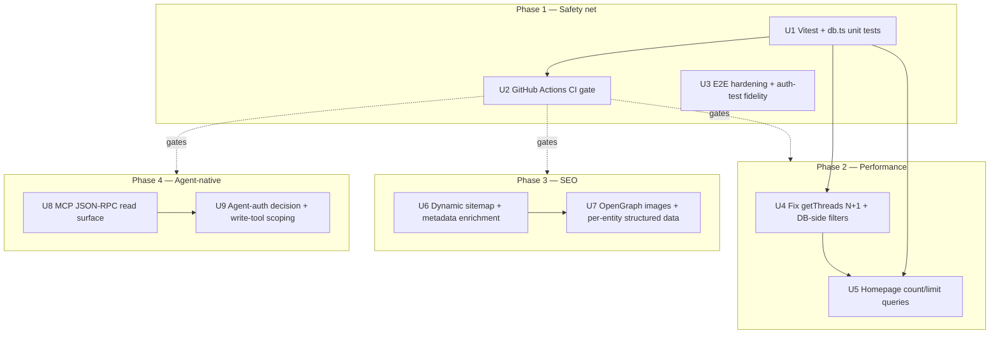
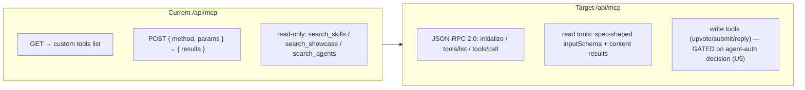

# refactor: vibetrends.dk improvement roadmap

## Summary

A prioritized, phased improvement pass across four areas the user selected — test/reliability, performance, SEO/growth, and agent-native depth. This is **not a rewrite**: the security, accessibility, REST routing, and Supabase backend are already sound. The plan sequences by leverage so each phase de-risks the next:

1. **Phase 1 — Test safety net & CI.** Stand up Vitest, cover the highest-risk untested code (`src/lib/db.ts`), and add a GitHub Actions gate. Nothing downstream is safe to ship without this.
2. **Phase 2 — Performance.** Kill the data-layer over-fetching (`getThreads` full-table reply scan, homepage 5-dataset fetch) now that tests can catch regressions.
3. **Phase 3 — SEO depth.** Make dynamic content discoverable (sitemap covers detail pages), enrich per-entity metadata, add OpenGraph images.
4. **Phase 4 — Agent-native parity.** Bring `/api/mcp` to a real protocol and expose the read tools cleanly; agent **write** access is scoped as an explicit follow-up decision, not bolted on blind.

Each area gets its highest-value slice. Deeper extensions (URL-based locale routing, Postgres full-text search, agent write-auth) are listed under **Deferred to Follow-Up Work** rather than crammed in.

---

## Problem Frame

vibetrends.dk is a Next.js 16 / React 19 directory + community platform (skills, showcase, forum, agents, MCP servers, blog) on Supabase, with an agent-native `/api/mcp` endpoint. It was built out fast and recently hardened (security, a11y, routing). The request is to "improve the project." Recon surfaced concrete, load-bearing gaps in all four selected areas:

- **Reliability:** one 7-case Playwright spec (`tests/e2e/basic.spec.ts`), zero unit tests, no Vitest, and **no CI** (`.github/workflows` does not exist). The riskiest logic — upvote toggle, `null`-vs-`0` count semantics, RLS-dependent deletes, bilingual row mapping in `src/lib/db.ts` — has no coverage. Changes are scary to ship.
- **Performance:** `getThreads` fetches **every reply for every thread** and filters in JS; the homepage (`src/app/page.tsx`) fetches five full datasets just to render counts and one featured item each. Search/category filtering for skills/showcase/agents runs in JS after pulling whole tables.
- **SEO:** `src/app/sitemap.ts` lists only static routes — **no detail pages**, so the actual content is invisible to crawlers. Detail metadata is title+description only (no OpenGraph, no canonical). Language is **cookie-based**, so one URL serves cookie-dependent da/en content — a structural bilingual-SEO weakness.
- **Agent-native:** `/api/mcp` is read-only with a custom `{ method, params }` shape (not MCP JSON-RPC) while human users can submit/upvote/reply. Parity gap.

## Goals & Non-Goals

**Goals**
- A unit-test safety net on the data layer plus an automated CI gate.
- Measurably less data fetched per request on the hot paths (home, forum).
- Dynamic content fully crawlable with richer per-entity metadata and social previews.
- A spec-correct MCP read surface, with the write-parity decision framed for a clean follow-up.

**Non-Goals**
- No backend rewrite, no schema redesign, no design overhaul.
- No URL-based locale routing in this pass (flagged as the deferred SEO follow-up).
- No new content authoring — content freshness is a separate operational concern.

---

## Key Technical Decisions

- **Vitest for units, keep Playwright for E2E.** Matches the user's stated testing defaults (Vitest unit / Playwright E2E). Unit-test `db.ts` by mocking the Supabase client module, not by hitting a live database — keeps CI hermetic and fast.
- **Test the data layer first, not the React components.** `db.ts` concentrates the branchy, bug-prone logic (toggle, `null` vs `0`, mapping). Component/UI behavior is already exercised by E2E. Highest coverage-per-effort goes to `db.ts`.
- **CI gate runs lint + typecheck + Vitest on every push/PR; Playwright runs but is allowed to be the slower job.** Prevents the "tests exist but nobody runs them" failure mode that the missing `.github/` already represents.
- **Push filtering/counting into Postgres rather than JS.** `getThreads` reply aggregation and the search/category filters should be expressed as queries (`select count`, scoped `in`/`eq`, or RPC), not post-fetch `.filter()`. The repo already ships `.agents/skills/supabase-postgres-best-practices` references (`data-n-plus-one.md`, `query-missing-indexes.md`, `advanced-full-text-search.md`) — follow them.
- **Dynamic sitemap reads IDs from the DB at build/request time.** A static route list cannot reflect community-submitted content. Generate detail URLs from `getSkills/getProjects/getAgents/getThreads/getBlogPosts`.
- **Shallow SEO now, locale-routing later.** Enriching metadata + OG + sitemap is cheap and high-value. Moving language into the URL is a routing restructure touching every page, the language provider, and the MCP/REST layer — too large for this pass and deferred deliberately. This caps achievable bilingual-SEO value; that trade is accepted (see origin call-out).
- **MCP read-tools to real protocol now; write-tools deferred behind an auth decision.** Today's MCP auth is the human session cookie (`createSupabaseServerClient`), which agents don't carry. Exposing upvote/submit/reply needs a deliberate agent-auth scheme (PAT, scoped key, or OAuth) — its own decision, not an afterthought. `getAuthUser()` in `src/lib/supabase-server.ts` is the natural seam when that lands.

---

## High-Level Technical Design

### Phase sequencing and what each unblocks

*Directional guidance — the dependency edges are the load-bearing part. Phase 1 (especially U1's coverage of `db.ts`) must precede the Phase 2 refactor so behavior is locked before it's changed. Phases 2/3/4 are independent of each other and can be reordered or parallelized once Phase 1 lands.*

### MCP surface: current vs. target

*Directional guidance. Confirm the exact MCP method/envelope shape against the current spec at implementation time (see Sources & Research) before finalizing U8.*

---

## Implementation Units

### U1. Vitest setup and `db.ts` unit coverage

- **Goal:** Stand up Vitest and cover the highest-risk data-layer logic so the Phase 2 refactor is safe.
- **Requirements:** Test & reliability focus; precondition for U4/U5.
- **Dependencies:** none.
- **Files:**
  - `vitest.config.ts` (create)
  - `package.json` (add `test` / `test:unit` script + devDeps: `vitest`, `@vitest/coverage-v8`)
  - `src/lib/__tests__/db.test.ts` (create)
  - Test seam: mock `src/lib/supabase-server.ts` (`supabasePublic`, `createSupabaseServerClient`) via `vi.mock`
- **Approach:** Mock the Supabase client modules so query builders return canned rows/errors. Assert on the mapping + branching logic, not on Supabase itself. Cover the bilingual mapper helpers and the upvote toggle/`null` semantics explicitly — these encode subtle decisions (`null` = missing row, `0` = legitimate toggle-off).
- **Execution note:** Characterization-first — write these to lock in *current* behavior before U4 changes the queries underneath them.
- **Patterns to follow:** existing camelCase mappers in `src/lib/db.ts`; `.agents/skills/supabase-postgres-best-practices` for query expectations.
- **Test scenarios:**
  - `mapSkill`/`mapProject`/`mapThread`/`mapAgent` pick the `_en` column when `lang='en'` and `_da` otherwise; null `tags`/`tools` map to `[]`.
  - `upvoteProject` with no authenticated user returns `0` and does not insert.
  - `upvoteProject` first call inserts a join row; a `23505` unique violation triggers the delete (toggle-off) path.
  - `upvoteProject` returns `null` when the post-update count row is missing, and `0` when `upvotes` is `0` (the null-vs-0 distinction).
  - `getThreads` with a category filter passes `eq('category', …)`; with `"All"`/undefined it does not.
  - `getAgents` with no category excludes `'MCP Server'` (`neq`), but includes it when that category is explicitly requested.
  - `getSkills`/`getProjects`/`getAgents` search filters by title/description/tags case-insensitively.
  - `deleteProject`/`deleteThread`/`deleteReply` return `false` on empty result (RLS-blocked / not found) and `true` when a row id comes back.
- **Verification:** `npm run test:unit` passes; coverage report shows `db.ts` branches (toggle, null-vs-0, lang select, category guard) exercised.

### U2. GitHub Actions CI gate

- **Goal:** Run lint, typecheck, and unit tests automatically on every push and PR so green stays green.
- **Requirements:** Test & reliability focus; the missing-CI gap.
- **Dependencies:** U1 (a `test:unit` script must exist to invoke).
- **Files:**
  - `.github/workflows/ci.yml` (create)
  - `package.json` (add a `typecheck` script: `tsc --noEmit`)
- **Approach:** Single workflow, Node 24, `npm ci`. Jobs: `lint` (`npm run lint`), `typecheck`, `test:unit`. Add Playwright as a separate job that installs browsers and runs `test:e2e` — keep it non-blocking on a first pass if browser install proves flaky in CI, then promote to required once stable. Do not put Supabase secrets in CI; unit tests are mocked and E2E should run against build output or be gated behind available env.
- **Patterns to follow:** standard Next.js + Vitest GH Actions; respect `AGENTS.md` (Next 16 build reads `node_modules/next/dist/docs/`).
- **Test scenarios:** `Test expectation: none — CI config; verified by the workflow running green on the opening PR.`
- **Verification:** PR shows the CI checks executing and passing; a deliberately broken test makes the gate red.

### U3. E2E hardening and auth-test fidelity

- **Goal:** Confirm the "simulate login" E2E reflects real Supabase-session auth (not a stale spoof path), and add coverage for the upvote toggle round-trip.
- **Requirements:** Test & reliability focus.
- **Dependencies:** U1.
- **Files:**
  - `tests/e2e/basic.spec.ts` (modify)
  - `tests/e2e/upvote.spec.ts` (create, optional split)
  - Read-only review: `src/app/components/LoginModal.tsx`, `src/app/components/AuthProvider.tsx`
- **Approach:** Verify whether the login test's email→`@testuser_vibe` path exercises the real magic-link/session flow or a local simulation; align the assertion with the actual auth (`getAuthUser` derives `${baseName}_vibe`). Add an upvote toggle test (upvote → count increments → re-click → toggles off) if achievable without live auth secrets; otherwise document why it's E2E-deferred.
- **Patterns to follow:** existing retry/`toPass` hydration handling in `basic.spec.ts`.
- **Test scenarios:**
  - Login flow asserts the username the server actually derives, and the test's auth path is documented as real-session vs simulated.
  - Upvote toggle round-trip reflects in the rendered count (or is explicitly marked deferred with reason).
  - Deep-link filter test remains green after the U4 query changes.
- **Verification:** `npm run test:e2e` green; auth assertion matches `getAuthUser` derivation.

### U4. Fix `getThreads` N+1 and move filters into Postgres

- **Goal:** Stop fetching all replies for all threads and stop filtering whole tables in JS.
- **Requirements:** Performance focus.
- **Dependencies:** U1 (characterization coverage must exist first).
- **Files:**
  - `src/lib/db.ts` (modify `getThreads`, and the search/category paths of `getSkills`/`getProjects`/`getAgents`)
  - Optional: `supabase/migrations/<new>_search_indexes.sql` (indexes for the columns now filtered server-side)
- **Approach:** For `getThreads`, either scope replies to the fetched thread ids (`in`) or return reply **counts** via aggregate when full reply bodies aren't needed for the list view. Replace post-fetch `.filter()` search with `ilike`/`or` query predicates; keep behavior identical to what U1 locked in. Add indexes for any column now used in a `where`/`ilike`. Mind that `cacheComponents: true` is on — verify caching behavior of changed queries.
- **Execution note:** Run U1's `db.test.ts` red/green around each query change — the tests are the contract.
- **Patterns to follow:** `.agents/skills/supabase-postgres-best-practices/references/data-n-plus-one.md`, `query-missing-indexes.md`, `advanced-full-text-search.md`.
- **Test scenarios:**
  - `getThreads` returns the same thread+reply shape as before for a thread with multiple replies (mapping unchanged).
  - A thread with zero replies returns `replies: []`.
  - Category filter and search return the same membership as the old JS-filter implementation (parity assertions against U1 fixtures).
  - Query issues one reply fetch scoped to the thread set rather than an unfiltered table read (assert the mocked query builder is called with `in`/`eq`, not bare `select('*')`).
- **Verification:** `db.test.ts` green; manual/`EXPLAIN` check (or query-call assertion) shows no unfiltered full-table reply scan on the forum list path.

### U5. Trim homepage over-fetching

- **Goal:** The homepage should fetch what it renders — counts and a single featured item per section — not five full datasets.
- **Requirements:** Performance focus.
- **Dependencies:** U1, U4 (reuse the new DB-side count/limit helpers).
- **Files:**
  - `src/app/page.tsx` (modify)
  - `src/lib/db.ts` (add count-only / `limit(1)` helpers, e.g. `getCounts()`, `getFeatured*`)
- **Approach:** Add helpers returning `count` (Supabase `select('*', { count: 'exact', head: true })`) for the stats band, and `limit`-bounded queries for featured items. Replace the five `getX(...).length`/`[0]` reads. Preserve the existing language-cookie behavior and Cache Components semantics.
- **Patterns to follow:** `.agents/skills/supabase-postgres-best-practices/references/data-pagination.md`.
- **Test scenarios:**
  - `getCounts` returns per-entity counts without materializing full rows (assert `head: true`/`count` usage).
  - Featured helpers return at most one item and respect `lang`.
  - Homepage renders identical visible numbers/featured items as before for a fixed fixture set.
- **Verification:** `db.test.ts` green for new helpers; homepage visually unchanged; fewer/lighter queries on the home path.

### U6. Dynamic sitemap and metadata enrichment

- **Goal:** Make community content crawlable and give every page proper canonical + OpenGraph metadata.
- **Requirements:** SEO/growth focus.
- **Dependencies:** none (independent of Phases 2/4); should land after U2 so it's gated.
- **Files:**
  - `src/app/sitemap.ts` (modify — pull detail IDs from the DB)
  - `src/app/layout.tsx` (modify — root `metadataBase`, default OG/Twitter, canonical)
  - Detail `generateMetadata` in `src/app/{skills,showcase,agents,mcp,blog,forum}/[id]/page.tsx` (enrich with OG + canonical)
- **Approach:** Generate sitemap entries for each skill/project/agent/mcp/thread/blog id via the existing `getX` functions. Add `metadataBase` and default OpenGraph/Twitter card metadata at the root. Extend each detail `generateMetadata` with `openGraph`, `alternates.canonical`, and entity-appropriate fields. Keep cookie-based language (locale-in-URL is deferred) but set `og:locale` from the cookie where read.
- **Patterns to follow:** existing `generateMetadata` in `src/app/agents/[id]/page.tsx`; `src/lib/jsonLd.ts`.
- **Test scenarios:**
  - Sitemap includes a URL for each entity id returned by the `getX` fixtures, plus the static routes.
  - Sitemap omits `MCP Server` agents from `/agents/*` and includes them under `/mcp/*` (mirrors the `getAgents` category split).
  - Detail `generateMetadata` returns `openGraph.title`, `description`, and a canonical URL for a known id; returns the not-found title for a missing id.
- **Verification:** `npm run build` emits detail URLs in the sitemap; metadata visible in page `<head>`; structured data validates.

### U7. OpenGraph images and per-entity structured data

- **Goal:** Social/share previews and richer structured data for the main entity types.
- **Requirements:** SEO/growth focus.
- **Dependencies:** U6.
- **Files:**
  - `src/app/{showcase,agents,blog}/[id]/opengraph-image.tsx` (create — `ImageResponse`)
  - `src/lib/jsonLd.ts` (extend with entity schemas, e.g. `CreativeWork`/`SoftwareApplication`/`Article`)
  - Detail pages render the JSON-LD (modify where not already present)
- **Approach:** Use Next's `ImageResponse` (`opengraph-image.tsx`) to render dynamic OG cards from entity title/author. Add JSON-LD per entity type and inject it on detail pages. Confirm CSP `img-src` covers any image source used by OG generation.
- **Patterns to follow:** existing `src/lib/jsonLd.ts`; Next 16 metadata-files docs in `node_modules/next/dist/docs/`.
- **Test scenarios:**
  - `jsonLd` builder emits valid schema objects with required fields for each entity type (unit-testable pure function).
  - OG route returns a 200 image response for a known id (smoke; image rendering itself not asserted pixel-wise).
- **Verification:** OG images resolve for sample detail URLs; structured data passes a validator.

### U8. MCP JSON-RPC read surface

- **Goal:** Bring `/api/mcp` to a spec-correct protocol for the existing read tools so real MCP clients can connect.
- **Requirements:** Agent-native focus.
- **Dependencies:** none functionally; land after U2.
- **Files:**
  - `src/app/api/mcp/route.ts` (modify)
  - `src/app/mcp/page.tsx` (modify — keep the human-facing `/mcp` docs in sync with the new shape)
- **Approach:** Replace the custom `{ method, params }` envelope with JSON-RPC 2.0 handling for `initialize`, `tools/list`, and `tools/call`, returning spec-shaped `content` results. Keep the three existing read tools (`search_skills`, `search_showcase`, `search_agents`) backed by the same `db.ts` functions. Confirm the exact envelope against the current MCP spec before finalizing (see Sources). Preserve the prior commit's `/mcp` JSON negotiation fix.
- **Patterns to follow:** existing tool definitions in `src/app/api/mcp/route.ts`.
- **Test scenarios:**
  - `tools/list` returns the three tools with spec-shaped `inputSchema`.
  - `tools/call` for `search_skills` with a query returns mapped results in the spec content shape.
  - An unknown method returns a JSON-RPC error object (not a bare 404 body).
  - Malformed JSON returns a JSON-RPC parse/invalid-request error.
- **Verification:** A real MCP client (or a conformance fixture) completes `initialize` → `tools/list` → `tools/call`; unit tests on the route handler pass.

### U9. Agent-auth decision and write-tool scoping

- **Goal:** Decide *how* an agent authenticates before exposing upvote/submit/reply, and document the chosen scheme — do not ship write tools without it.
- **Requirements:** Agent-native focus; agent-native parity.
- **Dependencies:** U8.
- **Files:**
  - `docs/plans/` follow-up note or a short ADR (decision artifact)
  - Read-only review: `src/lib/supabase-server.ts` (`getAuthUser`), upvote/create functions in `src/lib/db.ts`
- **Approach:** This unit is a **decision, not an implementation** in this pass. Evaluate PAT / scoped API key / OAuth-for-agents against the existing session-cookie model, with `getAuthUser()` as the identity seam. Output the chosen approach and a thin spike scope; the actual write tools become a follow-up plan once the scheme is chosen.
- **Test scenarios:** `Test expectation: none — decision/ADR unit. The chosen scheme's implementation carries its own tests in the follow-up.`
- **Verification:** A written decision exists naming the agent-auth approach and the seam, sufficient to start a focused write-tools plan.

---

## Scope Boundaries

### In scope
- Vitest + `db.ts` coverage, CI gate, E2E hardening.
- Data-layer performance fixes (forum N+1, homepage over-fetch, DB-side filters).
- Dynamic sitemap, metadata/OG enrichment, per-entity structured data.
- MCP read tools to real JSON-RPC; agent-auth **decision**.

### Deferred to Follow-Up Work
- **URL-based locale routing** (`/en/…`) — the real bilingual-SEO fix; a routing restructure of its own.
- **Postgres full-text search** (replacing `ilike` with a tsvector index) — once basic DB-side filtering proves out.
- **MCP write tools implementation** — gated on the U9 auth decision.
- **README rewrite** from the create-next-app boilerplate.
- **Content freshness / authoring** — operational, not engineering.

---

## Risks & Dependencies

- **Refactoring before tests land.** Mitigated by hard-ordering U1 before U4/U5 and the characterization execution notes.
- **Cache Components interaction.** `cacheComponents: true` is on; changed queries may cache differently than expected — verify on the forum/home paths during U4/U5.
- **CI + Playwright flakiness.** Browser install in CI can be flaky; U2 keeps E2E a separate, initially non-required job to avoid blocking the gate on infra noise.
- **MCP spec drift.** The JSON-RPC envelope must be confirmed against the current spec at U8 implementation time rather than from memory.
- **Cookie-based language caps SEO.** Accepted trade for this pass; the ceiling is removed only by the deferred locale-routing work.

---

## Sources & Research

- Local recon: `src/lib/db.ts`, `src/app/page.tsx`, `src/app/api/mcp/route.ts`, `src/app/sitemap.ts`, `src/lib/supabase-server.ts`, `next.config.ts`, `tests/e2e/basic.spec.ts`, `docs/engineering_log.md`.
- In-repo skill: `.agents/skills/supabase-postgres-best-practices/references/` — `data-n-plus-one.md`, `query-missing-indexes.md`, `advanced-full-text-search.md`, `data-pagination.md`.
- Framework: Next.js 16 docs under `node_modules/next/dist/docs/` (metadata files, sitemap, `opengraph-image`, Cache Components) — per `AGENTS.md`, read these before implementing.
- MCP protocol: confirm the current JSON-RPC method/envelope spec at U8 implementation time (external — not yet fetched; flagged so the plan isn't presented as spec-verified).

---

## Status & Follow-Up Batch (updated 2026-06-23)

The original U1–U9 roadmap above is **fully shipped** (merged across PRs #9–#13). A
visual status reconciliation lives at `docs/plans/roadmap-status.html`.

A separate follow-up batch, driven by direct product asks, shipped on
`feat/skill-flow-forum-readme` (2026-06-23) and is also complete:

- **WS1 — Add-Skill flow.** Only `title + link` are required now (a required
  description was silently blocking submits); the skills taxonomy moved to a
  discipline set (Full-Stack, Marketing, Webshop, Front-End, Back-End, Design,
  Agent workflows) in `src/lib/topics.ts`; 56 seed rows remapped via
  `supabase/migrations/20260623000000_skills_category_remap.sql` (reversible, 0 orphans).
- **WS2 — Forum tiny-Reddit polish.** Top/New sort tabs, comment upvotes
  (`reply_upvotes` table + triggers + RLS in
  `supabase/migrations/20260623010000_forum_reply_upvotes.sql`), and relative
  timestamps (`src/lib/timeAgo.ts`). The existing Supabase forum was extended; an
  Apache Answer fork was evaluated and rejected (Go/Docker Q&A monolith — wrong
  model and a duplicate stack).
- **WS3 — README.** Rewritten as cold-start context for an AI agent.

Still deferred (unchanged): URL-based locale routing, Postgres full-text search,
and the MCP write-tools implementation (now unblocked by the agent-auth decision).
