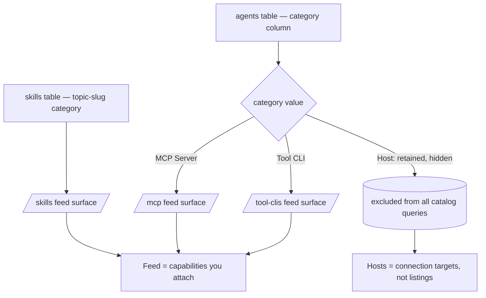
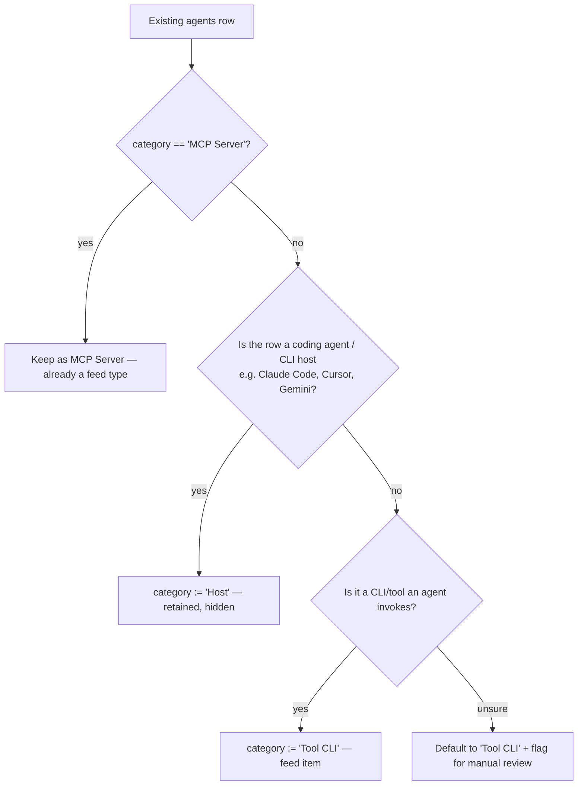
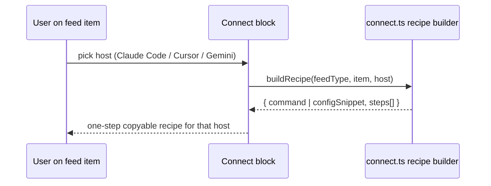

# feat: Recast Agents as an agent-feed

## Summary

Recast vibetrends from a directory that *lists* agents into a curated feed organized by **feed vs host**. Feed types — skills, MCP servers, and a new **tool-CLIs** type — are capabilities a user attaches to a coding agent. The coding agents themselves (Claude Code, Cursor, Gemini) become **connection targets**, not catalog listings. The Agents section is demoted from primary navigation; its rows are triaged into feed types and retained in place so the move is reversible. Every feed item gains a one-step connect action, and vibetrends' own catalog stays obtainable programmatically.

The work splits into two phases: **Phase 1** delivers the reversible core (taxonomy, demotion, data triage, and the agent-discovery contract updates that must move with it); **Phase 2** delivers the one-step connect UX and the programmatic catalog surface.

---

## Problem Frame

vibetrends launched with several content sections (skills, showcase, forum, agents, MCP servers, blog). Skills has a clear curation job — there are hundreds of thousands, so surfacing the 0.1% worth using is the value. Agents has no equivalent job: there are few of them and the category boundary is an argument, not a fact (is Claude Code an agent? a Gemini CLI running skills? a system prompt?). A section whose membership is contestable feels arbitrary, costs maintenance, and re-raises the "is this an agent?" question on every addition. The agents and third-party MCP-server listings already share one data model, which compounds the strain.

The underlying intent isn't a browsable agent directory — it's letting a user take curated content here and get it into their own coding tool. A Danish community can't win on volume against skills.sh; **connectability of curated content** is the defensible edge. This plan operationalizes that: reorganize the catalog around "can I attach this to my agent?", demote the contested section without destroying its data, and make connection the first-class action.

The implementation reality (from research): the `agents` table's free-text `category` column (`DevTools | Writing | Browsing | MCP Server`) is the *only* feed-vs-host discriminator that exists today, enforced in TypeScript and Zod but not at the DB level. MCP servers are simply `category='MCP Server'` rows that `getAgents()` excludes via `.neq()`. This makes the triage a reversible in-place `category` rewrite — the same mechanic the skills topic-taxonomy migration already used.

---

## Key Technical Decisions

**KTD1 — Carry the feed axis as `agents.category` values, not a new schema dimension.**
The tool-CLI feed type and the host marker become new `category` values (`Tool CLI`, `Host`) via an in-place migration, mirroring the skills topic-taxonomy migration (`supabase/migrations/20260620000000_*`). No new column, no constraint added (the union stays TS/Zod-enforced, matching current convention). Rationale: cheapest path that satisfies "retain data, stay reversible" (R9) — re-promotion is a navigation + classification change only. Alternative (a dedicated `feed_type`/`is_host` column) adds schema surface and migration risk for no behavior the category rewrite can't express.

**KTD2 — Host-like rows move to a hidden `Host` category, not deletion.**
Triaged host-like rows keep their row but get `category='Host'`, which all catalog queries exclude. They vanish from the catalog surface yet remain queryable for reversal (AE2, R9). Rationale: "demote, don't delete" stated directly in the origin.

**KTD3 — Tool-CLIs reuse the existing AgentsExplorer/AgentDetailView machinery as their own top-level section.**
`/tool-clis` mirrors `/mcp`: same shared explorer/detail components driven by a `scope` prop, same card/route patterns. Rationale: the explorer already abstracts `/agents` and `/mcp` behind `scope`; adding a third scope is the minimal, consistent move and keeps the change reversible. Alternative (a unified feed with type filters) is a larger IA redesign deferred to follow-up.

**KTD4 — A single feed-type source of truth (`src/lib/feedTypes.ts`), modeled on `src/lib/topics.ts`.**
One module defines the feed types (skills / mcp-servers / tool-clis) and the host registry (Claude Code / Cursor / Gemini) with bilingual labels, icons, and accents, and drives nav, the tool-CLI filter surface, the connect host picker, and the sitemap. Rationale: the topic-hub work paid for exactly this pattern after category lists triplicated and drifted; the feed axis is a third cross-cutting taxonomy and must not re-introduce the drift.

**KTD5 — One-step connect is host-aware *templating* over each item's existing install data, not a per-host config schema.**
A `src/lib/connect.ts` recipe builder takes `(feedType, item, host)` and returns a host-specific connect recipe (command or config snippet + minimal steps), wrapping the item's existing `install_command` / `github_url` / `source`. Hosts come from the KTD4 registry. Rationale: delivers R5/R6 without a schema change; the brainstorm explicitly defers the *exact* mechanism, and templating is the reversible, lowest-data-cost option. A richer per-host stored config is deferred until demand is shown.

**KTD6 — The programmatic catalog surface (R7) extends the existing read-only JSON-RPC MCP route + static discovery files; it stays read-only.**
R7 rides `src/app/api/mcp/route.ts` (adding feed-type-aware read tools) and the `public/*` discovery files. No write path, so the PAT/agent-auth ADR (`docs/decisions/2026-06-19-agent-auth.md`) does not gate this work. Rationale: research confirms data *access* is largely solved; the open work is consistency + a feed-type-aware read tool, not new auth.

**KTD7 — The agent-facing contract is updated in lockstep with the taxonomy change.**
`proxy.ts`'s route map, `scripts/generate-index.js`, and the five static `public/*` files (`ai.txt`, `ara.json`, `llm-ld.json`, `capability.json`, `agent-permissions.json`) all hardcode today's `agents = ?category=MCP Server` coupling. They are the agent-facing contract and are treated as part of the demotion, not an afterthought, or they drift silently.

---

## High-Level Technical Design

### Data model: one table, category as the feed-vs-host discriminator



Skills keep their own topic-slug taxonomy (`topics.ts`); the feed axis (skills / mcp-servers / tool-clis) is a third, cross-cutting taxonomy expressed in `feedTypes.ts`. The `agents` table carries only two of the three feed types (mcp-servers, tool-clis) plus the hidden host bucket.

### Triage decision (R3) — directional rule the migration encodes



### Connect flow (R5/R6) — host-aware templating



This is directional guidance for reviewers, not implementation specification.

---

## Output Structure

New route + module surface introduced by this plan (existing files modified are listed per-unit, not here):

```
src/
  lib/
    feedTypes.ts            # feed-type SoT + host registry (new)
    connect.ts              # host-aware connect recipe builder (new)
  app/
    tool-clis/
      page.tsx              # listing (AgentsExplorer scope="tool-clis")
      loading.tsx
      [id]/
        page.tsx            # detail (AgentDetailView)
    api/
      tool-clis/
        route.ts            # JSON twin of /api/mcp-servers
    components/
      ConnectBlock.tsx      # host picker + recipe (new)
supabase/
  migrations/
    <ts>_agent_feed_recategorization.sql   # in-place category rewrite (new)
```

The per-unit `**Files:**` lists remain authoritative; the implementer may adjust layout if a better one emerges.

---

## Requirements Traceability

| Req | Covered by |
| --- | --- |
| R1 — feed types in primary nav, no "Agents" top-level | U1, U4 |
| R2 — feed test defines membership; hosts not catalog items | U1, U3, U6 |
| R3 — triage Agents rows; retain underlying data | U2, U3 |
| R4 — tool-CLIs as a distinct feed type | U1, U2, U5 |
| R5 — every feed item exposes one-step connect | U7, U8 |
| R6 — hosts (Claude Code, Cursor, Gemini) as connection targets | U1, U7 |
| R7 — agent obtains catalog programmatically | U9 |
| R8 — third-party MCP catalog reframed under feed model, kept | U5, U6 |
| R9 — demotion reversible without data recovery | U2, U3, U4 |

---

## Implementation Units

### Phase 1 — Reversible core: taxonomy, demotion, triage, contract

### U1. Feed-type source of truth + host registry

**Goal:** One module defines the three feed types and the host connection targets, driving nav, the tool-CLI surface, the connect host picker, and the sitemap.
**Requirements:** R1, R2, R4, R6.
**Dependencies:** none.
**Files:** `src/lib/feedTypes.ts`, `src/lib/__tests__/feedTypes.test.ts`.
**Approach:** Mirror `src/lib/topics.ts` exactly: `as const` data tables, bilingual `labelDa/labelEn` + `descDa/descEn`, lucide `icon` name string, `accent` hex. Two exports: `FEED_TYPES` (skills, mcp-servers, tool-clis) and `HOSTS` (claude-code, cursor, gemini-cli). Helpers `getFeedType(slug)`, `getHost(slug)`, `FEED_TYPE_SLUGS`, `HOST_SLUGS`, label resolvers taking a lang. Keep the "no other feed-type/host lists in the codebase" comment convention.
**Patterns to follow:** `src/lib/topics.ts` (structure, helper shape, bilingual resolution).
**Test scenarios:**
- Happy path: `getFeedType('tool-clis')` returns the entry; `getHost('claude-code')` returns the host.
- `FEED_TYPE_SLUGS` / `HOST_SLUGS` enumerate exactly the defined entries (length + membership).
- Label resolver returns the `*_da` value for `da` and `*_en` for `en`.
- Edge: unknown slug returns `undefined` (or the module's chosen sentinel — match `topics.ts`).

### U2. Recategorization migration (in-place category rewrite)

**Goal:** Triage existing `agents` rows into the feed-vs-host taxonomy without destroying data.
**Requirements:** R3, R4, R9.
**Dependencies:** U1 (canonical category values).
**Files:** `supabase/migrations/<timestamp>_agent_feed_recategorization.sql`.
**Approach:** Follow the skills topic-taxonomy migration precedent (`supabase/migrations/20260620000000_*`): a documented, lossy, reversible mapping. `MCP Server` rows untouched. `DevTools/Writing/Browsing` rows map to `Tool CLI` by default, except a documented allowlist of host-like rows (coding agents/CLIs such as Claude Code, Cursor, Gemini) that map to `Host`. Include an in-file comment block stating the old→new map, the default fallback (`Tool CLI`), the host allowlist, and a manual-review note. Provide the inverse mapping as a commented down-path so reversal needs only re-running classification.
**Execution note:** The exact host allowlist depends on the real rows — inspect current `agents` data during execution and finalize the allowlist before applying. The *rule* (host coding-agents → `Host`, everything else → `Tool CLI`) is fixed here; the row list is execution-time.
**Patterns to follow:** `supabase/migrations/20260620000000_skills_topic_taxonomy.sql`.
**Test scenarios:** Test expectation: none at the SQL level — migration correctness is asserted through the query-layer characterization tests in U3 (host rows retained but excluded; tool-CLI rows surfaced). Flag any row hitting the default fallback during execution for manual review.

### U3. Data-layer query rework (characterization-first)

**Goal:** Update `db.ts` so catalog queries reflect the feed-vs-host split: hosts excluded everywhere, tool-CLIs queryable, MCP path preserved.
**Requirements:** R2, R3, R9.
**Dependencies:** U1, U2.
**Files:** `src/lib/db.ts`, `src/lib/__tests__/db.test.ts`.
**Approach:** Update the `category` TS union to `'Tool CLI' | 'MCP Server' | 'Host'` (retain tolerant handling of legacy values until the migration is confirmed applied in all envs). Rework the `getAgents()` filter: the current single `.neq('category','MCP Server')` becomes a feed-aware accessor — by default exclude both `Host` (always hidden) and `MCP Server` (its own surface), with explicit accessors/params for `Tool CLI` and `MCP Server`. Add `getToolClis(search, lang)` (or parameterize the existing function — match the `getMcpServers` shape). Update `mapAgent` only if field semantics change (they should not).
**Execution note:** Characterization-first — extend `src/lib/__tests__/db.test.ts` to lock the *current* `getAgents`/MCP filtering behavior (Supabase client module mocked, per the established convention) before rewriting the category seam.
**Patterns to follow:** existing `getAgents` / `getSkills({ view })` seam in `src/lib/db.ts`; Supabase-module-mock test style in `src/lib/__tests__/db.test.ts`.
**Test scenarios:**
- Covers AE2. Default catalog query excludes `Host` rows and `MCP Server` rows; a `Host` row is absent from results but a direct fetch by id still returns it (data retained).
- `getToolClis()` returns only `Tool CLI` rows, no `Host`/`MCP Server`/skills bleed-through.
- MCP-server query path returns only `MCP Server` rows (unchanged behavior — characterization).
- Edge: a legacy `DevTools` value present pre-migration is handled without throwing (tolerant mapping).
- Search + category params compose correctly (search term narrows within a feed type).

### U4. Demote Agents from primary navigation

**Goal:** Remove the Agents top-level nav entry and add Tool CLIs; keep `/agents` routes reachable (data retained) but unlinked.
**Requirements:** R1, R9.
**Dependencies:** U1.
**Files:** `src/app/components/Header.tsx`, `src/lib/translations.ts`.
**Approach:** In `Header.tsx`, remove the `Agents` item from `navItems` and add a `Tool CLIs` item (`/tool-clis`, icon from `feedTypes.ts`). Add the `nav.toolClis` translation key (da/en); leave `nav.agents` in place (unused but harmless, aids reversal). Do not delete the `/agents` route tree — demotion is nav-only here. Ensure `/agents/[id]` detail gating accounts for the new `Host` category (a `Host` row should 404 on the public `/agents/[id]` surface, consistent with hosts not being catalog items); confirm/adjust the existing category hard-gate.
**Patterns to follow:** existing `navItems` array and dropdown support in `Header.tsx`; bilingual key pattern in `src/lib/translations.ts`.
**Test scenarios:**
- Covers AE2. Nav renders without an "Agents" entry and with a "Tool CLIs" entry (both locales).
- `/agents/[id]` for a `Host`-category id returns 404 (host not a catalog item); a `Tool CLI` id does not render under `/agents/[id]` (it belongs to `/tool-clis`).
- E2E: header link set updated (extend `tests/e2e/basic.spec.ts` nav assertions).

### U5. Tool-CLIs section (reuse AgentsExplorer) + reframed MCP copy

**Goal:** A `/tool-clis` listing + detail surface mirroring `/mcp`, plus reframing the MCP surface copy from "browse list of servers" to "MCP capabilities one step from your setup."
**Requirements:** R4, R8.
**Dependencies:** U1, U3.
**Files:** `src/app/tool-clis/page.tsx`, `src/app/tool-clis/loading.tsx`, `src/app/tool-clis/[id]/page.tsx`, `src/app/components/AgentsExplorer.tsx`, `src/app/components/AgentDetailView.tsx`, `src/app/api/tool-clis/route.ts`, `src/lib/translations.ts`.
**Approach:** Add a `scope="tool-clis"` branch to `AgentsExplorer` (API filter `category='Tool CLI'`, detail base `/tool-clis`, copy, no sub-category chips). `/tool-clis/page.tsx` renders `<AgentsExplorer scope="tool-clis" />`; `/tool-clis/[id]` renders `AgentDetailView` with `backHref="/tool-clis"` and a category gate (404 unless `Tool CLI`). `/api/tool-clis/route.ts` is the param-free JSON twin of `/api/mcp-servers/route.ts`, hardcoding the `Tool CLI` filter (needed because `proxy.ts` drops injected query params). Update the MCP scope copy strings in the explorer/translations to the reframed framing; no MCP routing change.
**Patterns to follow:** `src/app/mcp/page.tsx`, `src/app/mcp/[id]/page.tsx`, `src/app/api/mcp-servers/route.ts`, the `scope` switch in `AgentsExplorer.tsx`.
**Test scenarios:**
- Covers R4. `/api/tool-clis` returns only `Tool CLI` rows.
- `/tool-clis/[id]` 404s for a non-`Tool CLI` id; renders for a `Tool CLI` id.
- Explorer in `tool-clis` scope hides sub-category chips and uses the `/tool-clis` detail base.
- E2E: `/tool-clis` lists cards with `data-testid` and a card click reaches detail.
- MCP surface still renders unchanged after the copy reframe (no regression).

### U6. Agent-discovery contract consistency

**Goal:** Update every agent-facing surface that hardcodes the old `agents = ?category=MCP Server` coupling so the contract matches the new taxonomy.
**Requirements:** R2, R8.
**Dependencies:** U1, U3.
**Files:** `src/proxy.ts`, `scripts/generate-index.js`, `public/ai.txt`, `public/ara.json`, `public/llm-ld.json`, `public/capability.json`, `public/agent-permissions.json`.
**Approach:** Sweep the seven surfaces: `proxy.ts` route map (add `/tool-clis` ↔ `/api/tool-clis`, keep `/mcp` mapping, drop any `?category=MCP Server` agents coupling), `generate-index.js` (count/emit tool-CLIs as a feed entity; reflect demotion of agents), and the five static files (reframe "Agent & MCP Registry" language to the feed model, add tool-CLIs, remove the `?category=MCP Server` agents instructions in `ai.txt`/`ara.json`). Keep the two MCP roles distinct: the third-party MCP *catalog* (feed content) vs. vibetrends' own connectable surface — do not conflate.
**Patterns to follow:** existing route-map entries in `src/proxy.ts`; the entity-emit loop in `scripts/generate-index.js`; current structure of each `public/*` file.
**Test scenarios:**
- `proxy.ts`: `?format=json` on `/tool-clis` rewrites to `/api/tool-clis`; CORS/`X-Agent-*` headers still applied on `/api/*`.
- `generate-index.js` output includes a tool-CLI count/entry and no longer presents agents as a top-level browsable section (run the generator against a mocked/seeded source; assert the emitted JSON shape).
- Static-file check: no remaining `category=MCP Server` agents-coupling string in `public/ai.txt` / `public/ara.json` (assert via a small test or grep gate).
- Edge: `semantic-index.json` generation still falls back to the committed copy without throwing when the source is unavailable.

### Phase 2 — Connect UX and programmatic surface

### U7. Connect recipe builder + Connect block

**Goal:** A host-aware recipe builder and a reusable Connect UI that turns any feed item into a one-step, host-specific connect action.
**Requirements:** R5, R6.
**Dependencies:** U1.
**Files:** `src/lib/connect.ts`, `src/lib/__tests__/connect.test.ts`, `src/app/components/ConnectBlock.tsx`.
**Approach:** `connect.ts` exports `buildConnectRecipe(feedType, item, host)` returning `{ command?: string, configSnippet?: string, steps: string[] }`, templating each host's wrapper around the item's existing install data (`install_command` for tool-CLIs/MCP; for MCP servers, the host-appropriate add form such as a `claude mcp add …` command vs. a Cursor JSON config; `github_url`/`source` for skills). `ConnectBlock.tsx` is a `"use client"` component: host picker sourced from `HOSTS` (U1), copy-to-clipboard on the resolved recipe, honoring the existing token/styling system. Generalizes the copy affordance currently in `AgentActionSection.tsx`.
**Patterns to follow:** `src/app/components/AgentActionSection.tsx` (copy-to-clipboard, panel styling); bilingual prop-passing for presentational components (`SkillCard.tsx`).
**Test scenarios:**
- Covers AE3. `buildConnectRecipe('skills', skill, 'claude-code')` returns a non-empty recipe with at least one copyable step.
- MCP-server item + `claude-code` produces a command form; the same item + `cursor` produces a config-snippet form (host-specific divergence).
- Tool-CLI item wraps its `install_command` for the chosen host.
- Edge: item missing install data (e.g., a skill with no `github_url`) yields a graceful fallback recipe (manual steps), not an empty/blank block.
- Edge: unknown host slug is rejected/handled (no throw).

### U8. Integrate Connect across feed surfaces

**Goal:** Surface the Connect action on every feed item — skills, MCP servers, tool-CLIs — at detail and card level, satisfying "every feed item is one step from a supported host."
**Requirements:** R5, R6.
**Dependencies:** U5, U7.
**Files:** `src/app/skills/[id]/page.tsx`, `src/app/components/SkillCard.tsx`, `src/app/components/AgentDetailView.tsx`, `src/app/components/AgentsExplorer.tsx`, `tests/e2e/basic.spec.ts`.
**Approach:** Embed `ConnectBlock` in skill detail (which has no install UX today) and add a compact connect affordance to `SkillCard`. In `AgentDetailView`, replace/extend `AgentActionSection`'s single copy box with `ConnectBlock` so MCP servers and tool-CLIs get the host picker. Keep changes presentational; data comes from existing fields plus U7's recipe builder. Preserve existing `data-testid`s and add one for the connect control.
**Patterns to follow:** existing detail-page composition (`Suspense` + async content) in `src/app/skills/[id]/page.tsx`; card prop pattern in `SkillCard.tsx`.
**Test scenarios:**
- Covers AE3. On a skill detail page, choosing Claude Code reveals a one-step copyable recipe.
- Each feed type (skill, MCP server, tool-CLI) renders a Connect control on its detail page.
- E2E: a feed item → pick host → copy control is present and clickable (extend `tests/e2e/basic.spec.ts`); watch the historical button-in-link nesting / `useRouter` pitfalls noted in the engineering log.
- Edge: an item with no install data shows the fallback recipe rather than a broken/empty block.

### U9. Programmatic catalog access (R7)

**Goal:** Let an agent obtain the curated catalog — including tool-CLIs and the feed-type taxonomy — programmatically, extending the existing read-only MCP surface.
**Requirements:** R7.
**Dependencies:** U3, U6.
**Files:** `src/app/api/mcp/route.ts`, `src/app/api/mcp/__tests__/route.test.ts`, and the relevant `public/*` discovery files touched in U6 (final R7 pass).
**Approach:** Add feed-type awareness to the JSON-RPC `TOOLS` array + `callTool()` switch: a `list_feed_types` tool (from `feedTypes.ts`) and either a `search_tool_clis` tool or a feed-type param on the existing search, keeping everything read-only (KTD6). Ensure `search_agents` semantics reflect the demotion (it should no longer present hosts as catalog results). No write tools — PAT auth stays out of scope.
**Patterns to follow:** existing `TOOLS` array, `callTool()` switch, and `list_topics`/`search_skills` shape in `src/app/api/mcp/route.ts`; tests in `src/app/api/mcp/__tests__/route.test.ts`.
**Test scenarios:**
- Covers R7. `tools/list` includes the new feed-type tool(s); `tools/call` for `list_feed_types` returns the three feed types with bilingual labels.
- Feed-type-aware search returns tool-CLIs and excludes `Host` rows.
- `search_agents` no longer returns host-category rows as catalog results.
- JSON-RPC framing preserved: `initialize` / `tools/list` / `tools/call` shapes unchanged; notifications still 202.
- Edge: unknown tool name returns a proper JSON-RPC error, not a crash.

---

## Scope Boundaries

**In scope:** R1–R9 as traced above — the feed-vs-host taxonomy, Agents demotion, in-place data triage, tool-CLIs feed type and section, agent-discovery contract updates, host-aware connect UX, and the read-only programmatic catalog surface.

**Deferred for later** (from origin — separate roadmap items):
- The own-signal Hot/Trending engine for feed types.
- Broadening topic-hub treatment (hub + per-slug landing pages) to tool-CLIs, showcase, forum, and blog. This plan gives tool-CLIs an explorer surface, not the full topic-hub landing treatment.
- A richer per-host stored connect-config data model (this plan templates over existing fields per KTD5).

**Deferred to follow-up work** (plan-local sequencing, not product non-goals):
- Re-promotion of an Agents (or successor) surface if demand reappears — reversible by design, not built here.
- Adding hosts beyond Claude Code / Cursor / Gemini CLI to the connect picker.
- Unifying skills/MCP/tool-CLIs into a single feed with type filters (the KTD3 alternative).

**Outside this product's identity** (from origin):
- A browsable directory of coding agents/CLIs as destinations ("which agent should I use") — a host-comparison job vibetrends does not own.
- Competing on catalog volume — vibetrends is curation plus connectability, not breadth.

---

## Acceptance Examples

- **AE1** (R2): classifying Claude Code yields a host / connection target (not a catalog item — `category='Host'`, excluded from catalog queries); classifying a scraper tool-CLI an agent invokes yields a `Tool CLI` feed item. Enforced by U2 triage rules + U3 query exclusion.
- **AE2** (R3, R9): a feed-worthy Agents entry appears under its feed type with data unchanged after demotion; a host-like entry no longer appears in the catalog but its row is retained. Enforced by U2 (in-place rewrite), U3 (retained-but-excluded), U4 (nav).
- **AE3** (R5, R6): a skill on a feed page + choosing a host (e.g. Claude Code) yields a one-step way to add it to that host. Enforced by U7 (recipe) + U8 (skill-detail integration).

---

## System-Wide Impact, Risks & Dependencies

- **Agent-facing contract drift (high-impact, addressed):** seven surfaces (`proxy.ts`, `generate-index.js`, five static `public/*` files) hardcode the old coupling. U6 sweeps them in the same phase as the taxonomy change; the static-file grep/test gate guards against a missed reference. Risk if U6 is skipped: external agents consume a stale contract while the UI shows the new one.
- **Migration on shared free-text column (medium):** `category` has no DB constraint, so a partial/incorrect triage is silently possible. Mitigation: characterization-first tests in U3 lock current behavior; the migration documents its lossy map and flags fallback rows for manual review; reversal is a re-run of classification (KTD1/KTD2).
- **`cacheComponents: true` (medium):** changed `db.ts` queries run under Next 16 cache components. Verify cache behavior of the new/changed accessors (a stale catalog could keep showing demoted hosts). Confirm against `node_modules/next/dist/docs/01-app` per AGENTS.md.
- **Skills have no install data (medium):** R5 for skills relies on `github_url`/`source` only; U7's fallback recipe path is the safety net so skills never render an empty Connect block.
- **E2E fragility (low, known):** prior Agents E2E hit button-in-link nesting and `useRouter` ReferenceErrors (engineering log). U8 restructures item actions — watch the same pitfalls.
- **Dependencies:** Supabase migration must be applied per environment before the U3 query changes go live (or the tolerant-legacy handling carries the gap). No new third-party dependency. PAT/agent-auth ADR is *not* a dependency (R7 stays read-only).
- **Non-standard Next.js 16:** new APIs in use (`cacheComponents`, `proxy.ts` instead of `middleware.ts`, async `params`/`searchParams`, `unstable_instant`). Read the bundled docs before writing per AGENTS.md.

---

## Open Questions (deferred to implementation)

- The exact host allowlist for the `Host` category — depends on inspecting real `agents` rows at execution (U2 execution note). The *rule* is fixed; the row list is not.
- Whether `getToolClis` is a new function or a parameterization of the existing agents accessor — resolve against the real `db.ts` shape when editing (U3).
- The precise host-specific wrapper strings for each connect recipe (e.g., the exact Claude Code vs. Cursor MCP add form) — finalize against current host install mechanics during U7; the recipe *shape* is fixed.
- Whether the reframed MCP copy needs new translation keys or edits in place (U5) — minor, resolve in edit.

---

## Sources & Research

- **Origin requirements:** `docs/brainstorms/2026-06-22-agent-feed-taxonomy-requirements.md` (R1–R9, AE1–AE3, scope boundaries carried forward).
- **Template to mirror:** `docs/plans/2026-06-20-001-skills-topic-hub-plan.md` and the shipped topic-hub code (`src/lib/topics.ts`, `src/app/skills/page.tsx`, `src/app/skills/topic/[slug]/page.tsx`) — single-source taxonomy + in-place `category` migration precedent (`supabase/migrations/20260620000000_*`).
- **Current data/query seam:** `src/lib/db.ts` (`agents` table, `category` union, `getAgents` `.neq('MCP Server')` split), `src/app/api/agents/route.ts` (Zod enum), `src/app/api/mcp-servers/route.ts`.
- **Agent-facing contract:** `src/app/api/mcp/route.ts` (JSON-RPC read tools), `src/proxy.ts` (route map / CORS), `scripts/generate-index.js`, `public/{ai.txt,ara.json,llm-ld.json,capability.json,agent-permissions.json}`.
- **Connect precedent:** `src/app/components/AgentActionSection.tsx`, `src/app/components/AgentsExplorer.tsx`, `src/app/components/AgentDetailView.tsx`.
- **Adjacent decision (not a dependency — read-only R7):** `docs/decisions/2026-06-19-agent-auth.md` (PAT plan gates only an agent *write* path).
- **Testing conventions:** Vitest with Supabase-module mock (`src/lib/__tests__/db.test.ts`, `src/app/api/mcp/__tests__/route.test.ts`), Playwright E2E (`tests/e2e/basic.spec.ts`); characterization-first before changing queries.
- **External research:** not run — connect mechanism is deferred-by-design with strong local patterns; the choice is recorded as KTD5/KTD6 rather than sourced externally.
