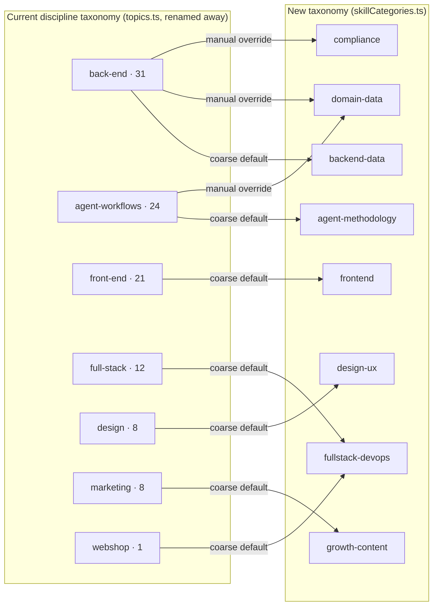

# refactor: Skills-specific categorization taxonomy

## Summary

Replace `src/lib/topics.ts`'s 7-category discipline scheme (full-stack, marketing, webshop, front-end, back-end, design, agent-workflows) with an 8-category scheme organized around what kind of help a skill gives an agent, not which layer of a stack it touches. `topics.ts` is renamed in place to `src/lib/skillCategories.ts` — it already has zero `/vibes` consumers today despite being named generically (verified: `ShowcaseProject` has no category field, and no file under `src/app/vibes/` references `TOPICS`, `TopicSlug`, or `topicLabel`), so there is no shared module to protect and no reason to build a parallel one. All 105 existing skill rows are recategorized via a reversible migration mirroring the two prior skills-category remaps already in `supabase/migrations/`.

---

## Problem Frame

`/skills` currently derives its category set from `src/lib/topics.ts`. The module's own doc comment already calls it "the single source of truth for the Skills taxonomy" — despite the generic name, it was conceived as skills-only, and a direct grep confirms it: every importer (`src/lib/db.ts`, `src/app/api/skills/route.ts`, `src/app/api/mcp/route.ts`, `src/app/skills/page.tsx`, `src/app/skills/topic/[slug]/page.tsx` + `opengraph-image.tsx`, `src/app/sitemap.ts`, `src/app/components/TopicIcon.tsx`, `src/lib/__tests__/db.test.ts`) is skills-scoped. There is no `/vibes`/showcase-project consumer.

The current scheme (full-stack / marketing / webshop / front-end / back-end / design / agent-workflows) encodes "which layer of a web stack does this project touch" — a fit for a *project*, poor for a *skill*. The mismatch was tolerable at low volume. It stopped being tolerable after importing 49 skills from two `mikkelkrogsholm` repos: general dev-tooling library docs (Drizzle, Prisma, tRPC, Stripe, Sentry, Temporal, …) and Danish domain-data lookup tools (job search across four different portals, real estate, medical research, transit, grocery deals) had no bucket that fit, and were approximated into `back-end` or `agent-workflows` by necessity. Current distribution across all 105 skills: back-end 31, agent-workflows 24, front-end 21, full-stack 12, design 8, marketing 8, webshop 1 — `webshop` has been effectively empty since it was introduced (no legacy source, per `supabase/migrations/20260623000000_skills_category_remap.sql`'s own comment), and `back-end`/`agent-workflows` together now hold over half of all skills, which is a sign the categories themselves, not the content, are the problem.

This is already the *third* iteration of `/skills` categorization (`20260620000000_skills_topic_taxonomy.sql` moved off skills.sh-mirrored slugs; `20260623000000_skills_category_remap.sql` moved onto the current discipline scheme). Getting the next set right matters more than usual — this plan proposes a scheme grounded directly in the actual 105-skill population, with an explicit semantic-correctness check (not just a structural one) before considering the migration done (see U2).

Separately, `/skills`' current `marketing` category value triggers a Vercel Firewall/WAF rule that blocks any POST to `/api/skills` containing the literal string "marketing" anywhere in the payload — discovered while importing the 49 skills. That is an infrastructure/dashboard configuration issue, not a code defect, and is explicitly **out of scope** for this plan (see Scope Boundaries). It is **not** meaningfully sidestepped by this taxonomy change: several skill titles unrelated to the category rename already contain the substring "marketing" (e.g. "Marketing Psychology"), so the WAF rule continues to block submissions/edits touching those rows regardless of what category slug is chosen. The new category's slug and label are still chosen to avoid adding a *second*, unnecessary trigger of the same bug (see Key Technical Decisions) — but that is a minor mitigation, not a fix.

---

## Key Technical Decisions

**Rename `topics.ts` to `src/lib/skillCategories.ts` in place, rather than creating a parallel module.** `topics.ts` has no consumers outside the skills surface today (see Problem Frame) — building a new module and "leaving `topics.ts` for `/vibes`" would leave `topics.ts` fully orphaned after this refactor while claiming a shared-module story that doesn't exist. Renaming the file, updating its doc comment to describe its actual (already skills-only) scope, and updating all 9 current importers to the new path and new export names is simpler than the create-new-plus-orphan-old alternative, and produces no dead code. If a genuine `/vibes`-side taxonomy is ever needed, it starts from a clean slate rather than inheriting this file's history.

**Single category per skill, not multi-category.** The existing free-text `tags` field (already populated on every skill, already used for fuzzy search matching in `src/app/skills/page.tsx`) remains the secondary, unstructured discovery mechanism. Two alternatives were considered and rejected for this round:
- *Multi-category* (array or junction table) — would touch Zod cardinality, the filter-chip selection model, and the submit form, for a benefit that's speculative given most of the current population, including all 49 just-imported skills, is single-purpose.
- *Tags-as-primary, category dropped or demoted* — would abandon the hub-card/topic-landing-page pattern this plan otherwise preserves, and would require building faceted/multi-select filtering UI on free text where none exists today; a materially larger investment than this refactor's scope. Single-category-with-secondary-tags is the cheaper structural fit, and if this taxonomy still shows persistent forced-fit rows after the migration (see Risks & Dependencies for a concrete trigger), tags-as-primary is the next escalation to revisit, not a discarded idea.

**New taxonomy organized by "kind of help," not "stack layer."** Reviewing all 105 skill titles (56 pre-existing + 49 imported) shows two content types the current discipline scheme doesn't distinguish: agent-methodology skills (`writing-plans`, `systematic-debugging`, `skill-creator`, `subagent-driven-development`) that aren't about a stack layer at all, and library/framework reference skills (`drizzle`, `react`, `stripe`) that are about a specific technology rather than a discipline. The proposed 8-category set, with every old slug's coarse default target named explicitly (no mapping left implicit in a diagram only):

| Slug | Label (en) | Coarse default source(s) | Absorbs (representative examples) |
|---|---|---|---|
| `agent-methodology` | Agent Methodology | `agent-workflows` | `writing-plans`, `systematic-debugging`, `subagent-driven-development`, `skill-creator`, `dev-skill-creator`, `using-git-worktrees`, `agent-readable-code`, `agent-browser`, `find-skills`, `brainstorming` |
| `frontend` | Frontend & UI | `front-end` | `react`, `tailwindcss`, `shadcn`/`shadcn-ui`, `motion`, `monaco-editor`, `react-markdown`, `tanstack-query`, `tanstack-router`, `vite`, `typescript-advanced-types`, `native-data-fetching`, `building-native-ui`, `expo-tailwind-setup` |
| `backend-data` | Backend & Data | `back-end` | `drizzle`, `drizzle-orm`, `prisma`, `hono`, `elysia`, `bun`, `trpc`, `zod`, `convex-quickstart`, `firebase-basics`, `neon-postgres`, `neon`, `turso`, `turso-db`, `duckdb-query`, `supabase`, `surrealdb`, `meilisearch`, `rustfs` |
| `fullstack-devops` | Full-Stack & DevOps | `full-stack`, `webshop` | `ai-sdk`, `next-best-practices`, `next-cache-components`, `turborepo`, `deploy-to-vercel`, `playwright-cli`, `playwright-best-practices`, `webapp-testing`, `test-driven-development`, `verification-before-completion`, `stripe`, `resend`, `sentry`, `opentelemetry`, `openobserve`, `temporal`, `trigger-dev`, `bullmq`, `upstash` |
| `design-ux` | Design & UX | `design` | `canvas-design`, `delight`, `polish`, `ui-ux-pro-max`, `extract-design-system`, `frontend-design`, `web-design-guidelines`, `emil-design-eng`, `sleek-design-mobile-apps`, `tailwind-design-system` |
| `growth-content` | Growth & Content | `marketing` | `ai-seo`, `seo-geo`, `seo-audit`, `copywriting`, `content-strategy`, `launch-strategy`, `marketing-psychology`, `pricing-strategy`, `programmatic-seo` |
| `compliance` | Compliance & Governance | *(none — new bucket, sourced via manual override)* | `gdpr-dev`, `gdpr-dpa` |
| `domain-data` | Domain Data & Research | *(none — new bucket, sourced via manual override)* | `boliga`, `boligsiden`, `jobbank-search`, `jobdanmark-search`, `jobindex-search`, `jobnet-search`, `medrxiv-search`, `pubmed-database`, `rejseplanen`, `salling-food-waste` |

This is 8 slugs (one more than today), drops `webshop` (near-empty, doesn't describe any skill — its 1 row folds into `fullstack-devops`'s coarse default), and adds `domain-data` (didn't exist before — the entire reason the 49-skill import didn't fit cleanly anywhere). Named `growth-content` rather than `marketing-content`: the coarse-default source category is `marketing`, but the new slug and label deliberately avoid the substring "marketing" so this migration doesn't introduce a *second* trigger for the WAF bug described in Problem Frame — this is a minor mitigation on new writes to this slug specifically, not a fix for the underlying bug (which is also tripped by unrelated skill titles). The examples above are illustrative and were derived by reading all 105 current titles, not sampled — a strong basis for the migration's mapping, but final assignment happens in the migration script (U2) with an explicit semantic review pass, not hand-specified row-by-row in this plan.

**Two-tier migration: coarse default mapping + explicit manual overrides for known misclassifications, plus a semantic (not just structural) verification pass.** A pure old-category → new-category `CASE` mapping (mirroring `20260623000000_skills_category_remap.sql`) is necessary but not sufficient: the current `back-end` bucket alone contains both `drizzle-orm` (→ `backend-data`) and `boliga` (→ `domain-data`) — two rows sharing an old category that must land in different new ones. The migration needs an explicit per-title override list for rows the coarse mapping would misclassify, following the "MANUAL REVIEW BEFORE PRODUCTION" pattern already established in `supabase/migrations/20260622000000_agent_feed_recategorization.sql` — and, because a migration can satisfy every *structural* check (all rows land in one of 8 valid slugs, no leftovers, row count preserved) while still leaving individual rows in the wrong bucket, U2 also requires a one-time manual read-through of the full post-migration `title → category` listing before the migration is considered complete (see U2 Test scenarios).

**Reversibility snapshot goes into a new column, not the existing `category_legacy`.** `category_legacy` already exists on `public.skills` and holds the *first*-era (skills.sh-slug) values from the 2026-06-23 migration — overwriting it would destroy that history. This migration snapshots the pre-migration (discipline-era) value into a new `category_legacy_v2` column before rewriting, preserving both generations of history and the existing rollback path.

**Icon set:** the new categories need lucide icon names distinct from the current set (`Layers`, `Megaphone`, `ShoppingCart`, `Atom`, `Database`, `Palette`, `Bot`) or intentionally reused where a name still reads correctly for its new label. Because `topics.ts` is being renamed rather than kept as a second module, there's exactly one icon-resolution surface to update, not two — `TopicIcon.tsx` gets updated in place for the new slug/label set rather than needing a parallel resolver component.

---

## Requirements Trace

| Requirement | Unit |
|---|---|
| The taxonomy module is renamed to `skillCategories.ts` with the new 8-slug scheme; all prior importers point at the new path | U1, U3, U4, U5, U6 |
| All 105 existing skill rows are recategorized under the new taxonomy, with the prior (discipline-era) value preserved for rollback, and a semantic (not just structural) correctness check is performed before sign-off | U2 |
| The migration is idempotent and reversible, following `AGENTS.md`'s migration constraints | U2 |
| `src/lib/db.ts`'s `Skill` type, `categoryLabel` resolution, and `createSkill` signature reflect the new category type | U3 |
| The external MCP contract (`search_skills` category enum, `list_topics` tool) is updated without silently breaking existing agent callers | U5 |
| Every `/skills`-surface derivation (Zod validation, filter chips, submit form, hub cards, topic landing pages, sitemap, icons) reads from the new module | U4, U6 |

---

## High-Level Technical Design

Every edge above (including `webshop`'s) now has an explicit coarse-default target named in the Key Technical Decisions table, not just in this diagram — the two are kept in sync so the migration's `CASE` statement has a single unambiguous source of truth for the coarse pass.

---

## Scope Boundaries

**In scope**
- Renaming `src/lib/topics.ts` to `src/lib/skillCategories.ts`, rewriting its contents to the new 8-slug taxonomy, and updating its test file
- Migrating all 105 `public.skills` rows to the new taxonomy, reversibly, with a semantic correctness review (not just structural)
- Updating all 9 current importers of the old module to the new path/exports: `src/lib/db.ts`, `src/app/api/skills/route.ts`, `src/app/api/mcp/route.ts`, `src/app/skills/page.tsx`, `src/app/skills/topic/[slug]/page.tsx`, `src/app/skills/topic/[slug]/opengraph-image.tsx`, `src/app/sitemap.ts`, `src/app/components/TopicIcon.tsx`, `src/lib/__tests__/db.test.ts`
- Icon resolution for the new category set (in place, on the existing `TopicIcon.tsx`)

**Deferred to Follow-Up Work**
- Multi-category, or tags-as-primary-classification, for skills (both considered and rejected for this round per the Key Technical Decisions above; revisit if the 8-category set still shows persistent forced-fit rows — concretely, if two or more consecutive bulk imports of 10+ skills each don't cleanly fit any existing category without a large manual-override list, per Risks & Dependencies)
- A drift-guardrail lint rule that fails when a taxonomy is hardcoded outside its single-source module (the forum-category work deferred the same thing; still outstanding project-wide)
- A `/vibes`-side taxonomy, if one is ever needed — this plan confirms none exists today and does not create one

**Outside this plan's scope**
- The Vercel Firewall/WAF rule blocking the literal string "marketing" in `/api/skills` POST payloads — an infrastructure/dashboard configuration issue, not addressed by this taxonomy change and not meaningfully mitigated by it either, since unrelated skill titles already trip the same rule (see Problem Frame)
- Changes to `feedTypes.ts` or the Agents/MCP-server feed-vs-host taxonomy (a separate, already-distinct taxonomy per `docs/brainstorms/2026-06-22-agent-feed-taxonomy-requirements.md`)

---

## Implementation Units

### U1. Rename `src/lib/topics.ts` to `src/lib/skillCategories.ts` and rewrite its taxonomy

**Goal:** Turn the existing (already skills-only) taxonomy module into the new 8-slug scheme, in place, with the module's doc comment corrected to describe its actual scope.

**Requirements:** taxonomy module renamed and rewritten; all prior importers will be repointed in U3–U6

**Dependencies:** none

**Files:**
- `src/lib/topics.ts` — rename to `src/lib/skillCategories.ts`, rewrite contents
- `src/lib/__tests__/topics.test.ts` (if it exists as a separate file from `db.test.ts`'s inline `TOPIC_SLUGS` assertions — confirm during implementation) — rename to `src/lib/__tests__/skillCategories.test.ts`, rewrite

**Approach:**
- Rename the file via `git mv src/lib/topics.ts src/lib/skillCategories.ts` (preserves history) rather than deleting and recreating.
- Replace `TOPIC_SLUGS` with `SKILL_CATEGORY_SLUGS` — a `const` tuple of the 8 slugs from the Key Technical Decisions table, in the order shown.
- Replace `TopicSlug` with `SkillCategorySlug` — `(typeof SKILL_CATEGORY_SLUGS)[number]`.
- Replace the `Topic` interface with `SkillCategory`: `slug`, `labelDa`, `labelEn`, `descDa`, `descEn`, `icon` (lucide icon name, string), `accent` (hex string) — same shape as before, renamed.
- Replace `TOPICS` with `SKILL_CATEGORIES: readonly SkillCategory[]` — one entry per slug, with Danish/English labels and short descriptions (e.g. `domain-data` → da: "Eksterne data- og API-opslag", en: "External data and API lookups").
- Replace `getTopic` with `getSkillCategory(slug: string): SkillCategory | undefined`, same internal `Record` lookup map.
- Replace `topicLabel` with `skillCategoryLabel(slug: string, lang: "da" | "en" = "da"): string`, same fallback-to-raw-slug contract for unknown/legacy values.
- Update the top-of-file doc comment to state plainly that this is the Skills taxonomy (dropping any implication of a broader/shared scope it never actually had).
- Pick 8 icon names for the new labels; reuse from the old set is fine where a name still reads correctly (e.g. `Bot` for `agent-methodology`), pick new ones where it doesn't.

**Patterns to follow:** the file's own existing shape (this unit renames and edits it, doesn't invent a new pattern) and `src/lib/forumCategories.ts` (the most recent sibling example of this exact shape, useful as a cross-check).

**Test scenarios:**
- `getSkillCategory("backend-data")` returns the record with both `labelDa` and `labelEn` populated.
- `getSkillCategory("unknown-slug")` returns `undefined`.
- `skillCategoryLabel("domain-data", "da")` and `skillCategoryLabel("domain-data", "en")` return distinct, non-empty strings.
- `skillCategoryLabel("legacy-value")` falls back to `"legacy-value"` (raw passthrough).
- `SKILL_CATEGORY_SLUGS` has exactly 8 entries; `SKILL_CATEGORIES` has length 8 in the same order.
- No old slug (`back-end`, `agent-workflows`, `front-end`, `full-stack`, `design`, `marketing`, `webshop`) appears in `SKILL_CATEGORY_SLUGS` — confirms the rename is a full replacement, not an additive change.

**Verification:** Module type-checks cleanly; `npx vitest run src/lib/__tests__/skillCategories.test.ts` passes all scenarios; every `SKILL_CATEGORIES` entry has non-empty `labelDa`/`labelEn`/`descDa`/`descEn`; `git log --follow src/lib/skillCategories.ts` shows the file's history preserved through the rename.

---

### U2. Migrate `public.skills.category` to the new taxonomy

**Goal:** Recategorize all 105 existing skill rows under the new 8-slug taxonomy, reversibly, with both a structural and a semantic correctness check before sign-off.

**Requirements:** all 105 rows migrated; idempotent and reversible per `AGENTS.md`; semantic correctness verified, not just structural completeness

**Dependencies:** U1 (the new slug set must be finalized before the mapping is written)

**Files:**
- `supabase/migrations/20260702000000_skills_category_taxonomy_v3.sql` — create

**Approach:**
- Mirror `supabase/migrations/20260623000000_skills_category_remap.sql`'s structure exactly: header comment explaining the old→new mapping and rationale, a reversibility snapshot step, the remap `UPDATE`, and a trailing POST-MIGRATION VERIFICATION / ROLLBACK comment block (not executed, for the operator running the migration).
- Snapshot step: `alter table public.skills add column if not exists category_legacy_v2 text; update public.skills set category_legacy_v2 = category where category_legacy_v2 is null;` — a **new** column, since `category_legacy` already holds the prior (skills.sh-era) generation from the 2026-06-23 migration and must not be overwritten.
- Coarse mapping: a `CASE` on the current discipline value, using the Key Technical Decisions table's "Coarse default source(s)" column directly (`back-end`→`backend-data`, `agent-workflows`→`agent-methodology`, `front-end`→`frontend`, `full-stack`→`fullstack-devops`, `webshop`→`fullstack-devops`, `design`→`design-ux`, `marketing`→`growth-content`) — every old slug now has an explicit target, no diagram-only mappings.
- Manual override: a second `UPDATE ... WHERE id IN (...)` (or `WHERE title_da IN (...)`, whichever the implementer finds gives a cleaner audit trail) applied *after* the coarse mapping, moving specific known-misclassified rows to their correct new slug — at minimum, every one of the 10 Danish domain-data-lookup skills (`Boliga Property Data`, `Boligsiden Property Data`, `Jobbank Search`, `Jobdanmark Search`, `Jobindex Search`, `Jobnet Search`, `medRxiv Search`, `PubMed Database`, `Rejseplanen`, `Salling Food Waste`) from wherever the coarse mapping placed them into `domain-data`, and the two GDPR skills (`GDPR for Developers`, `GDPR Data Processing Agreement Generator`) into `compliance`. The implementer re-derives the full override list against live data — the Key Technical Decisions table's examples are representative, not exhaustive.
- **Semantic verification, distinct from the structural checks below:** after applying the migration, the implementer pulls the full `select title_da, category from public.skills order by category, title_da` listing and reads every row — not just the counts — confirming no title is left in an obviously-wrong bucket. This is a one-time manual read-through (105 short lines), not automated, and is a required sign-off step before this unit is considered complete, not an optional nice-to-have.
- Same idempotency contract as the precedent: the coarse `UPDATE`'s `WHERE category IN (...)` predicate matches nothing once rows are already in the new slug set, and the override `UPDATE`'s `WHERE` predicate is similarly self-limiting, so re-running the file after a successful run is a no-op.
- Apply via the project's established one-off runner (`node --env-file=.env.local script.mjs` using `pg` + `DATABASE_URL`, wrapping the `.sql` file's statements in `BEGIN`/`COMMIT`) per `AGENTS.md` — no committed runner script exists in this repo by convention; write one ad hoc when executing.

**Patterns to follow:** `supabase/migrations/20260623000000_skills_category_remap.sql` (reversibility snapshot + coarse CASE mapping + verification/rollback comment block) and `supabase/migrations/20260622000000_agent_feed_recategorization.sql` (the "MANUAL REVIEW BEFORE PRODUCTION" override-list pattern, for judgment-call reassignments).

**Test scenarios:**
- Post-migration distribution query (`select category, count(*) from public.skills group by category`) returns exactly the 8 new slugs, zero rows with a pre-migration slug remaining. *(Structural.)*
- `select count(*) from public.skills where category_legacy_v2 is null` returns 0 — every row has a reversibility snapshot. *(Structural.)*
- `select count(*) from public.skills` returns 105 (or the then-current total) both before and after — rows are recategorized, never deleted or duplicated. *(Structural.)*
- Running the migration file a second time produces no further row changes (idempotency). *(Structural.)*
- The rollback statement (`update public.skills set category = category_legacy_v2 where category_legacy_v2 is not null`) restores the pre-migration discipline-era distribution exactly. *(Structural.)*
- Manual read-through of the full `title_da → category` listing (105 rows) confirms no obviously-misclassified row remains — e.g. no framework/library-reference skill under `domain-data`, no Danish data-lookup skill left under `backend-data` or `agent-methodology`. *(Semantic — the check the prior structural-only version of this plan was missing.)*
- `Test expectation: SQL migration — verified via the queries and manual read-through above, not a Vitest unit test.`

**Verification:** Distribution query shows all 105 rows under the 8 new slugs with no leftover old-slug values; `category_legacy_v2` is populated on every row; the full-listing manual read-through has been performed and any misclassifications found during it have been corrected before this unit is marked complete — not deferred silently.

---

### U3. Update `src/lib/db.ts` — `Skill` type and `createSkill`

**Goal:** Point the `Skill` interface's `category`/`categoryLabel` fields and `createSkill`'s signature at the renamed taxonomy module.

**Requirements:** `Skill.category` reflects the new type; `categoryLabel` resolves via the new module

**Dependencies:** U1

**Files:**
- `src/lib/db.ts` — modify

**Approach:**
- Replace `import { topicLabel, type TopicSlug } from "./topics"` with `import { skillCategoryLabel, type SkillCategorySlug } from "./skillCategories"`.
- `Skill.category: TopicSlug` → `Skill.category: SkillCategorySlug`.
- `mapSkill()`'s cast (`s.category as TopicSlug`) and label resolution (`topicLabel(s.category, lang)`) switch to `SkillCategorySlug` / `skillCategoryLabel`.
- `createSkill(..., category: Skill["category"], ...)` — signature updates automatically via the `Skill["category"]` reference; no literal type change needed there.
- `SkillRow.category: string` stays a widened string (unchanged) — same "legacy value never trips the mapper" convention already used for `AgentRow.category`.
- `getSkills(search?, category?, ...)`'s `.eq('category', category)` filter stays untyped-string; no change needed.
- Confirm during implementation that no other type in this file (e.g. any `/vibes`-side entity) imports `TopicSlug`/`topicLabel` from the old path — Problem Frame's grep found none, but this is the unit where a surprise would surface as a compile error, which is the correct failure mode if the grep missed something.

**Test scenarios:**
- `Test expectation: none — type-only change plus a resolver-function swap with an identical contract (same fallback behavior as the renamed skillCategoryLabel); tsc --noEmit is the verification gate.`

**Verification:** `tsc --noEmit` passes; `npx vitest run src/lib/__tests__/db.test.ts` passes with its taxonomy-related assertions now targeting `SKILL_CATEGORY_SLUGS`/`skillCategoryLabel` instead of `TOPIC_SLUGS`/`topicLabel`.

---

### U4. Update `src/app/api/skills/route.ts` — Zod validation

**Goal:** Derive the `skillSchema`'s `category` enum from `SKILL_CATEGORY_SLUGS`.

**Requirements:** submission validation accepts only the new taxonomy's slugs

**Dependencies:** U1

**Files:**
- `src/app/api/skills/route.ts` — modify

**Approach:**
- Replace `import { TOPIC_SLUGS } from "@/lib/topics"` with `import { SKILL_CATEGORY_SLUGS } from "@/lib/skillCategories"`.
- Replace `category: z.enum(TOPIC_SLUGS)` with `category: z.enum(SKILL_CATEGORY_SLUGS)`.
- No other change to the route.

**Test scenarios:**
- POST `/api/skills` with `category: "domain-data"` (a new slug) succeeds validation.
- POST `/api/skills` with `category: "back-end"` (an old, now-invalid slug) fails validation with a 400.
- `src/app/api/skills/__tests__/route.test.ts` (existing file) gets a new/updated test case covering both scenarios above.

**Verification:** `npx vitest run src/app/api/skills/__tests__/route.test.ts` passes; a manual POST with each of the 8 new slugs succeeds.

---

### U5. Update `src/app/api/mcp/route.ts` — external MCP contract

**Goal:** Point the `search_skills` tool's `category` input enum and the `list_topics` tool at the new taxonomy.

**Requirements:** external MCP contract reflects the new taxonomy

**Dependencies:** U1

**Files:**
- `src/app/api/mcp/route.ts` — modify

**Approach:**
- Update the existing `import { TOPIC_SLUGS, TOPICS } from "@/lib/topics"` to `import { SKILL_CATEGORY_SLUGS, SKILL_CATEGORIES } from "@/lib/skillCategories"` — this file's tool definitions are confirmed skills-only already (the `list_topics` tool's own description reads "Vis de 8 emner i Skills-biblioteket …", explicitly scoped to Skills), so this is a straight repoint, not a split.
- `search_skills`'s `category` input schema: `enum: [...TOPIC_SLUGS]` → `enum: [...SKILL_CATEGORY_SLUGS]`.
- `list_topics`'s handler maps `TOPICS` to its JSON-RPC response — swap to `SKILL_CATEGORIES`. No tool renaming or `surface` parameter is needed; there is no `/vibes`-side caller of this tool to reconcile against (confirmed per Problem Frame).
- Update `list_topics`'s description string if it references the old category count/names, so an agent reading the schema at call time sees the current 8-slug set, not stale text.
- This is the one unit in this plan touching a genuinely external contract (a real agent could be calling this MCP endpoint today with the old slug values) — treat the old→new enum change as a breaking change for any external caller hardcoding old slugs. There's no way to know from the codebase alone whether a real external caller exists yet; treat this as a known, accepted breaking change rather than something requiring a deprecation window (see Risks & Dependencies).

**Patterns to follow:** the existing `search_skills`/`list_topics` tool definitions in this file, for both schema shape and JSON-RPC response format.

**Test scenarios:**
- `search_skills` called with `category: "domain-data"` returns only skills under that slug.
- `search_skills` called with a stale old slug (e.g. `"back-end"`) is rejected by the schema (or returns empty, whichever the existing behavior is for unknown enum values — match that behavior for consistency, don't introduce new error handling).
- `list_topics`'s response includes all 8 new skill categories with populated labels and an accurate description string (no stale "7 categories" or old slug names in the tool's own description text).

**Verification:** Manual JSON-RPC call to `search_skills` with each new slug returns expected results; `list_topics`'s response and description are checked for staleness; `public/*.json` agent-discovery files (`ai.txt`, `llm-ld.json`, `capability.json`) are checked for hardcoded old-slug references and updated if any exist.

---

### U6. Update `/skills` UI surfaces — filter chips, submit form, hub cards, topic pages, sitemap, icons

**Goal:** Every user-facing `/skills` surface derives its category set from the renamed `skillCategories.ts`, with explicit, concrete behavior for sparse categories, icon fallback, and bilingual search — not left implicit.

**Requirements:** filter chips, submit dropdown, hub cards, topic landing pages, OG images, and the sitemap all reflect the new taxonomy

**Dependencies:** U1, U2 (UI should land after data is migrated, so counts/filters are correct on deploy)

**Files:**
- `src/app/skills/page.tsx` — modify
- `src/app/skills/topic/[slug]/page.tsx` — modify
- `src/app/skills/topic/[slug]/opengraph-image.tsx` — modify
- `src/app/sitemap.ts` — modify
- `src/app/components/TopicIcon.tsx` — modify in place (updated for the new slug/label/icon set; no parallel component needed since there is only one taxonomy module now)

**Approach:**
- `src/app/skills/page.tsx`: replace `TOPICS`/`TOPIC_SLUGS` imports and usages with `SKILL_CATEGORIES`/`SKILL_CATEGORY_SLUGS` — the per-category count reduction, the hub-card grid (icon/accent/labels/description/count/link), the submit-form `<select>` default and `<option>` list, and the search match against `skill.categoryLabel`.
- **Sparse-category rendering:** hub cards render uniformly regardless of count, including a legitimately low one like `compliance`'s 2 — no special-casing (hiding, merging into an "other" bucket, or a "coming soon" treatment) for low-count categories in this round. A real count of 2 is still a real count; adding conditional low-count UI is out of scope unless a category's count is later found to be persistently 0, which would instead be a signal to reconsider that slug's existence (see Risks & Dependencies), not to add hide-if-sparse UI logic.
- **Bilingual search match:** `skill.categoryLabel` as currently stored on a fetched `Skill` is already resolved to the active `vibe_lang` (per `mapSkill()`'s existing `topicLabel(s.category, lang)` / `skillCategoryLabel(s.category, lang)` call) — so the search match only ever compares against the label in the *current* display language, not both. This is *existing* behavior carried forward unchanged, not a new gap introduced by this refactor; no change needed here beyond the rename.
- `src/app/skills/topic/[slug]/page.tsx`: swap `getTopic(slug)` for `getSkillCategory(slug)`; the `[slug]` param space is now the 8 new slugs (old slugs 404 via the existing `notFound()` path, which is correct — they're gone).
- `src/app/skills/topic/[slug]/opengraph-image.tsx`: swap `getTopic` for `getSkillCategory` for the OG image's label/accent.
- `src/app/sitemap.ts`: swap `TOPIC_SLUGS.map(slug => \`/skills/topic/${slug}\`)` for `SKILL_CATEGORY_SLUGS.map(...)`. Old topic-landing URLs (e.g. `/skills/topic/back-end`) drop out of the sitemap and 404 — no redirect is planned in this round (see Scope Boundaries; add if search-console data post-launch shows meaningful traffic to old URLs).
- `src/app/components/TopicIcon.tsx`: update the icon-name → component map for the new 8-slug set (per U1's Approach). **Fallback for an unresolved icon name:** render a neutral default icon (reuse whatever generic/fallback icon, if any, the component already falls back to for an unrecognized name today — confirm during implementation; if none exists today, add one rather than leaving a blank icon slot, since a blank slot causes a visible layout gap on the hub-card grid) rather than throwing or rendering nothing.

**Patterns to follow:** the existing `src/app/skills/page.tsx` hub-card and filter-chip rendering (unchanged in shape, only the data source changes).

**Test scenarios:**
- Visiting `/skills` shows exactly 8 filter chips/hub cards, each rendered uniformly (including `compliance` at its real low count, per the sparse-category decision above) matching the post-migration distribution.
- Visiting `/skills/topic/domain-data` renders the topic landing page with the correct label/description and lists only skills under that slug.
- Visiting `/skills/topic/back-end` (an old, now-invalid slug) 404s.
- The submit-skill form's category dropdown lists exactly the 8 new categories; submitting with each succeeds (covered functionally by U4's Zod test, this scenario is the UI-level confirmation).
- `sitemap.xml` contains 8 `/skills/topic/<slug>` entries matching the new slugs, and none matching the old ones.
- OG image generation for a skill topic page renders without error and reflects the new category's label/accent.
- Searching `/skills` with a Danish category term while `vibe_lang=en` (or vice versa) does not match on the other language's label — confirms the existing (unchanged) single-language search behavior, not a regression.
- `Test expectation: primarily UI-level / manual verification for render correctness; skillCategoryLabel and getSkillCategory's resolver logic are already covered by U1's unit tests.`

**Verification:** `/skills` and each of the 8 `/skills/topic/<slug>` pages render correctly in both `da` and `en`; sitemap reflects the new slugs; every hub card shows a resolved icon (no blank slots, no console errors from unresolved icon names).

---

## Risks & Dependencies

- **Third-iteration churn risk, with a concrete revisit trigger.** Two prior taxonomy changes already happened on this exact column within the last two weeks of repo history. If this taxonomy also turns out to be a poor fit, the cost of a fourth iteration is now well-understood and cheap to execute mechanically (the `category_legacy`/`category_legacy_v2` reversibility chain and the established migration pattern) — but the real cost is user/UI churn (filter chips, bookmarked topic URLs) each time. Concrete trigger to revisit (rather than an unmeasured "if it feels wrong"): two or more consecutive bulk imports of 10+ skills each that don't cleanly fit any existing category without a large manual-override list. U2's semantic-review step (not just the structural checks) is the mechanism that catches misclassification *this* round, before it silently accumulates the way it did between iteration two and this one.
- **`growth-content` mitigates but does not fix the WAF bug.** The new slug avoids adding a second trigger for the "marketing" substring WAF rule, but unrelated skill titles (e.g. "Marketing Psychology") already trip it independent of category — see Problem Frame and Scope Boundaries. Any future submission or edit touching those specific rows will still fail until the WAF rule itself is fixed, which is out of scope here.
- **External MCP contract change (U5).** Any external agent that has hardcoded the old 7 category slugs against `search_skills` will see those values start failing validation. There's no way to know from the codebase alone whether any real external caller exists yet (the product is young); treat this as a known, accepted breaking change rather than something requiring a deprecation window, since inventing a compatibility shim for a contract with no confirmed callers isn't warranted.
- **Sitemap/SEO churn for old topic URLs.** `/skills/topic/<old-slug>` URLs drop out of the sitemap and start 404ing. Explicitly deferred (no redirect) per Scope Boundaries; low risk given the site's SEO indexing footprint for these pages is still small, but worth a Search Console check a few weeks post-launch.

---

## Open Questions

- Exact final assignment for any of the 56 pre-existing skills whose title alone doesn't obviously map to one new bucket (the Key Technical Decisions table's examples cover the clear cases; a handful of borderline titles — e.g. `supabase-postgres-best-practices` vs. `supabase` — may reasonably land in either `backend-data` or `fullstack-devops`). Left to the U2 implementer's judgment during the manual-override pass, caught by the required semantic read-through if the coarse/override mapping gets it wrong.

---

## Sources & Research

- Current taxonomy (renamed by this plan): `src/lib/topics.ts`
- Sibling taxonomy-module pattern: `src/lib/feedTypes.ts` (slug-keyed); `src/lib/forumCategories.ts` (most recent example of mirroring this shape for a non-skills surface — see `docs/plans/2026-06-24-004-refactor-forum-category-source-of-truth-plan.md` for its plan-doc template, mirrored here)
- Prior skills-category migrations (direct precedent for U2): `supabase/migrations/20260620000000_skills_topic_taxonomy.sql`, `supabase/migrations/20260623000000_skills_category_remap.sql`
- Override-list pattern precedent: `supabase/migrations/20260622000000_agent_feed_recategorization.sql`
- Touch-point audit, confirming `topics.ts` has zero non-skills consumers: `src/lib/db.ts` (`Skill.category`, `mapSkill`, `createSkill`; `ShowcaseProject` has no category field), `src/app/api/skills/route.ts` (Zod schema), `src/app/api/mcp/route.ts` (`search_skills`, `list_topics` — description text already scoped to "Skills-biblioteket"), `src/app/skills/page.tsx` (filter/hub/submit), `src/app/skills/topic/[slug]/page.tsx` + `opengraph-image.tsx`, `src/app/sitemap.ts`, `src/app/components/TopicIcon.tsx`, `src/lib/__tests__/db.test.ts`; a direct grep of `src/app/vibes/` for `TOPICS`/`TopicSlug`/`topicLabel` returned no matches
- Related, non-overlapping taxonomy work: `docs/brainstorms/2026-06-22-agent-feed-taxonomy-requirements.md` (Agents/MCP feed-vs-host split — a different table, different axis, confirmed not to intersect this plan)
- Current skills population (105 rows) reviewed in full: 56 pre-existing skill titles queried directly from `public.skills`, plus the 49 titles imported from `github.com/mikkelkrogsholm/dev-skills` and `github.com/mikkelkrogsholm/skills` earlier in this session
- Institutional learnings: none found (`docs/solutions/` does not exist in this repo yet); this plan's migration approach is grounded in the two prior migration files directly rather than a documented learning
- External research: not run — local precedent (two direct prior migrations of this exact column, plus a sibling taxonomy-module example) is strong and directly applicable
- This plan was revised after a 6-persona document review (coherence, feasibility, product-lens, design-lens, security-lens, adversarial) surfaced two P1 findings that materially changed the approach: (1) the original draft incorrectly claimed `topics.ts` continues to serve `/vibes` — a direct grep confirmed it has zero non-skills consumers, so the plan moved from "create a parallel module" to "rename the existing one in place"; (2) the originally-proposed `marketing-content` slug still contained the substring that trips the WAF bug described in Problem Frame — renamed to `growth-content`, and the plan's claim that the rename "sidesteps" the WAF bug was corrected to acknowledge it's a partial mitigation only, since unrelated skill titles trip the same rule independent of category
