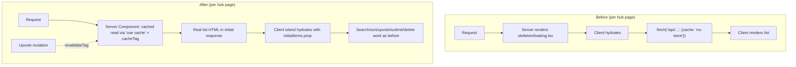
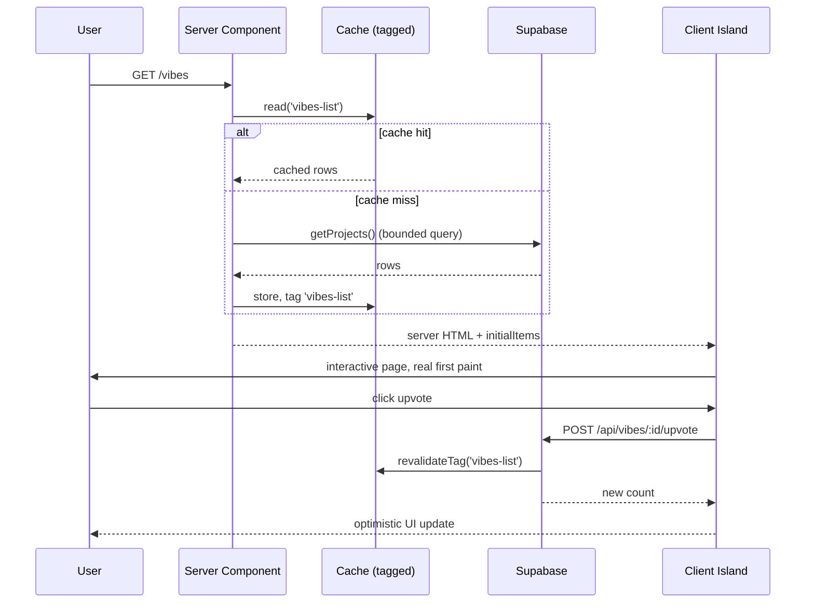

# feat: Site-wide performance, SEO, and UX optimization pass

## Summary

vibetrends.dk's primary content hubs (`/vibes`, `/skills`, `/forum`, and the `AgentsExplorer`-backed `/cli`, `/mcp`, `/agents`) are fully client-rendered: they ship empty/skeleton HTML and fetch their list data in a `useEffect` after hydration. Combined with zero use of Next.js 16's Cache Components (`"use cache"` is enabled in `next.config.ts` but used nowhere in `src/`), every page — hub, detail, and `sitemap.xml` — re-runs its Supabase queries on every single request, several of which fetch entire tables (`select('*')`, no `.limit()`) and filter in JavaScript instead of SQL. This plan closes those gaps: server-render hub page content for real first paint and crawlability, cache the read paths Cache Components was turned on for for exactly this, and stop the full-table fetches. A prior SEO plan (`docs/plans/2026-06-24-002-feat-seo-discoverability-improvements-plan.md`) already shipped structured data, breadcrumbs, and sitemap tiering, and explicitly deferred "Performance/Core Web Vitals" — this plan is that follow-up, not a repeat.

## Problem Frame

Three compounding issues, confirmed by direct code inspection (see origin: repo research, this session):

1. **Hub pages render empty for crawlers and first paint.** `/vibes`, `/skills`, `/forum` are `"use client"` top to bottom; `AgentsExplorer.tsx` (backing `/cli`, `/mcp`, `/agents`) is the same. All fetch their list via `fetch(..., { cache: "no-store" })` inside `useEffect`. Googlebot and any AI-agent crawler (this site explicitly serves agent-discovery files — `public/ai.txt`, `public/capability.json`, etc. — so agent crawlability is a stated product goal, not incidental) sees skeleton markup, not content. Real users see skeleton → hydrate → fetch → render instead of content on arrival.
2. **No caching despite Cache Components being on.** `cacheComponents: true` is set in `next.config.ts`, but `grep -rln "use cache" src/` returns nothing. Every detail page, the homepage, and `sitemap.ts` re-run their Supabase reads on every request/crawl.
3. **Over-fetching in the query layer.** `getSkills`, `getProjects`, `getAgents` (`src/lib/db.ts`) run `select('*')` over the entire table with no `.limit()`, then filter by search term in JavaScript after the fetch. This gets more expensive as tables grow and defeats any future pagination.

## Scope Boundaries

**In scope:**
- Server-rendering the six client-only hub surfaces so first paint and crawlers see real content, while preserving all existing interactivity (search, sort, upvote, submit, delete, login gating)
- Applying `"use cache"` / `cacheLife` / `cacheTag` to read paths (detail pages, hub initial data, sitemap) per the Next.js 16 Cache Components model
- Pushing search filtering from JS to SQL and removing unbounded `select('*')` fetches in `src/lib/db.ts`
- Keeping upvote counts correct after this change (tagged revalidation on mutation, not stale shared-cache — see Key Technical Decisions and the [[supabase-migration-access]]-adjacent learning below)
- Reducing upvote mutation round-trips from 2-3 sequential Supabase calls to 1
- Adding Core Web Vitals visibility (`@vercel/speed-insights`, not currently installed)

**Out of scope / non-goals:**
- Re-doing SEO work already shipped by `docs/plans/2026-06-24-002-feat-seo-discoverability-improvements-plan.md` (structured data, breadcrumbs, tiered sitemap priorities, hub static metadata) — this plan only touches what that plan explicitly deferred
- hreflang / URL-based locale routing — documented as an intentional deferral in the prior SEO plan; the cookie-based DA/EN toggle is unchanged here
- Visual redesign or new features — this is a rendering-strategy, caching, and query-efficiency pass, not a UX redesign
- Database schema/index changes beyond what U1 requires (a single trigram/GIN index migration if search-in-SQL needs it) — no broader schema work

### Deferred to Follow-Up Work
- Formalizing a `docs/solutions/` learnings directory (surfaced by this session's learnings research — the repo currently has no structured learnings store, only commit messages and completed plans)
- `AgentDetailView.tsx`'s duplicate client-side JSON-LD (flagged as a leftover in the prior SEO plan's "Deferred to Follow-Up Work") and static metadata for the `/agents` hub
- Pagination UI for hub lists (this plan bounds queries server-side but does not add infinite-scroll/pagination controls)

## Key Technical Decisions

**KTD1 — Server shell + client island, not full SSR.** Each hub page becomes a server component that fetches the initial list (cached) and renders real markup, wrapping a client component that receives that list as `initialItems` props and owns search/sort/upvote/submit/delete interactivity exactly as today. This preserves 100% of existing client behavior (modals, honeypot, optimistic upvote UI, github-meta prefill) while fixing first paint and crawlability. Rationale: a full server-rendered-only page would lose interactive upvote/submit/delete without a much larger rewrite; the shell+island split is the standard Next.js pattern for "SEO-critical list, client-heavy interactions."

**This split introduces three async states that must be specified consistently across U4-U7, not reinvented per unit:** (1) *cache-miss fallback* — a cache-miss on the server read blocks the SSR response on the Supabase call; each hub keeps its existing `loading.tsx` as the Suspense fallback for this case (streamed in, not a client-side skeleton-then-fetch) rather than leaving the response to hang with no visual feedback; (2) *in-flight sort/category refetch* — when a post-mount client refetch is triggered (sort tab, category switch), the previously-rendered list stays visible with a non-blocking loading affordance (e.g., a subtle opacity/spinner treatment on the existing grid) rather than being replaced by a full skeleton, matching how the current client-only implementation already behaves during its fetch; (3) *optimistic upvote failure* — if the upvote request fails (network error or non-2xx response) after the optimistic count increment, the client island must roll the displayed count back to its pre-click value and surface the failure the same way `handleUpvote`'s existing catch block does today (console error, no silent permanent miscount). Each of U4-U7 references this paragraph rather than re-deciding these states independently.

**KTD2 — Cache read paths with `cacheTag`, invalidate on write with `revalidateTag`, called without a profile argument.** `docs/plans/.../fix-upvotes` history (commits `e224ec4`, `0db6f62`) shows this codebase already got burned once by a *shared* cache (Vercel edge, `Cache-Control: public, max-age=N`) serving stale vote counts to a user who just voted and reloaded. That was an HTTP-cache-header bug on API routes, not a Cache Components bug — `"use cache"` operates at the data/render layer, not as an HTTP response header, so this is not simply "the same bug happening again." But the failure mode is the same shape: a reader seeing a cached count during the request-scoped or timed cache window right after a mutation. Mitigation: tag every cached read function with a `cacheTag` keyed to the entity type (e.g., `cacheTag('skills-list')`), and call `revalidateTag('skills-list')` from the corresponding `upvote*`/create/delete mutation in `src/lib/db.ts` so a vote invalidates the cache immediately rather than waiting out a TTL.

**`revalidateTag` must be called without a profile argument.** Per `node_modules/next/dist/docs/01-app/01-getting-started/09-revalidating.md`, `revalidateTag(tag, profile)` with a profile (the docs' own "Recommended" example uses `'max'`) defaults to stale-while-revalidate — it serves the stale cached value immediately and refreshes in the background, which would silently reintroduce the exact stale-upvote-count bug this KTD exists to prevent. Only `revalidateTag(tag)` with **no** second argument (documented as "legacy behavior, equivalent to `updateTag`") invalidates immediately. `updateTag` itself is Server-Actions-only and unusable here since the upvote mutations are Route Handlers. Every `revalidateTag` call this plan introduces must omit the profile argument — call this out explicitly in code review, since it is easy to "helpfully" add one while skimming the docs.

**The correctness guarantee is "revalidated on write," not "never stale."** A `cacheLife` TTL is not layered on top of tagged revalidation as a second line of defense — doing so would mean the system falls back to serving stale counts for up to the TTL window whenever tag invalidation is delayed or races a concurrent read (see Risks & Dependencies), which contradicts "counts must never appear stale after a user's own vote." List/detail reads backing upvote counts get `cacheTag`-only invalidation (effectively `cacheLife('max')`, refreshed exclusively via `revalidateTag`) — no independent short TTL. A short `cacheLife` TTL is acceptable only on reads with no correctness stake (e.g., `sitemap.ts` in U3).

**Cache-tag scoping must cover every cached variant, not just the default.** If a read is cached under a variant-specific tag (e.g., `cacheTag(`skills-list:${category}:${search}`)` for a filtered/sorted view), the entity must *also* carry the entity-wide tag (e.g., `cacheTag('skills-list')`) so a single `revalidateTag('skills-list')` call on mutation invalidates all cached variants, not just the one tagged with that exact string — Next's tag matching is exact-string, not prefix-based. Every cached read gets both tags; every mutation revalidates only the broad entity-wide tag.

**KTD3 — Push search to Postgres via `.or()` + `ilike` across both language columns, with the search term escaped before interpolation.** `getSkills`/`getProjects`/`getAgents` map `title_da`/`title_en` (etc.) to a single localized field in JS after fetch; there's no single `title` column to `ilike` against in SQL. Search must match `.or('title_da.ilike.%q%,title_en.ilike.%q%,description_da.ilike.%q%,description_en.ilike.%q%')` (adjusted per table) rather than assuming one column.

**The search term must be escaped before it is embedded in the `.or()` filter string.** This codebase has zero prior usage of Supabase's `.or()` filter-string builder (confirmed via `grep -rn "\.or(" src/`) — today's search is a pure client-side `.includes()` filter, so arbitrary user input is inert. Once search moves into a raw PostgREST filter string, characters with syntactic meaning in PostgREST's filter grammar (`,`, `.`, `(`, `)`, `%`, `*`) become attacker-controlled: an input containing those characters can break out of the intended `ilike` clause and redefine the filter structure, at minimum causing errors that leak schema/query details. Escape (or reject) `,`, `.`, `(`, `)`, and `*` in the raw search term before building the `.or()` string, or use a helper that guarantees the term can only ever populate the `ilike` pattern position. U1 must include a test asserting that a search term containing those characters neither errors nor widens/narrows the filter beyond the literal string match.

**Tag/array-field search does not use `.contains()`/`.overlaps()` — those don't replicate current substring-match behavior.** Today's JS filter does substring matching within tag strings (`tags.some(t => t.toLowerCase().includes(q))` — e.g., searching "code" matches a tag like "vibe-coding"). PostgREST's `.contains()`/`.overlaps()` map to Postgres array operators (`@>`/`&&`), which test exact-element containment, not substring matching within an element — porting to those operators would silently narrow matches for any term that today matches via a partial tag string. If SQL-side substring matching across an array column is needed, this requires a different construct (e.g., unnesting the array or a text-search approach) — investigate during implementation and treat "identical match behavior to today" as the acceptance bar. If baseline `ilike` performance on the current table sizes is acceptable (verify during implementation), no new index is needed; if not, add a `pg_trgm` GIN index migration following the existing idempotent-migration convention in `AGENTS.md`.

**KTD4 — `unstable_instant` stays scoped to its current seven detail routes for now.** It's already used on `agents/[id]`, `mcp/[id]`, `blog/[id]`, `forum/[id]`, `vibes/[id]`, `skills/topic/[slug]`, and `skills/[id]` (not just `vibes/[id]` as initially assessed — corrected per feasibility review). Expanding it to the new server-rendered hub pages is a plausible future win but not required to fix the identified problems, and each addition needs its own verification. Left as a Deferred item, not folded into this plan's units.

**Every detail page using `unstable_instant` establishes a `lang`-via-cookie pattern the new hub server components must also follow.** Each of those seven routes reads the `vibe_lang` cookie inside a component nested in its own `<Suspense>` boundary, separate from the outer route Suspense — required because `cookies()` is a dynamic API under Cache Components, and a cached parent component cannot itself call `cookies()`. U4-U7's server components need `lang` for every `getProjects`/`getSkills`/`getAgents`/`getThreads` call (all three tables are bilingual); they must follow this same nested-Suspense-plus-cookie-read pattern, not read `cookies()` directly in the cached data-fetch path, or the page will always render Danish content regardless of the visitor's language cookie.

## Requirements Traceability

| Area | Requirement | Addressed by |
|---|---|---|
| SEO / crawlability | Hub pages must render real list content in server HTML, not skeletons | U4, U5, U6, U7 |
| Performance | Read paths must use Next.js 16 Cache Components caching, not re-query per request | U2, U3 |
| Performance | Query layer must not fetch entire tables for search/list operations | U1 |
| Correctness | Upvote counts must be revalidated immediately on write, not served stale from a TTL window, after a user's own vote (regression risk from KTD2) | U2 (tag design), test scenarios in U4-U7 |
| Performance | Upvote mutations should not require 2-3 sequential round-trips | U8 |
| Observability | Core Web Vitals must be measurable going forward to catch regressions (no pre-change baseline is captured — U9 lands after U1-U8, so it verifies future state, not before/after impact) | U9 |

---

## High-Level Technical Design





---

## Implementation Units

### U1. Push search to SQL and bound list queries in `src/lib/db.ts`

**Goal:** Remove `select('*')` + JS-filter pattern from `getSkills`, `getProjects`, `getAgents` (and by extension `getCli`); replace with SQL-side `.or()`/`ilike` search and explicit column selection.

**Requirements:** Performance — query layer must not fetch entire tables (see Requirements Traceability)

**Dependencies:** None — foundational unit, must land before U2 (caching wraps these functions) and U4-U7 (server components call these functions directly).

**Files:**
- `src/lib/db.ts` (modify `getSkills`, `getProjects`, `getAgents`)
- `supabase/migrations/<timestamp>_search_trigram_indexes.sql` (new — only if KTD3's baseline-performance check shows `ilike` needs index support; idempotent per `AGENTS.md` convention)
- `src/lib/db.test.ts` or equivalent (new/modify — check for existing test file first)

**Approach:** Per KTD3, replace the `list.filter(...)` post-fetch block with a conditional `.or(...)` clause built from the same fields currently checked in JS (title in both languages, description in both languages, tags/tools array). Keep the `category`/`view`/`sort` branching logic unchanged — only the search and full-table-fetch behavior changes. Select explicit columns instead of `select('*')` where the mapped type doesn't need every column (verify against `SkillRow`/`ShowcaseRow`/`AgentRow` types before narrowing, since removing a column the mapper needs would silently break the UI).

**Patterns to follow:** `getCounts()` (`src/lib/db.ts:899`) already demonstrates minimal-fetch (`head: true, count: 'exact'`) as the established "don't over-fetch" convention in this file. `getThreads()`'s `.in('thread_id', threadIds)` batching (this session's learnings research, commit `16535c7`) is the existing "scope the query, don't fetch everything" precedent to extend here.

**Test scenarios:**
- Searching `getSkills("react")` returns skills matching in either `title_da`/`title_en`/`description_da`/`description_en`/`tags`, same result set as the current JS-filter behavior for a fixed fixture set
- Search is case-insensitive (matches current `.toLowerCase()` behavior)
- Empty search string returns the full (bounded) list, unchanged from current behavior
- Category + search combined (`getSkills("agent", "productivity")`) narrows correctly on both dimensions
- A search term matching zero rows returns `[]`, not an error
- A search term containing PostgREST filter-syntax characters (`,`, `.`, `(`, `)`, `*`) — e.g. `x),category.eq.Hidden,title_da.ilike.%(` — does not error and does not widen or redefine the filter beyond a literal (escaped) substring match against the intended columns (Covers the filter-injection risk in KTD3)
- A tag search matching via substring within a tag string (e.g. searching "code" matches a tag "vibe-coding") behaves identically to today's JS `.includes()` match, not narrowed to exact-element matching
- `getProjects`/`getAgents` mirror the same scenarios for their respective search fields

**Verification:** Existing hub-page search UI (once wired through U4-U7) returns identical result sets to today's JS-filtered behavior for a representative set of manual search terms; no full-table `select('*')` remains in these three functions (`grep -n "select('\*')" src/lib/db.ts` shows only functions that legitimately need every column, e.g. single-row `getSkillById`).

---

### U2. Add `"use cache"` + tagged revalidation to read functions

**Goal:** Wrap the read functions hub/detail pages depend on with Next.js 16 Cache Components caching (`"use cache"`, `cacheLife`, `cacheTag`), and wire `revalidateTag` into every corresponding mutation so votes/submissions/deletes invalidate immediately.

**Requirements:** Performance (Cache Components read-path caching), Correctness (no stale upvote counts — KTD2)

**Dependencies:** U1 (caching should wrap the already-corrected query functions, not the old over-fetching versions)

**Files:**
- `src/lib/db.ts` (add `"use cache"` directive + `cacheLife`/`cacheTag` to `getSkills`, `getProjects`, `getAgents`, `getCli`, `getSkillById`, `getProjectById`, `getAgentById`, `getThreads`, `getThreadById`, `getBlogPosts`, `getBlogPostById`; add `revalidateTag` calls to `upvoteSkill`, `upvoteProject`, `upvoteAgent`, `upvoteThread`, `upvoteReply`, and any create/delete functions for these entities)
- `node_modules/next/dist/docs/01-app/01-getting-started/08-caching.md` (reference only — read before implementing, per AGENTS.md)

**Approach:** Per KTD2, each cached read function gets both a variant-specific `cacheTag` (scoped to the exact query shape, e.g. category+search) and the broad entity-wide `cacheTag` (e.g., `'skills-list'`), plus `'skill-{id}'` for detail reads. No independent `cacheLife` TTL on these — revalidation is tag-only (see KTD2). Every mutation for that entity calls `revalidateTag` with **no profile argument** against the broad entity-wide tag(s) only (e.g., upvoting a skill invalidates `'skills-list'` and `'skill-{id}'`, which is sufficient because every variant-specific cache entry also carries the broad tag). Do not apply `"use cache"` to `getCounts`, `getTopProjects`, `getTopSkills`, `getTopAgents`, `getLatestPosts` in this unit unless verification shows they're safe — the homepage's `Promise.all` fetch of these is already narrow (per this session's learnings research, `da393a7`); confirm caching them doesn't reintroduce staleness before including them, and defer if uncertain.

**Technical design:**
```
// directional — not literal implementation
"use cache"
cacheTag('skills-list', `skills-list:${category ?? 'all'}:${search ?? ''}`)
... existing query logic from U1 ...

// in upvoteSkill, after successful mutation:
revalidateTag('skills-list') // no profile arg — immediate invalidation, not stale-while-revalidate
revalidateTag(`skill-${id}`)
```

**Patterns to follow:** None yet established in this codebase (confirmed zero `"use cache"` usage) — this unit sets the pattern others should follow. Read the Cache Components doc directly rather than assuming standard Next.js 15 `revalidate`/`fetch`-cache semantics, per `AGENTS.md`.

**Test scenarios:**
- After upvoting a skill, immediately re-fetching the skills list (server-side) reflects the new count — no stale cached read (Covers the correctness requirement in Requirements Traceability)
- After upvoting, the detail page for that entity also reflects the new count
- Two consecutive requests for the same uncached list within the cache window return consistent data (cache is actually being hit, not silently bypassed)
- Submitting a new project (`/vibes` submit flow) causes the next list read to include it (create-path revalidation, not just upvote-path)
- Deleting a project causes the next list read to exclude it
- Upvoting from a **filtered/sorted view** (e.g., a category-filtered or searched skills list, not just the default unfiltered list) reflects the new count on the next read of that same filtered view — this specifically catches a tag-scoping bug where only the default variant gets invalidated

**Verification:** Manual upvote-then-reload test on each of the six entity types shows the new count immediately, matching the guarantee the prior `no-store` HTTP-header fix (commit `e224ec4`) established — this unit must not regress that fix's outcome even though it operates at a different cache layer. **This verification must run against a deployed Vercel preview environment, not local `next dev` alone** — both prior stale-count bugs (`0db6f62`, `e224ec4`) were only reproducible against Vercel's actual distributed edge/runtime and were invisible locally; local dev does not replicate the conditions that produced them.

---

### U3. Cache `sitemap.ts` generation

**Goal:** Stop `sitemap.ts`'s six parallel full-table Supabase queries from re-running on every crawler hit.

**Requirements:** Performance (Cache Components read-path caching)

**Dependencies:** U1, U2 (reuses the same cached read functions)

**Files:**
- `src/app/sitemap.ts`

**Approach:** Wrap the sitemap-generation function body with `"use cache"` and a `cacheLife` profile appropriate for crawl frequency (e.g., `hours`, not `minutes` — sitemap freshness is far less time-sensitive than upvote counts). Sitemap entries don't need per-vote revalidation; a periodic TTL is sufficient here, unlike U2's write-triggered invalidation.

**Test scenarios:**
- `sitemap.ts` output includes all six entity types with correct URLs, same as current behavior
- Repeated calls within the cache window do not issue new Supabase queries (verify via query count or cache-hit logging during manual testing)

**Verification:** `/sitemap.xml` returns the same entity set as before this change; response time for a second request within the cache window is measurably faster than the first.

---

### U4. Server-render `/vibes` with a client interactive island

**Goal:** `/vibes` renders its project list in server HTML on first response; all existing interactivity (search, sort, upvote, submit, delete, login-gating, GitHub-meta prefill) continues to work identically.

**Requirements:** SEO/crawlability (hub pages must render real content — see Requirements Traceability)

**Dependencies:** U1, U2 (needs the cached, SQL-search-capable `getProjects`)

**Files:**
- `src/app/vibes/page.tsx` (convert to server component: cached data fetch, renders header + initial grid, wraps client island)
- `src/app/vibes/VibesExplorer.tsx` (new — client component holding today's `page.tsx` state/interactivity, renamed and refactored to accept `initialProjects` prop)
- `src/app/vibes/loading.tsx` (verify still meaningful now that initial data is server-fetched; likely only shown on slow cache-miss, not on every load)

**Approach:** Per KTD1. The server component (`page.tsx`) calls the cached `getProjects()` (respecting `sort` from `searchParams` where applicable) and passes the result as `initialProjects` to the new client component, which owns everything currently in `page.tsx`: search-as-you-type filtering (client-side, on `initialProjects`, same as today's `filteredProjects` logic), sort-tab switching (may require a client-side re-fetch via the existing `/api/vibes` route when `sort` changes post-mount, matching current behavior), upvote/submit/delete handlers, the submit modal, honeypot field, and GitHub-meta prefill. The `jsonLd` block moves to the server component so crawlers see it without relying on client hydration (currently it's built from `filteredProjects` client state, which starts empty — this was a real SEO gap per this session's research).

**Patterns to follow:** `LoginModal`'s `next/dynamic(..., { ssr: false })` lazy-load pattern already used in this file — keep it in the new client component. `AgentDetailView`/detail-page split of server `generateMetadata` + client interactivity (used across detail pages) is the closest existing precedent for a server/client split in this codebase, even though those aren't list pages.

**Test scenarios:**
- Server-rendered HTML (view-source or SSR test) contains the project titles/descriptions for the initial (unsorted/unsearched) list — Covers the SEO/crawlability requirement
- JSON-LD `ItemList` in the initial server response includes all initially-rendered projects, not an empty list
- Client-side search filters the already-rendered list without a network request (matches current behavior)
- Sort-tab switching still fetches and re-renders correctly (matches current `/api/vibes?sort=` behavior)
- Upvote click updates the count optimistically and persists after reload (regression check against U2's cache-correctness requirement)
- Submit modal flow (honeypot present, GitHub prefill on blur, success state, new project appended to list) works identically to pre-change behavior
- Delete flow (author-only visibility, confirm dialog, removal from list) works identically
- Logged-out user clicking upvote or submit sees the login modal, not a silent failure
- Empty state (`showcase.empty`/`showcase.empty_sub`) still renders when a search yields no results

**Verification:** `curl` or view-source on `/vibes` (no JS execution) shows real project cards in the HTML, not a skeleton; existing Playwright e2e coverage for the showcase page (check `e2e/` or equivalent for existing specs) passes unmodified or with only prop/selector adjustments, not behavioral changes.

---

### U5. Server-render `/skills` with a client interactive island

**Goal:** Same outcome as U4, applied to `/skills`.

**Requirements:** SEO/crawlability

**Dependencies:** U1, U2, and ideally sequenced after U4 (reuse the shell/island pattern established there)

**Files:**
- `src/app/skills/page.tsx` (convert to server component)
- `src/app/skills/SkillsExplorer.tsx` (new — client island, mirroring `VibesExplorer.tsx`'s shape)
- `src/app/skills/loading.tsx` (verify)

**Approach:** Mirror U4's approach exactly, adapted to `/skills`' specific fields (category filter, `view` parameter for Danish/hot/trending boards per `getSkills`' `view` argument, rating display). Read `src/app/skills/page.tsx` at implementation time for the current interactivity list — this plan does not enumerate skills-specific UI beyond what U4 already establishes as the pattern.

**Patterns to follow:** `VibesExplorer.tsx` from U4 — this is the second application of the same shell+island pattern, so structural decisions made in U4 should be reused, not re-litigated.

**Test scenarios:** Same category-by-category coverage as U4 (server HTML contains initial list, JSON-LD populated server-side, client search/filter/upvote/category-switch/view-switch work identically, empty state renders, logged-out gating works) adapted to skills-specific interactions (category filter, `view` parameter, rating display if interactive).

**Verification:** Same as U4, applied to `/skills`.

---

### U6. Server-render `/forum` with a client interactive island

**Goal:** Same outcome as U4/U5, applied to `/forum`.

**Requirements:** SEO/crawlability

**Dependencies:** U1, U2, sequenced after U4

**Files:**
- `src/app/forum/page.tsx` (convert to server component — note `forum/layout.tsx` already supplies static `entityMetadata`, so this unit only changes the list-body rendering, not metadata)
- `src/app/forum/ForumExplorer.tsx` (new — client island)
- `src/app/forum/loading.tsx` (verify)

**Approach:** Mirror U4's approach, adapted to forum threads (category filter, sort `top`/`new`, reply counts via `getThreads`' existing batched reply fetch). `DiscussionForumPosting` JSON-LD (already implemented per the prior SEO plan) should now populate from server-fetched data rather than any client-state gap, if one currently exists — verify during implementation whether forum's JSON-LD already runs server-side (the layout's static metadata suggests partial server-side setup already).

**Patterns to follow:** `VibesExplorer.tsx` / `SkillsExplorer.tsx`.

**Test scenarios:** Same shape as U4/U5 — server HTML contains initial thread list, JSON-LD populated server-side, client search/category/sort/upvote work identically, logged-out gating works, reply counts render correctly from the batched fetch. **Empty state:** if `/forum` currently has no dedicated empty state (verify at implementation start — flagged as unconfirmed by this session's research), add one matching the pattern already established on `/vibes` (`showcase.empty`/`showcase.empty_sub` — icon, primary message, secondary hint) rather than shipping this unit with a blank result silently falling through; this is a decision, not a follow-up question.

**Verification:** Same as U4/U5, applied to `/forum`.

---

### U7. Server-render `AgentsExplorer`-backed hubs (`/cli`, `/mcp`, `/agents`)

**Goal:** Same SEO/crawlability outcome as U4-U6, applied to the shared `AgentsExplorer.tsx` component that backs three routes.

**Requirements:** SEO/crawlability

**Dependencies:** U1, U2, sequenced after U4 (largest/most complex of the four hub conversions since one component serves three routes with different category filters)

**Files:**
- `src/app/components/AgentsExplorer.tsx` (convert to accept `initialItems` prop; interactivity logic stays, initial-fetch `useEffect` removed)
- `src/app/cli/page.tsx`, `src/app/mcp/page.tsx`, `src/app/agents/page.tsx` (each becomes the server-side data-fetch call site, passing category-appropriate `initialItems` to `AgentsExplorer`)

**Approach:** Because three routes share one client component, the server/client split here differs slightly from U4-U6: each route's `page.tsx` (already a server shell wrapping `AgentsExplorer` per current research) fetches its own category-scoped cached data (`getCli()`, `getAgents(undefined, 'MCP Server')`, `getAgents()`) and passes it as `initialItems` to `AgentsExplorer`, which stops doing its own client-side initial fetch but keeps all other interactivity (search, category switch within `/agents`, upvote) unchanged. Verify `/agents`' category-switching behavior (switching between agent categories client-side) still works when the initial data is server-scoped to the default category — this may require the client component to still support re-fetching on category change, same as sort-tab switching in U4.

**Patterns to follow:** `VibesExplorer.tsx` (U4) for the initialItems-prop pattern; existing `AgentsExplorer.tsx` structure for what interactivity must be preserved.

**Test scenarios:**
- `/cli`, `/mcp`, `/agents` each show real server-rendered content on first response, scoped to the correct category for that route
- Category-switching within `/agents` (if present today) still works, re-fetching via the existing API route
- Search/upvote/login-gating behavior identical to pre-change across all three routes
- `AgentDetailView.tsx`'s known duplicate client-side JSON-LD issue (flagged in the prior SEO plan's deferred items) is not touched or expanded by this unit — stays out of scope per Scope Boundaries

**Verification:** Same view-source/crawler-visibility check as U4-U6, run against all three routes.

---

### U8. Reduce upvote mutation round-trips

**Goal:** Cut `upvoteSkill`/`upvoteProject`/`upvoteAgent`/`upvoteThread`/`upvoteReply` from 2-3 sequential Supabase calls to 1 by returning the updated count directly from the insert/RPC instead of a separate re-select.

**Requirements:** Performance (upvote round-trip reduction — see Requirements Traceability)

**Dependencies:** U2 (must coordinate with the new `revalidateTag` calls added there — this unit changes the same functions)

**Files:**
- `src/lib/db.ts` (modify `upvoteSkill`, `upvoteProject`, `upvoteAgent`, `upvoteThread`, `upvoteReply` to call a new RPC instead of insert/delete + re-select)
- `supabase/migrations/<timestamp>_upvote_toggle_rpc.sql` (new — one RPC per entity or a shared parameterized RPC, mirroring `20260706000000_admin_multi_upvote.sql`'s `UPDATE ... RETURNING` pattern; idempotent per `AGENTS.md` convention)

**Approach:** The `upvotes` counter lives on the parent table (`skills.upvotes`, `vibes.upvotes`, etc.), maintained by an `AFTER INSERT`/`AFTER DELETE` trigger on the separate `*_upvotes` join table (`supabase/migrations/20260706010000_skill_upvotes.sql` and the equivalent for vibes/threads/agents). Because the count lives on a different table than the one being inserted/deleted, `.insert(...).select()` on the join table **cannot** return the parent table's updated count — it can only return columns from the join table itself. Getting the count in one round-trip requires a new RPC that performs the insert-or-toggle-delete and returns the resulting count in a single `UPDATE ... RETURNING` (or equivalent), mirroring the existing `adminBumpUpvotes` pattern (`supabase/migrations/20260706000000_admin_multi_upvote.sql`), which already does exactly this for the admin path. Do not use a client-computed "known pre-delete value minus one" for the toggle-off count — that is a read-modify-write race under concurrent upvotes (the same class of bug this plan works to avoid at the read layer in U2), and it also cannot be verified against this unit's own required concurrency test scenario below. Verify the admin multi-upvote RPC path (`adminBumpUpvotes`) is unaffected by this change (research confirmed it already returns a count directly via `adminCount !== null`) — only the non-admin insert/delete path needs the new RPC.

**Test scenarios:**
- Upvoting an entity for the first time returns the correct incremented count in a single round-trip (verify via network/query call count, not just correctness)
- Un-upvoting (toggle-off delete) returns the correct decremented count
- The admin multi-upvote RPC path is unaffected (still returns a count directly, as it does today)
- Concurrent upvotes from two different users on the same entity both land correctly (no lost update from the round-trip change)

**Verification:** Query-count instrumentation or manual Supabase logging shows one round-trip per upvote action instead of two-to-three; upvote counts remain accurate under the existing test coverage for this behavior.

---

### U9. Add Core Web Vitals monitoring

**Goal:** Install and wire up `@vercel/speed-insights` so this plan's performance impact (and future regressions) is measurable in production.

**Requirements:** Observability (Core Web Vitals visibility — see Requirements Traceability)

**Dependencies:** None — independent of the other units, can land anytime, but sequenced last since it's the verification tool for everything above.

**Files:**
- `package.json` (add `@vercel/speed-insights` dependency)
- `src/app/layout.tsx` (mount `<SpeedInsights />` alongside the existing `<Analytics />` from `@vercel/analytics`)
- `next.config.ts` (verify CSP `securityHeaders` `scriptSrc`/`connect-src` allow the Speed Insights script — per this session's research, CSP is hand-maintained here and silently blocks unlisted script sources)

**Test expectation:** none -- this is a monitoring/instrumentation addition with no application behavior to test; verification is that the script loads without CSP violations and reports data in the Vercel dashboard post-deploy.

**Verification:** After deploying to a preview environment, confirm no CSP violation errors in the browser console related to the Speed Insights script, and that the Vercel project dashboard begins showing Web Vitals data.

---

## Risks & Dependencies

- **Highest risk: reintroducing stale upvote counts.** This codebase already shipped two fixes for this exact failure mode (commits `0db6f62`, `e224ec4`). U2's `cacheTag`/`revalidateTag` design is the mitigation, but it operates at a different layer (Cache Components data cache) than the previous fixes (HTTP `Cache-Control` headers on API routes) — the two layers are independent and this plan must not assume the earlier fix's `no-store` headers protect against a new caching bug introduced at the data layer. Each of U4-U7's test scenarios includes an explicit upvote-then-reload check for this reason.
- **Cache Components is an unfamiliar API surface in this codebase** (zero prior usage). U2 is the highest-uncertainty unit; budget time to read `node_modules/next/dist/docs/01-app/01-getting-started/08-caching.md` thoroughly before implementing, per `AGENTS.md`'s explicit instruction.
- **U4-U7 are the largest surface-area change** (4 client components refactored, all existing interactive behavior must be preserved exactly). Sequencing U4 first and reusing its established pattern for U5-U7 reduces risk of divergent approaches, but each still needs its own full test pass — behavior parity bugs (a broken modal, a lost search debounce) are easy to introduce silently in a refactor this size.
- **No existing Lighthouse CI or bundle-analyzer** — this plan's performance claims (faster first paint, fewer full-table queries) are verified via manual/Playwright checks and the new Web Vitals monitoring (U9), not an automated performance regression gate. A future follow-up could add one, but that's out of scope here.
- **U8 and U2 modify the same upvote functions concurrently.** If upvote behavior misbehaves post-deploy, having both the cache-invalidation change (U2) and the round-trip/RPC change (U8) land close together on the same functions makes it harder to isolate which change caused a regression. Land and verify U2 in production first; treat U8 as a separable follow-on commit even though both are part of this plan, so a revert of one doesn't require reverting the other.

## Sources & Research

- Repo research (this session): rendering-strategy audit of all hub/detail pages, `src/lib/db.ts` query patterns, Cache Components confirmation via `node_modules/next/dist/docs/`, existing SEO/tooling inventory
- Institutional learnings (this session): commit history for the upvote-caching bug (`0db6f62`, `e224ec4`) and query-scoping fixes (`da393a7`, `16535c7`); confirmed no `docs/solutions/` directory exists in this repo
- `docs/plans/2026-06-24-002-feat-seo-discoverability-improvements-plan.md` — origin for what's already shipped and what this plan explicitly follows up on (Performance/Core Web Vitals, explicitly deferred there)
- `AGENTS.md` (repo root) — Next.js 16 API-difference warning and DB migration procedure, both directly applicable to U1's optional index migration and U2's caching model
- Multi-persona doc review (this session): security-lens flagged the KTD3 filter-injection risk; feasibility-reviewer verified against `supabase/migrations/` that U8's original mechanism couldn't work given the trigger-based upvote-count schema, corrected KTD4's `unstable_instant` usage count, and flagged the `revalidateTag` profile-argument footgun against `node_modules/next/dist/docs/01-app/01-getting-started/09-revalidating.md`; adversarial-reviewer flagged the KTD2 TTL/"never stale" contradiction and the cache-tag scoping gap in the original technical-design snippet; design-lens flagged the unspecified async states (cache-miss, in-flight refetch, upvote-failure rollback) and the forum empty-state ambiguity
