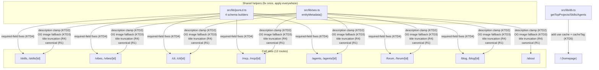

# fix: Resolve Ahrefs Site Audit SEO issues

**Type:** fix
**Depth:** Standard
**Target repo:** vibetrends-dk

---

## Summary

An Ahrefs Site Audit (9 Jul 2026, health score 99/Excellent, 3 errors / 125 warnings / 272 notices) flagged seven fixable on-page SEO defects: 3 non-canonical pages listed in the sitemap, 98 meta descriptions too short and 11 too long, 7 slow-loading pages, 5 pages with incomplete Open Graph tags, 3 internal links pointing at redirected URLs, 1 page title too long, and 32 pages with structured-data (JSON-LD) validation errors for Google rich results. The Ahrefs export does not list the affected URLs (only counts), so root causes were traced directly in the codebase. Six of the seven issues have a confirmed, fixable root cause; the internal-redirect-link issue could not be pinned to a specific in-repo link and is carried as an open question rather than an invented fix.

Out of scope per explicit instruction: "Pages to submit to IndexNow" (148, informational, not a code defect) and "Page has only one dofollow incoming internal link" (65, requires a broader internal-linking strategy).

## Problem Frame

vibetrends.dk (Next.js 16, App Router, Vercel, Supabase) serves ~14 route groups (skills, vibes, forum, blog, cli, mcp, agents, about) through a shared metadata helper (`src/lib/seo.ts`) and a shared JSON-LD helper (`src/lib/jsonLd.ts`). The Ahrefs audit surfaced defects that trace to three shared code paths plus a handful of isolated gaps:

- `entityMetadata()` (`src/lib/seo.ts`) passes DB-sourced descriptions straight through with no length handling, and only attaches an OG image when a caller explicitly passes one (no caller currently does for 5 list-level routes).
- Two routes (`blog/page.tsx`, `about/page.tsx`) return a bare `{ title, description }` from `generateMetadata()` instead of going through `entityMetadata()`, so they (along with `skills/page.tsx`, which has no metadata export at all) inherit the root layout's `canonical: "/"` — producing exactly the 3 non-canonical sitemap entries.
- Detail-page titles concatenate `entity.title` + a suffix + the root template's `" | vibetrends.dk"` with no length cap, occasionally exceeding 60 characters.
- `src/lib/jsonLd.ts`'s four schema builders (`articleJsonLd`, `softwareAppJsonLd`, `forumThreadJsonLd`, `skillsListJsonLd`) each omit one or more fields Google's rich-results validator expects or flags.
- Three homepage data-fetch functions (`getTopProjects`, `getTopSkills`, `getTopAgents` in `src/lib/db.ts`) are explicitly uncached, causing live Supabase round-trips on every homepage request.

## Requirements

- **R1**: Sitemap entries must not carry a conflicting canonical signal — every URL in `sitemap.ts` must resolve to a page whose `<link rel="canonical">` points at itself.
- **R2**: Meta descriptions must fall within 110–160 characters for all entity/list/detail pages that currently fall outside that range.
- **R3**: All list-level pages using `entityMetadata()` must emit a complete Open Graph object (title, type, image, url) with an absolute image URL.
- **R4**: Detail-page `<title>` (including the root template suffix) must not exceed ~60 characters.
- **R5**: JSON-LD structured data emitted by `articleJsonLd`, `softwareAppJsonLd`, `forumThreadJsonLd`, and `skillsListJsonLd` must satisfy Google's rich-results required-property set for each declared `@type`, or the declared type must be narrowed to one the page can actually satisfy.
- **R6**: The three uncached homepage data-fetch functions must be cached consistently with the rest of `db.ts`'s caching convention (`"use cache"` + `cacheLife` + `cacheTag`), without breaking the existing Suspense-per-route pattern ("KTD4") or the single-arg `revalidateTag` invalidation convention ("KTD2").
- **R7 (investigation only, no fix)**: Determine whether the 3 internal-link-to-redirect findings are reproducible from in-repo links; if not reproducible, document why and leave as an open question rather than guessing at a fix.

## Key Technical Decisions

**KTD1 — Fix at the shared helper, not per call-site.** `entityMetadata()` is used by 13 routes; `articleJsonLd`/`softwareAppJsonLd`/`forumThreadJsonLd`/`skillsListJsonLd` are each used by 1–4 routes. Description clamping, OG-image fallback, and title truncation belong inside `entityMetadata()` itself so all current and future callers get the fix automatically, rather than patching 13 call sites individually. JSON-LD fixes go into the four builder functions in `jsonLd.ts` for the same reason.

**KTD2 — Truncate long descriptions, don't invent short ones.** For the 11 pages with descriptions >160 chars, truncate to a sentence/word boundary under 160 chars (never mid-word, append no ellipsis inside the 160-char budget if avoidable). For the 98 pages with descriptions <110 chars, there is no reliable auto-generated replacement content — pad by appending a short, generic, on-brand suffix (e.g., context about vibetrends.dk) only when the raw description is non-empty and under 110 chars, so the result reads naturally rather than as a truncation artifact. Never fabricate factual claims about the entity.

**KTD3 — OG image fallback via a site-wide default image, not per-page images.** The 5 affected routes (`/cli`, `/mcp`, `/forum`, `/vibes`, `/agents` — all list pages, not detail pages) have no natural "image" to represent a list. Pass the existing `/images/og-default.jpg` (already used in `layout.tsx`'s root OG metadata) as the default `image` argument into `entityMetadata()` for these 5 calls, rather than generating 5 new `opengraph-image.tsx` files for pages with no obvious visual subject.

**KTD4 — Narrow `softwareAppJsonLd`'s `@type` claims rather than fabricate rating data.** The `offers.price` type mismatch (string `"0"` vs. numeric) is a straightforward type fix. The missing `aggregateRating`/`review` is not fixable by adding real data (no rating system exists for these entities) — per Google's guidelines, fabricating ratings risks a manual action. Fix: only emit `aggregateRating` when real review data exists (it currently doesn't for any entity type here), and drop the implicit "requires rating" `SoftwareApplication` risk by not including `offers` unless the app is actually monetized (all listed CLI/MCP/agent tools are free/community tools, so `offers` should be removed rather than kept with a wrong type).

**KTD5 — Cache the 3 uncached homepage functions using the existing convention, don't change the caching mechanism.** `db.ts` already has a documented KTD ("KTD2": single-arg `revalidateTag` for immediate invalidation — do not convert to the two-arg form) and a cache-tag convention (broad tag + variant tag on lists, single tag on detail rows). Apply the same `"use cache"` + `cacheLife('max')` + `cacheTag(...)` shape already used by `getProjectById`/`getAgentById`/`getSkillById` to `getTopProjects`/`getTopSkills`/`getTopAgents`, using a broad tag per list (e.g. `'top-projects'`) so any create/update path that already calls `revalidateTag` for the underlying entity type also invalidates these.

**KTD6 — Treat R7 as investigation, not implementation.** Repo research found no internal `<Link>`, nav component, or hardcoded href targeting any of the three known redirect sources (`www.vibetrends.dk`, `/tool-clis(/*)`, `/agents?category=MCP+Server`). Without the actual flagged URLs from the Ahrefs export, guessing at a code change risks a no-op fix. This unit documents the investigation and its (negative) result rather than inventing a change.

## High-Level Technical Design

## Scope Boundaries

**In scope:** the 6 fixable issues (R1–R6) plus the investigation for R7, all within `vibetrends-dk`.

**Explicitly out of scope (per user instruction):**
- "Pages to submit to IndexNow" (148) — informational notice, not a defect; no code change applies.
- "Page has only one dofollow incoming internal link" (65) — would require a broader internal-linking/content-strategy change, not a targeted bug fix.

### Deferred to Follow-Up Work
- Bilingual (`_da`/`_en`) canonical/hreflang strategy — noted as a pre-existing deferred item in `seo.ts`'s own doc comments; not part of this fix.
- Adding real user ratings/reviews to unlock `aggregateRating` in `softwareAppJsonLd` legitimately — would require building a ratings feature, out of scope here.
- Re-running Ahrefs Site Audit after this fix ships to confirm the 3 redirect-link findings clear or to get exact URLs if they persist (needed to close out R7 definitively).

## Open Questions

- **R7 / 3XX redirect on 3 internal links**: root cause not reproducible from in-repo code (see KTD6). Recommend re-exporting the Ahrefs "View affected URLs" list for this specific issue (the summary PDF only shows counts) and re-investigating with concrete URLs. This may also originate from Ahrefs's own external link graph (backlinks Ahrefs found elsewhere pointing at a vibetrends.dk redirect), which wouldn't be fixable in this repo at all.

---

## Implementation Units

### U1. Fix non-canonical sitemap pages

**Goal:** Every URL in `sitemap.ts` resolves to a page whose canonical tag points at itself, not at `/`.

**Requirements:** R1

**Dependencies:** none

**Files:**
- `src/app/skills/page.tsx` (add metadata export)
- `src/app/blog/page.tsx` (replace bare `{title, description}` return)
- `src/app/about/page.tsx` (replace bare `{title, description}` return)

**Approach:** Bring all three routes in line with the existing convention used by `/vibes` and `/forum` (`layout.tsx` or `page.tsx` calling `entityMetadata({ path: "/skills" })` etc., which sets `alternates.canonical` correctly). For `blog/page.tsx` and `about/page.tsx`, replace the bare `{ title, description }` object returned from `generateMetadata()` with a call through `entityMetadata()`, preserving their existing dynamic title/description logic as arguments.

**Patterns to follow:** `src/app/vibes/layout.tsx` and `src/app/forum/layout.tsx` (both already call `entityMetadata({ path: ... })` correctly).

**Test scenarios:**
- Happy path: rendering `/skills`, `/blog`, `/about` emits `<link rel="canonical" href="https://vibetrends.dk/skills">` (etc.) — not `href="https://vibetrends.dk/"`.
- Regression: `/vibes` and `/forum` (already correct) remain unaffected.
- Edge case: `blog/page.tsx`'s and `about/page.tsx`'s existing dynamic title/description behavior (if any per-request logic exists) is preserved after switching to `entityMetadata()`.

**Verification:** For each of the 3 routes, the rendered `<head>` contains a self-referencing canonical link matching the route's own path.

---

### U2. Clamp meta description length in `entityMetadata()`

**Goal:** All descriptions emitted through `entityMetadata()` fall within 110–160 characters.

**Requirements:** R2

**Dependencies:** none (independent of U1)

**Files:**
- `src/lib/seo.ts` (add clamping logic inside `entityMetadata()`)
- `src/app/seo.test.ts` or equivalent new test file colocated with existing test conventions (check for an existing `seo`-related test file first; create one if none exists)

**Approach:** Inside `entityMetadata()`, before assigning `description` to both the top-level `description` field and `openGraph.description`, apply: if length > 160, truncate at the last word/sentence boundary at or before 160 chars; if length < 110 and non-empty, append a short fixed suffix (e.g. a generic "on vibetrends.dk" style clause) sized to land the total between 110–160; if empty, leave existing fallback behavior for empty descriptions unchanged (do not fabricate content from nothing).

**Patterns to follow:** Existing `entityMetadata()` structure in `src/lib/seo.ts` — add the clamp as a pure helper function co-located in the same file so it's independently testable.

**Test scenarios:**
- Happy path: a 200-character description is truncated to ≤160 chars, ending at a word boundary (no mid-word cut).
- Happy path: a 40-character description is padded to land within 110–160 chars.
- Edge case: a description exactly at 110 or 160 chars passes through unchanged.
- Edge case: an empty-string description does not crash the padding logic and preserves existing empty-description fallback behavior.
- Edge case: a description between 110–160 chars is returned unchanged (byte-for-byte).
- Integration: `openGraph.description` and the top-level `description` field both reflect the clamped value, not the raw input.

**Verification:** Unit tests on the clamp helper cover all scenarios above; a manual check of a previously-too-short and a previously-too-long real page confirms the rendered `<meta name="description">` is within range.

---

### U3. Add OG image fallback for the 5 list pages missing one

**Goal:** `/cli`, `/mcp`, `/forum`, `/vibes`, `/agents` all emit a complete `openGraph` object including `images`.

**Requirements:** R3

**Dependencies:** U2 (both touch `entityMetadata()`/its call sites; sequence to avoid merge conflicts, not a hard technical dependency)

**Files:**
- `src/lib/seo.ts` (confirm `image` param already supported — research confirms it is, just unused)
- `src/app/cli/page.tsx`
- `src/app/mcp/page.tsx`
- `src/app/agents/page.tsx`
- `src/app/vibes/layout.tsx`
- `src/app/forum/layout.tsx`

**Approach:** Pass `image: "/images/og-default.jpg"` (the same default already used in `src/app/layout.tsx`'s root OG metadata) into each of the 5 `entityMetadata({...})` call sites. Confirm `entityMetadata()` resolves this to an absolute URL (it must, per the Ahrefs OG-tag requirement that image URLs be absolute) — check whether `metadataBase` (already set in `layout.tsx`) makes relative paths absolute automatically for Next.js metadata, and adjust if the OG tags emitted are still relative.

**Patterns to follow:** `src/app/layout.tsx` root `openGraph.images` entry (existing absolute-path pattern with width/height/alt).

**Test scenarios:**
- Happy path: each of the 5 routes emits `<meta property="og:image" content="https://vibetrends.dk/images/og-default.jpg">` (absolute URL, correct domain).
- Regression: detail routes with their own `opengraph-image.tsx` (unaffected by this change) still render their generated image, not the fallback.
- Edge case: confirm `og:title`, `og:type`, `og:url` are still present and correct alongside the new `og:image` (i.e., this change doesn't accidentally overwrite the other three fields with the wholesale-replace merge behavior documented in Next 16 metadata docs).

**Verification:** Rendered `<head>` for all 5 routes contains all four required OG tags (`og:title`, `og:type`, `og:image`, `og:url`) with an absolute image URL.

---

### U4. Truncate detail-page titles to stay under ~60 characters

**Goal:** No page's final `<title>` (entity title + suffix + root template) exceeds ~60 characters.

**Requirements:** R4

**Dependencies:** none

**Files:**
- `src/lib/seo.ts` (add title truncation, likely inside `entityMetadata()` or a shared helper called by detail-page title construction)
- `src/app/skills/[id]/page.tsx`
- `src/app/agents/[id]/page.tsx`
- `src/app/cli/[id]/page.tsx`
- `src/app/mcp/[id]/page.tsx`
- `src/app/vibes/[id]/page.tsx`
- `src/app/blog/[id]/page.tsx`
- `src/app/skills/topic/[slug]/page.tsx`

**Approach:** Add a shared title-truncation helper (co-located with the description clamp from U2 in `src/lib/seo.ts`) that truncates the entity-name portion of the title (not the suffix) at a word boundary so the total length, including the route's suffix and the root template's `" | vibetrends.dk"`, stays at or under ~60 characters. Apply it at each of the 7 detail-route title-construction sites identified in research.

**Patterns to follow:** The existing `` `${entity.title} - <Suffix>` `` construction pattern in `src/app/skills/[id]/page.tsx:21` and equivalents.

**Test scenarios:**
- Happy path: a known long title (`"GDPR Data Processing Agreement Generator"` + `" - Skills Library | vibetrends.dk"` = 76 chars) is truncated so the total is ≤60 chars, ending at a word boundary.
- Edge case: a short title well under the limit passes through unchanged.
- Edge case: truncation does not cut the suffix or template portion — only the entity-name portion shrinks.
- Regression: all 7 routes apply the same helper consistently (no route left with unbounded titles).

**Verification:** Query the live/staging DB for the longest title per entity type; confirm the rendered `<title>` for each is ≤60 chars after the fix.

---

### U5. Fix JSON-LD structured data validation errors

**Goal:** `articleJsonLd`, `softwareAppJsonLd`, `forumThreadJsonLd`, and `skillsListJsonLd` satisfy Google's rich-results required-property set (or narrow their claimed `@type`/fields to what the page can support).

**Requirements:** R5

**Dependencies:** none

**Files:**
- `src/lib/jsonLd.ts` (all four builder functions)
- `src/app/blog/[id]/page.tsx` (pass `post.imageUrl` into `articleJsonLd()`)
- `src/app/cli/[id]/page.tsx`, `src/app/mcp/[id]/page.tsx` (consume updated `softwareAppJsonLd()`)
- `src/app/agents/[id]/page.tsx`, `src/app/vibes/[id]/page.tsx` (currently inline-duplicate the software-app schema per research — reconcile to call `softwareAppJsonLd()` instead of duplicating, if that doesn't expand scope significantly; otherwise apply the same fix to both inline copies)
- `src/app/forum/[id]/page.tsx` (consume updated `forumThreadJsonLd()`)
- wherever `skillsListJsonLd()` is called (research found it referenced in the skills list page)

**Approach (per KTD4):**
- `articleJsonLd()`: add required `image` field, sourced from `post.imageUrl`.
- `softwareAppJsonLd()`: fix `offers.price` to be numeric (or remove `offers` entirely for non-monetized tools, per KTD4); do not add fabricated `aggregateRating`/`review` — omit those fields when no real rating data exists.
- `forumThreadJsonLd()`: add `image` (fallback to site default) and `interactionStatistic` if reply/view counts are available on the thread object; if not available, omit rather than fabricate.
- `skillsListJsonLd()`: add `codeRepositoryUrl` sourced from `skill.githubUrl` (already fetched and available, just unused in this builder per research).

**Patterns to follow:** Existing structure of `src/lib/jsonLd.ts`; the `jsonLdScript()` wrapper already used in `src/app/layout.tsx` and per-route call sites.

**Test scenarios:**
- Happy path: `articleJsonLd()` output includes a valid `image` field when `imageUrl` is provided.
- Happy path: `softwareAppJsonLd()` output has no `offers` block for free tools, or a numeric `price` when present.
- Edge case: `softwareAppJsonLd()` never emits `aggregateRating`/`review` when no real rating data is passed in (verifies KTD4's no-fabrication rule holds even if a future caller passes partial data).
- Happy path: `skillsListJsonLd()` includes `codeRepositoryUrl` when `githubUrl` is present on the skill.
- Edge case: `forumThreadJsonLd()` omits `interactionStatistic` gracefully when reply/view counts are unavailable, without emitting `undefined` or `null` literals into the JSON-LD output.
- Integration: run each fixed schema through Google's Rich Results Test (manual, post-deploy) or a local schema validator to confirm no validation errors remain for the fields touched.

**Verification:** For at least one page per affected `@type` (Article, SoftwareApplication, DiscussionForumPosting, the skills-list ItemList), the emitted JSON-LD passes structural review against Google's documented required/recommended properties for that type.

---

### U6. Cache the 3 uncached homepage data-fetch functions

**Goal:** `getTopProjects`, `getTopSkills`, `getTopAgents` follow the same caching convention as the rest of `db.ts`, reducing homepage TTFB.

**Requirements:** R6

**Dependencies:** none

**Files:**
- `src/lib/db.ts` (add `"use cache"` + `cacheLife` + `cacheTag` to the 3 functions)

**Approach:** Apply the same shape already used by `getProjectById`/`getAgentById`/`getSkillById` (`"use cache"` directive, `cacheLife('max')`, `cacheTag(...)`) to the 3 currently-uncached functions. Use a broad list-level tag per function (e.g. `'top-projects'`, `'top-skills'`, `'top-agents'`) so existing entity-mutation code paths that already call `revalidateTag` for the underlying entity type (project/skill/agent) also invalidate these homepage aggregates — confirm by checking what tags existing mutation paths already revalidate and either reuse or extend those calls. Preserve the single-arg `revalidateTag` invalidation convention (KTD2 in `db.ts`) — do not introduce the two-arg form.

**Patterns to follow:** `getProjectById`/`getAgentById`/`getSkillById` in `src/lib/db.ts` for the caching shape; existing mutation paths for the tag-invalidation wiring.

**Test scenarios:**
- Happy path: homepage renders correctly with cached data on first load.
- Integration: after a project/skill/agent is created or updated, the relevant homepage top-list reflects the change after the existing revalidation path fires (no stale cache beyond the existing invalidation contract).
- Edge case: cold cache (first request after deploy or tag invalidation) still returns correct data, just not from cache.
- Regression: the Suspense-per-route pattern (KTD4 in the existing codebase) is preserved — `cookies()` or other per-request calls in the homepage `page.tsx` remain inside their own Suspense boundary, not pulled into the newly-cached functions.

**Verification:** Homepage TTFB measurably improves on repeat requests (cache hit); a manual create/update of a project/skill/agent still surfaces on the homepage within the existing revalidation contract.

---

### U7. Investigate the 3XX-redirect-on-internal-links finding (no code change expected)

**Goal:** Either find and fix a reproducible internal link pointing at a redirect source, or document that none was found and why.

**Requirements:** R7

**Dependencies:** none

**Files:** none expected; investigation only. If a link is found, the fix lands in whichever component/content holds it (e.g. `src/app/components/Header.tsx`, `Footer.tsx`, or DB-sourced content).

**Approach:** Re-check for any remaining internal `<Link>`/`href` targeting the three known redirect sources (`www.vibetrends.dk`, `/tool-clis(/*)`, `/agents?category=MCP+Server`) beyond what U1–U6's research already ruled out, including DB-sourced content (blog post bodies, forum posts) that might contain stale internal links. If none found, record the negative result in the PR description per KTD6 and leave R7 as an open question for a follow-up Ahrefs re-scan with concrete URLs.

**Patterns to follow:** n/a (investigation unit).

**Test scenarios:**
- Test expectation: none — this is an investigation unit with no guaranteed code change. If a link is found and fixed, apply the relevant test scenario style from U1 (canonical/redirect-target verification) to the specific fix made.

**Verification:** PR description documents the investigation outcome (found-and-fixed, or not-reproducible-in-repo) so the open question in Scope Boundaries can be closed or escalated on the next Ahrefs re-scan.

---

## Risks & Dependencies

- **Risk:** Description clamping (U2) or title truncation (U4) could produce awkward-reading text if the padding/truncation logic is too naive. Mitigation: word-boundary truncation, and manual spot-check of a few real (not synthetic) descriptions/titles before merging.
- **Risk:** U6's caching change could serve stale homepage data if tag invalidation isn't wired to the right mutation paths. Mitigation: verify against existing `revalidateTag` call sites for project/skill/agent mutations before assuming the new tags are covered.
- **Risk:** U5's JSON-LD changes are judged correct by structural review against Google's documented schema, but full confirmation requires Google's Rich Results Test tool post-deploy (external, cannot be run as an automated test in this repo).
- **Dependency:** None of the units block each other technically; U2/U3 touch the same file (`seo.ts`) so sequencing them (not parallelizing) avoids merge conflicts.

## Sources & Research

- Local repo research (this session): `src/app/sitemap.ts`, `src/lib/seo.ts`, `src/lib/jsonLd.ts`, `src/lib/db.ts`, `next.config.ts`, `src/proxy.ts`, `src/app/layout.tsx`, and all 13 route files using `entityMetadata()`, cross-referenced against live DB queries for description/title length distributions.
- `AGENTS.md` (repo root): Next.js 16 docs live in `node_modules/next/dist/docs/`, not general training knowledge — consulted for metadata merge semantics (shallow merge, `openGraph` wholesale-replace behavior).
- Ahrefs Site Audit PDF export (9 Jul 2026) provided by user — issue counts and "How to fix" guidance per issue type; did not include per-URL detail (limitation noted in Open Questions).
