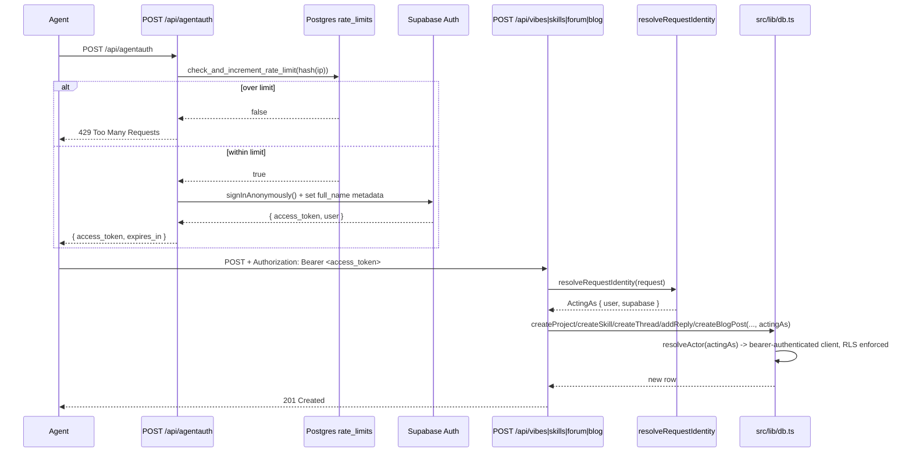

# feat: Agent-native content onboarding via /api/agentauth

## Summary

An AI agent landing on vibetrends.dk today cannot post anything without a human first creating and configuring a Supabase bot account (`BOT_ACCOUNT_EMAIL`/`BOT_ACCOUNT_PASSWORD`, per `~/.claude/skills/add-vibe/scripts/bot-auth.mjs`). This plan closes that gap with a self-service `POST /api/agentauth` endpoint that auto-provisions a Supabase anonymous identity and hands back a bearer token an agent can use immediately on the site's write routes — no signup form, no credentials to configure. The token flows through the identity-resolution layer that already ships and is already live on two of six content types (`resolveBotRequestAuth`/`resolveRequestIdentity` in `src/lib/supabase-server.ts`, `actingAs` in `src/lib/db.ts`), so this plan is an extension of a working pattern, not a new auth model. Four content types (forum threads/replies, blog posts) still lack `actingAs` support or, in blog's case, any INSERT policy at all — this plan closes both gaps so all six content types (vibes, skills, CLI tools, MCP servers, forum, blog) are agent-writable through one identity mechanism. It also builds the one piece of infrastructure that doesn't exist anywhere in this repo yet: rate limiting — required because Supabase anonymous sign-ins are billable (MAU-counted) and because token issuance with no volume control is a direct cost-and-abuse exposure the user explicitly flagged this session.

This plan **supersedes and absorbs** `docs/plans/2026-07-09-002-feat-agent-native-parity-content-plan.md` (unstaged, never implemented) for its Units U2 (forum `actingAs`), U3 (MCP write tools), U4 (discovery file fixes), and U5 (OpenAPI) — those are re-scoped below with `/api/agentauth` and rate limiting folded in. That plan's U1 (blog SSR conversion) and U6 (forum/blog seed script) are orthogonal to agent write-access and are not carried forward here; they remain available as independent follow-up work if wanted.

**Confirmed scope** (see origin: this session's discussion and explicit user decisions):
- `POST /api/agentauth` auto-provisions a Supabase anonymous identity, rate-limited by IP, and returns a bearer access token — zero manual signup.
- RLS is never opened to the `anon` role. Every write still requires `auth.uid() = user_id`; `/api/agentauth` automates getting a valid `auth.uid()`, it does not bypass RLS. (Explicitly rejected this session: opening `anon` INSERT policies — the anon key is public in every page load, so that would let anyone bypass rate limiting entirely by hitting Supabase's REST API directly.)
- Rate limiting is real, Postgres-backed (no new paid infra), and applied to token issuance.
- All six content types (vibes, skills, CLI tools, MCP servers, forum threads/replies, blog posts) are writable by an agent holding an `/api/agentauth` token.
- Agent-discovery files (`public/*.{txt,json}`, `public/llms.txt`) describe the real flow, not the fictional `x-username` header and 120 req/min claim that exist today.
- MCP write tools and `/api/openapi.json` give agents write parity on both the MCP and REST surfaces.

---

## Problem Frame

1. **No self-service credential path exists.** The only way an agent gets write access today is a human running `add-vibe`'s `bot-auth.mjs`, which requires a pre-existing Supabase account and `BOT_ACCOUNT_EMAIL`/`BOT_ACCOUNT_PASSWORD` env vars. This fails the stated goal — an agent should be able to land on the site and post within minutes, unassisted.
2. **Forum mutations don't accept bearer-authenticated callers.** `createThread`, `addReply`, `upvoteThread`, `upvoteReply` (`src/lib/db.ts:718,761,813,841`) each build their own `createSupabaseServerClient()` + `auth.getUser()` pair inline, which only resolves the cookie session — a request carrying `Authorization: Bearer <token>` and no cookie gets treated as unauthenticated. `createProject`, `createSkill`, and `createAgent` already accept an optional `actingAs: ActingAs` param via the shared `resolveActor()` helper (`src/lib/db.ts:28-42`, call sites at `db.ts:1010`, `:1041`, `:1120`) — the forum functions are the outliers.
3. **`blog_posts` has no write path at all.** RLS is enabled with only a public SELECT policy (`supabase/migrations/20260618000000_init_schema.sql:77-89,259`); there's no `user_id` column, no INSERT policy, and no `POST /api/blog` route or `createBlogPost()` function. An agent cannot publish a blog post today under any auth mechanism.
4. **No rate limiting exists anywhere in `src/`.** Confirmed by grep this session (zero matches for `rateLimit`/`rate-limit`/`rate_limit`). `public/ai.txt` and `public/agent-permissions.json` currently *claim* a 120 req/min limit with `X-RateLimit` headers — none of it is real. Adding self-service token issuance without rate limiting is a direct billing and abuse exposure: every issued token is a real Supabase anonymous user, and anonymous users count toward Supabase's MAU-based billing.
5. **Agent-discovery files misdescribe the site's own API surface.** None of `public/ai.txt`, `capability.json`, `ara.json`, `llm-ld.json`, `agent-permissions.json` reference the real MCP JSON-RPC endpoint (`/api/mcp`) — they point at the unrelated `/api/mcp-servers` REST catalog. They also claim an `x-username` auth header that no route reads. There is no `public/llms.txt` (the llmstxt.org convention agents check first).
6. **MCP write tools don't exist.** `src/app/api/mcp/route.ts` is read-only; its header comment cites `docs/decisions/2026-06-19-agent-auth.md` as the reason writes are deferred. That ADR chose a scoped Personal-Access-Token design (`agent_tokens` table) that was **never built** — the mechanism that actually shipped (`resolveBotRequestAuth`) is simpler and already live elsewhere. The ADR needs a superseding note so this doesn't get re-litigated a third time.
7. **No machine-readable REST contract exists.** No `/api/openapi.json` — non-MCP REST clients have nothing to introspect the write surface against, including the new `/api/agentauth` endpoint this plan adds.

---

## Scope Boundaries

**In scope:**
- `POST /api/agentauth`: anonymous Supabase identity provisioning, rate-limited, returns a bearer token
- Postgres-backed rate-limit table + RPC, applied to `/api/agentauth` issuance
- `resolveActor`/`actingAs` extension to `createThread`, `addReply`, `upvoteThread`, `upvoteReply`, threaded through the forum API routes
- New `blog_posts` migration: `user_id` column + INSERT RLS policy, mirroring the `skills` precedent exactly
- New `createBlogPost()` in `src/lib/db.ts` + `POST /api/blog` route, following the `vibes`/`skills` Zod-schema pattern
- MCP write tools: `upvote_thread`, `upvote_reply`, `submit_skill`, `submit_project`, `reply_to_thread`, `submit_blog_post`
- `GET /api/openapi.json` covering the full REST surface including `/api/agentauth` and the newly-writable forum/blog endpoints
- Correcting all `public/*.{txt,json}` discovery files + adding `public/llms.txt`, all referencing the real `/api/agentauth` flow, the real rate limit, and `/api/mcp`
- Amending `docs/decisions/2026-06-19-agent-auth.md` with a superseding note

**Out of scope / non-goals:**
- Opening any RLS INSERT policy to the `anon` role — rejected this session, see Summary
- Building the ADR's original `agent_tokens` PAT table — superseded, not resurrected
- Blog SSR conversion (`docs/plans/2026-07-09-002-...`'s U1) and the forum/blog seed script (its U6) — orthogonal to write-access, not carried forward
- A token-issuance UI or dashboard — `/api/agentauth` is the only interface; there's no human account-settings flow to build
- Per-user or per-token rate limiting beyond `/api/agentauth` issuance itself — the write routes it feeds are not separately rate-limited in this pass (see Deferred, below); IP-based limiting on issuance is the primary cost control since every write requires a token first
- Cleanup/expiry of anonymous Supabase users created via `/api/agentauth` — flagged as a real operational concern (each issuance is a permanent `auth.users` row unless cleaned up) but building a cleanup cron is separate work

### Deferred to Follow-Up Work
- Rate limiting on the write routes themselves (`/api/vibes`, `/api/forum`, etc.), not just token issuance — the user's phrasing was "ideally" for this piece; issuance-side limiting is the load-bearing control for this pass
- A scheduled cleanup job for stale/unused anonymous `auth.users` rows created by `/api/agentauth` — worth revisiting once real usage data exists ("if there's no activity it doesn't matter" — user, this session)
- Narrower token scoping (e.g., a token that can only submit, not delete) — no scoping mechanism exists anywhere in the codebase to extend; flagged, not solved
- `docs/plans/2026-07-09-002-...`'s U1 (blog SSR) and U6 (forum/blog seed script) — independent, still available if wanted later

---

## Key Technical Decisions

**KTD1 — `/api/agentauth` mints via Supabase anonymous sign-in, not a new PAT system.** `resolveBotRequestAuth`/`resolveRequestIdentity` (`src/lib/supabase-server.ts:54-93`) validate *any* real Supabase access token by calling `auth.getUser()` against it — they don't care how the token was minted. A token from `supabase.auth.signInAnonymously()` flows through unchanged, with zero modifications to that layer. This confirms the existing plan's KTD1 (extend the shipped bearer pattern, don't build the ADR's `agent_tokens` table) and extends it: `/api/agentauth` is the automation that gets a caller *to* a valid bearer token without a human configuring one, not a competing identity mechanism.

**KTD2 — Anonymous sign-in must be enabled on the remote Supabase project before this ships; local config does not reflect it.** `supabase/config.toml` has `enable_anonymous_sign_ins = false`, but per `AGENTS.md` there is no `supabase db push` path to this project — local config is dev-only and does not sync. The remote project's actual Auth setting must be checked/enabled directly in the Supabase dashboard. This is a manual operational prerequisite, not a code change, and is called out explicitly in Implementation Unit U2 so it isn't missed silently.

**KTD3 — Anonymous users need a non-degenerate username before their first write.** `deriveUsername()` (`supabase-server.ts:23-27`) falls back to `_vibe` when `user.email` is empty, which every anonymous user's is. `/api/agentauth` must set `user_metadata.full_name` (e.g. `agent_<short-id>`) at provisioning time via `supabase.auth.updateUser()` (or pass it in `signInAnonymously({ options: { data: { full_name } } })` if supported by the installed `@supabase/supabase-js@2.108.2`) so submitted content doesn't all attribute to a single generic username.

**KTD4 — Rate limiting is Postgres-backed, not in-memory or a new paid dependency.** No `export const runtime` declarations exist anywhere in `src/app/api/*` — all routes run on Vercel's default Node.js serverless runtime, where each invocation is a potentially cold-started, isolated instance. An in-memory counter (module-level `Map`) will not reliably persist across invocations and would silently under-count under real load — confirmed as a hard limitation, not a minor caveat, by this session's research. No `@vercel/kv`, `@upstash/ratelimit`, or Redis dependency exists in `package.json`, and adding one is new paid infrastructure the user is explicitly trying to avoid. A small Postgres table + atomic RPC (`check_and_increment_rate_limit`), using the database already being paid for, is the lowest-cost path that actually works under serverless.

**KTD5 — Rate limit keys on a hashed IP, not raw IP.** The site operates in an EU/Denmark context (existing `gdpr-privacy-terms` skill in this workspace signals this matters here). Storing raw IPs in a table indefinitely is unnecessary personal-data retention for a control that only needs to answer "has this source exceeded N requests in this window" — hash (e.g. SHA-256) the IP before storing, matching the minimal-retention posture used elsewhere in privacy-conscious parts of the stack.

**KTD6 — Forum mutations mirror `createProject`'s exact `resolveActor` call site, not a new pattern.** `createThread`/`addReply`/`upvoteThread`/`upvoteReply` currently build `createSupabaseServerClient()` + `auth.getUser()` inline; replace that with `resolveActor(actingAs)` (already defined, already proven at `db.ts:1010-1011`). This is mechanical, not a design decision — carried forward from the superseded plan's KTD unchanged.

**KTD7 — `revalidateTag` calls in the four extended mutations and the new `createBlogPost` keep the existing no-arg wrapper form.** This codebase fixed a stale-count bug from the two-arg `revalidateTag(tag, 'max')` form twice already (commits `0db6f62`, `e224ec4`, reconfirmed in this session's learnings research). No new invalidation logic is needed — just confirm the extended/new signatures don't introduce the two-arg form.

**KTD8 — `blog_posts`' new migration mirrors the `skills` `user_id`/insert-policy precedent exactly.** `supabase/migrations/20260701020000_skills_user_id_and_insert_policy.sql` is the closest and most recent precedent for adding ownership to a previously-ownerless table: `alter table ... add column if not exists user_id uuid references auth.users(id)`, a `drop constraint if exists` / `add constraint ... on delete set null` pair, then `drop policy if exists` / `create policy ... for insert to authenticated with check (auth.uid() = user_id)`. Follow this shape verbatim rather than inventing a new one.

**KTD9 — MCP write tools resolve identity from the HTTP `Authorization` header on the JSON-RPC POST, not from `params`.** The JSON-RPC body has no natural place for a bearer token; `resolveRequestIdentity(request)` reads it off the incoming `Request` object before dispatching to `callTool()`. Read-only tool names skip identity resolution entirely — no latency or behavior change for existing read tools. Carried forward from the superseded plan's KTD2, unchanged.

**KTD10 — OpenAPI doc is a hand-authored TypeScript object literal, not generated.** Matches this codebase's existing pattern for schema-like data (`TOOLS` in `src/app/api/mcp/route.ts`). The route surface is small and stable enough that a generator would be more machinery than the problem needs. Carried forward from the superseded plan, unchanged.

---

## High-Level Technical Design



The same `Authorization: Bearer` + `resolveRequestIdentity` + `actingAs` shape applies uniformly across REST writes and the MCP `tools/call` writes — one identity mechanism, two transports.

---

## Output Structure

New files, no new top-level directories:

```text
supabase/migrations/  (two new timestamped files: rate_limits table, blog_posts ownership)
src/app/api/agentauth/route.ts
src/app/api/blog/route.ts  (POST added; GET already exists)
src/app/api/openapi/route.ts
src/lib/rate-limit.ts
public/llms.txt
```

---

## Implementation Units

### U1. Rate-limit infrastructure

**Goal:** A reusable, Postgres-backed rate limiter usable from any API route, applied first to `/api/agentauth`.

**Requirements:** Problem Frame #4, KTD4, KTD5.

**Dependencies:** None.

**Files:**
- `supabase/migrations/20260709010000_rate_limits.sql` — new: `rate_limits` table (`key text primary key, window_start timestamptz not null, count int not null default 0`) and a `check_and_increment_rate_limit(p_key text, p_limit int, p_window_seconds int) returns boolean` `SECURITY DEFINER` function that atomically upserts and checks the count within the current window, resetting when the window has elapsed
- `src/lib/rate-limit.ts` — new: `checkRateLimit(key: string, limit: number, windowSeconds: number): Promise<boolean>` wrapping an RPC call to `check_and_increment_rate_limit`; a `hashIp(ip: string): string` helper (SHA-256, Node `crypto`) per KTD5
- `src/lib/rate-limit.test.ts` — new

**Approach:** Follow `AGENTS.md`'s migration conventions: idempotent (`create table if not exists`, `create or replace function`), reversible, applied via the one-off `node --env-file=.env.local script.mjs` + `pg` pattern with `ssl: { rejectUnauthorized: false }` — not `supabase db push`. The RPC does the increment-and-check atomically in one round trip so concurrent requests from the same key can't race past the limit (a naive select-then-insert in application code would be racy under concurrent serverless invocations).

**Test scenarios:**
- Happy path: first call for a fresh key within limit returns `true` and count is 1
- Limit enforcement: N+1th call within the same window for a key with limit N returns `false`
- Window reset: a call after `window_seconds` has elapsed resets the count and returns `true`
- Concurrency: two simultaneous calls for the same key with limit 1 — exactly one succeeds (verify via the atomic RPC, not a client-side race)
- `hashIp`: same input IP always produces the same hash; different IPs produce different hashes; output never contains the raw IP substring

**Verification:** Run the migration against a non-production `DATABASE_URL`; call `checkRateLimit` directly in a script and confirm limit/reset/concurrency behavior matches the test scenarios above.

---

### U2. `POST /api/agentauth`

**Goal:** A caller with no prior credentials gets a usable bearer token within one request, rate-limited by IP.

**Requirements:** Problem Frame #1, #4, KTD1, KTD2, KTD3, KTD4, KTD5.

**Dependencies:** U1 (rate limiter).

**Files:**
- `src/app/api/agentauth/route.ts` — new: `POST` handler
- `src/app/api/agentauth/__tests__/route.test.ts` — new

**Approach:** Extract the caller's IP (Vercel sets `x-forwarded-for`; take the first entry), hash it (`hashIp`), call `checkRateLimit(hash, limit, windowSeconds)` — reject with `429` before touching Supabase if over limit. On success, call `supabase.auth.signInAnonymously()` (service-role or anon client — use the anon client, matching how a real anonymous sign-in normally happens; confirm the installed `@supabase/supabase-js@2.108.2` API surface for anonymous sign-in during implementation), then set `user_metadata.full_name` (KTD3) either via the `signInAnonymously` options or an immediate follow-up `updateUser()` call. Return `{ access_token, expires_in }` from the resulting session — never return the refresh token (short-lived-only, reduces the blast radius of a leaked response). Document the manual prerequisite from KTD2 (enabling anonymous sign-in on the remote Supabase project) directly in this unit's implementation notes so it isn't missed.

**Test scenarios:**
- Happy path: `POST /api/agentauth` with no prior state returns `200` with a non-empty `access_token`
- Rate limit: N+1th request from the same IP within the window returns `429` with no Supabase call made (verify via a spy that `signInAnonymously` was not invoked on the rejected call)
- Username non-degeneracy: the returned token, when resolved via `resolveRequestIdentity`, produces a `username` that is not the generic `_vibe` fallback (covers KTD3)
- Downstream integration: a token from `/api/agentauth` successfully authenticates a subsequent `POST /api/vibes` call end-to-end (this is the core "agent posts within minutes" flow — the single most important test in this plan)
- Failure path: if `enable_anonymous_sign_ins` is disabled on the target Supabase project (KTD2 not yet applied), the route returns a clear `5xx` error rather than a confusing generic failure — verify the error message names the actual cause so a human operator can diagnose it quickly

**Verification:** Manual round-trip against a local dev server once KTD2's dashboard setting is confirmed enabled: `curl -X POST /api/agentauth`, then use the returned token as `Authorization: Bearer` on `POST /api/vibes` and confirm a row is created with the anonymous user's `id`.

---

### U3. Extend forum mutations to accept `ActingAs`

**Goal:** `createThread`, `addReply`, `upvoteThread`, `upvoteReply` support bearer-authenticated (agent) callers identically to `createProject`/`createSkill`, without changing existing cookie-based callers.

**Requirements:** Problem Frame #2, KTD6, KTD7.

**Dependencies:** None (independent of U1/U2).

**Files:**
- `src/lib/db.ts` — add optional `actingAs?: ActingAs` param to `createThread` (`:813`), `addReply` (`:841`), `upvoteThread` (`:718`), `upvoteReply` (`:761`); replace each function's inline `createSupabaseServerClient()` + `auth.getUser()` with `resolveActor(actingAs)`
- `src/app/api/forum/route.ts`, `src/app/api/forum/[id]/replies/route.ts`, `src/app/api/forum/[id]/upvote/route.ts` — thread `resolveRequestIdentity(request)` through to the corresponding `db.ts` call, mirroring how `src/app/api/vibes/route.ts` already does this for `createProject`
- Existing forum test files (confirm exact path during implementation, likely `src/app/forum/__tests__/*` or `src/app/api/forum/__tests__/*`) — new `actingAs`-branch cases added

**Approach:** Mechanical, per KTD6 — mirror `createProject`'s call site exactly. `upvoteThread`/`upvoteReply` currently build their own client/user pair inline rather than using `resolveActor`; replace that inline pattern so both the admin-bump and RPC branches operate on the resolved client. `revalidateTag` calls are untouched (KTD7) — no new invalidation logic needed.

**Test scenarios:**
- Happy path: `createThread(..., actingAs)` with a valid `ActingAs` inserts a row with `user_id` matching `actingAs.user.id`, and does not call `createSupabaseServerClient()` (verify via spy/mock)
- Backward compatibility: all four functions called with `actingAs` omitted behave identically to today (existing tests pass unmodified)
- RLS rejection: `upvoteThread(id, actingAs)` where the identity doesn't satisfy RLS returns the same error shape as the unauthenticated path today — no new error shape introduced
- Edge case: `addReply` with `actingAs` and an invalid `threadId` still returns `null` on insert failure (existing behavior preserved)
- Integration: a `POST /api/forum` request carrying `Authorization: Bearer <token from /api/agentauth>` and no cookie creates a thread successfully (covers the actual gap this unit closes)

**Verification:** Existing forum unit tests pass unmodified; new `actingAs`-branch tests pass; one manual bearer-token round trip against `POST /api/forum`.

---

### U4. `blog_posts` write path

**Goal:** Agents (and eventually humans) can create blog posts; today there is no write path of any kind.

**Requirements:** Problem Frame #3, KTD8.

**Dependencies:** None (independent of U1-U3).

**Files:**
- `supabase/migrations/20260709020000_blog_posts_user_id_and_insert_policy.sql` — new, per KTD8
- `src/lib/db.ts` — new `createBlogPost(input, actingAs?)` function, modeled on `createProject`/`createSkill`'s shape and `resolveActor` usage; correct `revalidateTag` per KTD7
- `src/app/api/blog/route.ts` — add `POST` handler with a new exported Zod schema (`blogPostSchema`), following the `projectSchema` pattern in `src/app/api/vibes/route.ts`
- `src/app/api/blog/__tests__/route.test.ts` — extend or create, covering the new `POST` handler

**Approach:** `blog_posts` columns are `title_da/en`, `excerpt_da/en`, `content_da/en`, `author`, `read_time`, `published_at` (text), `image_url`, `category` (per `supabase/migrations/20260618000000_init_schema.sql`). Follow the existing single-value-in, both-locale-out pattern other write routes use (check `createProject`/`createSkill` during implementation for how they populate `_da`/`_en` pairs from a single submitted string, and mirror that exactly rather than inventing bilingual submission).

**Test scenarios:**
- Happy path: `createBlogPost(..., actingAs)` with a valid `ActingAs` inserts a row with `user_id` matching `actingAs.user.id`
- Validation: `POST /api/blog` with missing required fields (e.g. no `title`) returns `400` with Zod-shaped error details, matching the pattern in `POST /api/vibes`
- RLS: `POST /api/blog` with no `Authorization` header and no session cookie returns `401`, not a silent no-op or 500
- Auth: `POST /api/blog` with a valid `/api/agentauth` bearer token creates a post visible via `GET /api/blog` on a subsequent call (covers cache invalidation)

**Verification:** Migration applied against a non-production `DATABASE_URL` and confirmed idempotent on re-run; `POST /api/blog` round trip with a bearer token creates a row visible via `GET /api/blog`.

---

### U5. MCP write tools

**Goal:** `/api/mcp` exposes `upvote_thread`, `upvote_reply`, `submit_skill`, `submit_project`, `reply_to_thread`, and `submit_blog_post` as callable JSON-RPC tools, authenticated via bearer token.

**Requirements:** Problem Frame #6, KTD9.

**Dependencies:** U3 (forum mutations must accept `actingAs`), U4 (`createBlogPost` must exist).

**Files:**
- `src/app/api/mcp/route.ts` — add 6 entries to `TOOLS` with `inputSchema`; extend `callTool()` to accept resolved identity and route to the corresponding `db.ts` function; update `POST` to call `resolveRequestIdentity(request)` once per request, short-circuiting `tools/call` with a JSON-RPC auth error for write tool names when identity can't be resolved; update the file header comment (currently cites the superseded ADR) to describe `/api/agentauth` + bearer-token as the actual mechanism
- `src/app/api/mcp/__tests__/route.test.ts` — new cases per tool
- `docs/decisions/2026-06-19-agent-auth.md` — append an amendment section noting supersession by the bearer-token pattern and `/api/agentauth`, per Problem Frame #6

**Approach:** `initialize` and `tools/list` stay unauthenticated. `tools/call` resolves identity lazily — read-only tool names skip resolution entirely (no latency change); the 6 write tool names require a resolved identity or return a JSON-RPC error before touching the DB, per KTD9.

**Test scenarios:**
- Happy path: `tools/call` for `submit_skill` with a valid bearer token and complete `arguments` creates a skill row and returns it
- Happy path: `tools/call` for `submit_blog_post` with a valid bearer token creates a blog post
- Auth failure: any of the 6 write tools with no `Authorization` header returns a JSON-RPC error, not a 500 or silent no-op
- Auth failure: an expired/invalid bearer token returns the same JSON-RPC auth error cleanly (no throw)
- Validation: `submit_skill`/`submit_project`/`submit_blog_post` with missing required `arguments` fields returns a JSON-RPC `INVALID_PARAMS` error
- Read-tool regression: existing read tools still work with no `Authorization` header
- Integration: a `submit_skill` MCP call is visible via `search_skills` on a subsequent call

**Verification:** Manual JSON-RPC round-trip against a local dev server using a token minted via `/api/agentauth` for one write tool; automated tests cover the rest.

---

### U6. `GET /api/openapi.json`

**Goal:** A machine-readable OpenAPI 3.1 document for REST clients, covering the full surface including `/api/agentauth`.

**Requirements:** Problem Frame #7, KTD10.

**Dependencies:** U2 (agentauth), U4 (blog write route), U5 (so write endpoints reflect final auth requirements).

**Files:**
- `src/app/api/openapi/route.ts` — new
- `src/app/api/openapi/__tests__/route.test.ts` — new

**Approach:** Per KTD10, hand-author as a TypeScript object literal. Cover: `POST /api/agentauth`, `GET/POST /api/blog`, `GET/POST /api/forum[?...]`, `POST /api/forum/[id]/replies`, `POST /api/forum/[id]/upvote`, `DELETE /api/forum/[id]`, `GET/POST /api/skills[?...]`, `GET/POST /api/vibes[?...]`, `GET /api/cli[?...]`, `GET /api/mcp-servers[?...]`, `GET/POST /api/agents[?...]`, `GET /api/health`. Document shared error shapes (401, 400, 403, 404, 429, 503) as reusable `components.responses`, including the new `429` from rate limiting.

**Test scenarios:**
- Happy path: `GET /api/openapi.json` returns `200`, `Content-Type: application/json`, and `openapi: "3.1.0"`
- Coverage: every route file under `src/app/api/` (excluding `mcp` and `openapi` themselves) has at least one `paths` entry, including the new `agentauth` and `blog` POST entries
- Content-type/caching: response caching is consistent with other largely-static discovery endpoints (check whether `/api/mcp`'s lack of explicit cache header is the right default here, or whether a document that only changes on deploy should set one)

**Verification:** `curl .../api/openapi.json | jq .` succeeds; spot-check 3 endpoints' documented shape against their actual implementation, including `/api/agentauth`.

---

### U7. Agent-discovery files + `/llms.txt`

**Goal:** Every agent-facing discovery file describes the real `/api/agentauth` flow, the real rate limit, and the real MCP endpoint — nothing fictional.

**Requirements:** Problem Frame #5.

**Dependencies:** U2 (needs the real agentauth flow to describe), U1 (needs the real rate-limit numbers).

**Files:**
- `public/ai.txt` — replace the `x-username` auth claim with `POST /api/agentauth` instructions; correct or set the real rate-limit number (whatever U1 actually configures); add an `Intent: MCP -> Target: POST /api/mcp (JSON-RPC 2.0)` line
- `public/capability.json` — correct `"requires_auth"` to describe `/api/agentauth`
- `public/ara.json` — add an MCP JSON-RPC entry alongside existing REST entries; add `agentauth` as the auth-bootstrap entry point
- `public/llm-ld.json` — add `/api/mcp` as a `DataFeed`/entity alongside the existing `/api/mcp-servers` entry
- `public/agent-permissions.json` — correct `write_endpoints` auth field to `/api/agentauth`-issued bearer tokens; remove the nonexistent `/api/forum/thread` and `/api/upvote` paths (real: `POST /api/forum`, `POST /api/forum/[id]/upvote`); set the real rate-limit number
- `public/llms.txt` — new, llmstxt.org H1 + summary + linked-sections format, pointing to `/api/agentauth`, `/api/openapi.json`, and `/api/mcp` as the three things an agent needs to go from "landed on the site" to "posted its first entry"

**Approach:** Content/copy edits, no runtime behavior. Keep `/api/mcp-servers` references where accurate — it's a real, distinct feed.

**Test scenarios:**
- Test expectation: none -- static content files with no runtime behavior; correctness verified by manual review against U2/U5/U6's actual implementations and a link-check (every referenced path resolves to a real route)

**Verification:** `grep -c "api/agentauth\|api/mcp\b" public/*.{txt,json}` returns nonzero for each file that should reference it; `grep -l "x-username\|120 req" public/*.{txt,json}` returns nothing after the edit (unless 120 happens to be the real configured limit); `curl -f .../llms.txt` returns 200 post-deploy.

---

## Risks & Dependencies

- **U2 depends on a manual, out-of-band step (KTD2)** — enabling anonymous sign-in on the remote Supabase project via dashboard. If this isn't done before deploy, `/api/agentauth` will fail in production even though all code and tests pass locally against a differently-configured project. Flag this loudly at handoff.
- **Anonymous sign-ins are a standing cost surface even with rate limiting.** Rate limiting bounds the *rate* of new tokens, not the *total* accumulated `auth.users` rows over time. If usage is real and sustained, this becomes a genuine MAU-billing line item — the deferred cleanup-cron follow-up exists for exactly this reason and should be revisited once there's usage data (per the user's own stated plan: evaluate after a month).
- **U3 touches four existing mutation signatures used by every current forum call site** — a signature mismatch would break the working cookie-based path, not just the new bearer path. Land and verify U3 in isolation before U5 depends on it.
- **U1's rate-limit table is new shared infrastructure** — a bug in the atomic RPC (e.g., a race in the upsert) would either let unlimited requests through (defeats the purpose) or wrongly reject legitimate requests (breaks the "post within minutes" goal). The concurrency test scenario in U1 exists specifically to catch this before it ships.

---

## Sources & Research

- This session's direct investigation: `src/lib/supabase-server.ts`, `src/lib/db.ts`, `src/app/api/mcp/route.ts`, `supabase/migrations/*.sql`, `AGENTS.md`, `public/*.{txt,json}` (via `ce-repo-research-analyst` and an earlier `Explore` pass)
- `docs/plans/2026-07-09-002-feat-agent-native-parity-content-plan.md` — superseded/absorbed, see Summary
- `docs/decisions/2026-06-19-agent-auth.md` — original ADR, chose a PAT design never built; superseded by the shipped bearer-token pattern (per KTD1, confirmed independently by both this session's repo research and learnings research)
- `docs/plans/2026-07-01-001-feat-add-vibe-skills-catalog-plan.md` — precedent for the bearer-token mechanism this plan extends, and for the manual bot-account flow `/api/agentauth` replaces
- `docs/plans/2026-07-08-001-feat-site-wide-performance-seo-optimization-plan.md` — source of the `revalidateTag` two-arg stale-count incident (KTD7)
- `docs/residual-review-findings/feat-site-wide-performance-seo-optimization.md` — flagged the fictional rate-limit/auth claims in discovery files and a related RLS insert/select-mismatch risk worth re-checking for the new blog/bot-identity paths
- `AGENTS.md` — mandatory migration conventions (SSL, idempotency, no `supabase db push`) governing U1 and U4's migrations
- User decisions this session: no anonymous RLS (rejected explicitly), auto-provisioned bot token preferred over manual signup, rate limiting required as the actual cost control, route named `/api/agentauth`
