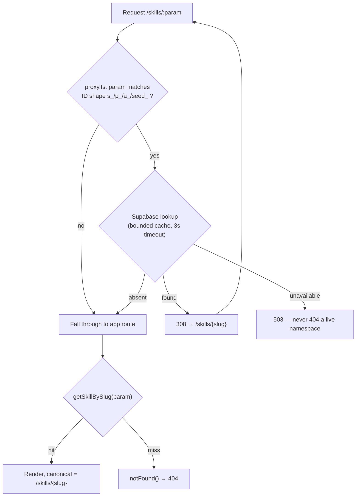
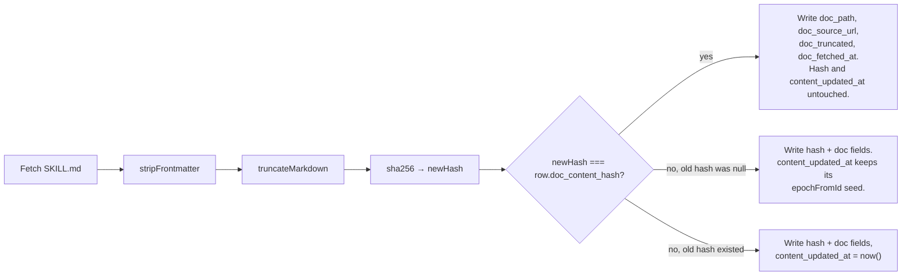

# feat: Danish descriptions, slug URLs, and real lastmod

**Plan depth:** Deep · **Target repo:** vibetrends-dk

Three independent SEO/UX changes, sequenced so each phase ships alone. The parenthetical item numbers refer to positions in the roadmap list this plan was written from; they are not IDs used elsewhere in this document.

- **Phase A (roadmap item 6)** — real Danish descriptions for the 100 skills, 14 vibes, and the untranslated CLI/MCP entries, with a working English fallback.
- **Phase B (roadmap item 7)** — slug URLs for `/skills`, then `/vibes` and `/cli` + `/mcp`, with permanent redirects from the old ID paths.
- **Phase C (roadmap item 8)** — a `content_updated_at` that only moves when rendered content actually changes, emitted as sitemap `lastmod`.

---

## Summary

The site serves Danish-first UI to a Danish audience, but every entity description is English. Not because a Danish column is missing — `description_da` exists on `skills`, `vibes`, and `agents` — but because every write path copies the English string into both columns. Phase A makes "no Danish yet" a representable state and fills it in.

Phase B replaces opaque `s_1785096155359` URLs with title-derived slugs across the three catalog surfaces, preserving the old paths as permanent redirects issued from `src/proxy.ts`.

Phase C replaces the sitemap's "no honest date available" gap for skills with a `content_updated_at` driven by a content hash in `scripts/refresh-skill-docs.mjs`, so re-running the refresher does not restamp unchanged rows.

---

## Problem Frame

### Phase A — descriptions are English everywhere

Verified against the live database on 2026-08-04:

| Table | Rows | Rows where `description_da = description_en` |
| --- | --- | --- |
| `skills` | 100 | 100 |
| `vibes` | 14 | 14 |
| `agents` (MCP Server) | 11 | 1 |
| `agents` (CLI) | 4 | 3 |

`agents` holds exactly these 15 rows — the `Host` category that `src/lib/db.ts:961` excludes from every catalog list is currently empty, so it contributes nothing to the backfill set. `skills.title_da = title_en` for all 100 rows as well, though titles are mostly proper nouns and are out of scope here.

The cause is the write path, not the schema. `createSkill`, `createProject`, and `createAgent` in `src/lib/db.ts` each take a single `description` argument and write it to both `description_da` and `description_en`. The columns are `NOT NULL`, so there is no way to represent "no Danish translation exists" — an English copy and a genuine Danish string are indistinguishable, which is why "fall back to English only when missing" cannot be implemented against the current schema.

The skill doc body (`skills.doc_markdown`, the fetched `SKILL.md`/`README.md`) stays English by design and is explicitly out of scope for translation.

### Phase B — ID URLs

Detail pages live at `/skills/{id}`, `/vibes/{id}`, `/cli/{id}`, `/mcp/{id}` where `id` is either a legacy `seed_<name>` string or an epoch-derived `s_1785096155359` / `a_1783085673118`. These carry no keyword signal, are unshareable-looking, and are the URLs already submitted to Google.

**The redirect cannot be issued from the page.** `next.config.ts:73` sets `cacheComponents: true`. `src/proxy.ts:50-66` records a measured result for exactly this situation: the root layout's Suspense shell is prerendered and flushed before any page code runs, so a `redirect()` or `notFound()` thrown from a server component is streamed into an already-sent 200. Google reads that as a soft redirect and never consolidates the old URL. That comment ends with "Only proxy runs early enough to set a real 308" and "Do not copy this pattern onto the live detail routes." Phase B therefore issues the redirect from `src/proxy.ts`, which already implements this shape for the retired `/agents/:id` namespace.

### Phase C — fabricated lastmod

`src/app/sitemap.ts` currently omits `lastmod` for every skill URL, with a comment naming the exact reason: `skills.doc_fetched_at` records when the refresher last ran, not when content changed, because `scripts/refresh-skill-docs.mjs` stamps `now()` unconditionally on every successful fetch even when the markdown is byte-identical. The site previously served one shared build date across all 150 URLs, which is what taught Google to ignore `lastmod` here. Omission was the honest stopgap; a real change timestamp is the fix.

---

## Requirements

| ID | Requirement | Phase |
| --- | --- | --- |
| R1 | `description_da` can represent "no Danish text exists" distinctly from "Danish text that happens to match the English" | A |
| R2 | Every read path renders `description_en` when `description_da` is absent, in both `da` and `en` locales | A |
| R3 | All 100 skills, 14 vibes, and the 4 untranslated CLI/MCP entries carry Danish descriptions reviewed and approved by a Danish speaker | A |
| R4 | New submissions can supply a Danish description; those that don't store null rather than an English copy | A |
| R5 | The English original stays in `skills.doc_markdown` untranslated | A |
| R6 | Each skill, vibe, CLI, and MCP row has a unique, stable, title-derived slug that does not change when the title is edited | B |
| R7 | `/skills/{slug}` serves the detail page; `/skills/{id}` returns a real 308 to it (same for vibes, cli, mcp) | B |
| R8 | Every internal link, canonical URL, JSON-LD URL, sitemap entry, feed URL, and OG image path uses the slug | B |
| R9 | Slugs cannot collide with existing sub-routes (`/skills/topic/...`) | B |
| R10 | `skills.content_updated_at` advances only when the rendered doc content changes | C |
| R11 | The sitemap emits a real, per-row `lastmod` for skill URLs | C |

---

## Key Technical Decisions

### KTD1 — Make `description_da` nullable rather than adding a column (R1)

The roadmap item said "add a `description_da` column." The column exists on all three tables. Adding a second Danish column (`description_da_v2`, or a `has_translation` flag) would leave two sources of truth for the same field and force every read path to know which one wins.

Instead: `alter column description_da drop not null`, then null out the rows where `description_da = description_en`, which is exactly the set of known-untranslated rows in the current data. `null` becomes the canonical "not translated yet" marker, and the fallback in the mapper is a one-line coalesce.

Nulling those rows changes nothing visible — they render English today via the duplicate and English tomorrow via the fallback.

Accepted limitation: a genuinely Danish description that happens to be byte-identical to its English one becomes unrepresentable, since U1 nulls it and U4's apply pass rejects it as a passthrough. At description length this is vanishingly unlikely, and the consequence is a forced paraphrase, not data loss.

### KTD2 — Translate agent-side with a human approval gate (R3, R4)

There is no `ANTHROPIC_API_KEY` in `.env.local` and no LLM client in `package.json`. A server-side translation call inside `createSkill` would add a new secret, a per-submission cost, latency on the write path, and a failure mode where a submission 500s because a translation provider is down.

Instead the translation happens at the two places that already have a model in the loop:

- **Backfill** — a three-step script with a human gate. Export untranslated rows to a JSON work file; translate in-session; **the Danish speaker reads and approves the apply file before it lands**; then apply in a transaction. The approval step is not optional and not implicit in the artifact's reviewability — it is an enumerated step in U4, because `AGENTS.md`'s standing rule (from a prior incident) is that bulk content changes need real before/after samples before merge, not after.
- **Ongoing** — an optional `descriptionDa` field on the submit schema. The `add-vibe` skill, which already writes an English description with a model, supplies the Danish one in the same call. Omitting it stores null, and the row falls back to English until someone backfills it.

Tradeoff: nothing forces a Danish description at submit time, so the untranslated set can regrow. Accepted — the backfill script is re-runnable and reports how many rows are missing Danish, which makes the gap visible.

### KTD3 — Issue the redirect from `src/proxy.ts`, not from the page (R7)

The original instinct — `permanentRedirect()` in the page component — does not work in this codebase. See the Phase B problem frame: under `cacheComponents: true` a redirect thrown from a server component streams into an already-sent 200, which Google treats as a soft redirect. `src/proxy.ts` measured this against a production build and left an explicit warning.

`src/proxy.ts` already resolves retired `/agents/:id` to `/cli/:id` or `/mcp/:id` with a bounded `lookupCache`, a 3-second timeout, and `unavailable` → 503 semantics that keep a credentials-less preview deploy from 404-ing a whole namespace. Phase B extends that same handler rather than inventing a parallel mechanism.

The proxy comment warns "Do not copy this pattern onto the live detail routes" because `/agents/:id` is dead URL space where a Supabase round trip per request is acceptable, and the catalog routes are not. That constraint is honored by gating the lookup on an **ID-shaped param** (`/^(s_\d+|p_\d+|a_\d+|seed_)/`): slug requests — the hot path — never trigger a lookup and fall straight through. Verified safe: `slugify` emits hyphens, never underscores, so no generated slug can match the ID shape.

This also supersedes the 301-vs-308 question. `NextResponse.redirect` takes an explicit status, so the proxy can emit a literal 301 if wanted; 308 is the default and Google treats the two identically, so 308 stands unless there is a reason to prefer otherwise.

### KTD4 — App routes become slug-only (R7)

With the redirect in proxy, `/skills/[slug]/page.tsx` resolves by slug and calls `notFound()` on a miss. No ID branch, no redirect logic, one data path. An ID that reaches the page at all means the proxy did not fire, which is a bug in the matcher rather than a case to handle in the page.

The dynamic segment renames from `[id]` to `[slug]`. This does not conflict with the sibling `src/app/skills/topic/[slug]/page.tsx` (different segment level) or `src/app/api/skills/[id]` (different tree). A skill slugged `topic` would still be shadowed by the static segment, hence the reserved-slug guard in R9.

### KTD5 — Hash the rendered markdown; seed `content_updated_at` from the row's creation instant (R10, R11)

The hash must cover the string that actually gets rendered — post-`stripFrontmatter`, post-`truncateMarkdown` — not the raw upstream file. A frontmatter-only edit upstream changes the raw bytes but not the page, and stamping a change for it reintroduces exactly the noise this is meant to remove.

On the initial migration every row has a null hash and no known change date. Leaving `content_updated_at` null until a genuine change is detected is the strictly honest option, but it is also permanent rather than transitional: every *future* skill starts with a null hash too, so a stable skill corpus could emit zero `lastmod` forever while every acceptance check in this plan still passes. That is a change that ships green and delivers nothing.

Instead, seed `content_updated_at` from `epochFromId(id)`. `src/lib/db.ts:1420` already derives a real creation instant from the epoch-derived IDs and already uses it as the feed's `publishedAt`, so this is an existing, trusted signal rather than a fabricated date — and it produces a *distinct* per-row value, which is what the original shared-build-date bug lacked. Legacy `seed_*` IDs carry no epoch and stay null. The hash gate then advances the timestamp on real content changes from there.

### KTD6 — One slug implementation, called from both the app and the migration script

Slug derivation needs Danish/ASCII folding (`æ` → `ae`, `ø` → `oe`, `å` → `aa`) and collision suffixing. Writing that logic twice — once in TypeScript, once as inline SQL for the backfill — would create two sources of truth that "must match exactly" with nothing enforcing it, across three migrations.

There is no need for a second copy. Per `AGENTS.md` these migrations are applied by a one-off node script anyway, and `scripts/refresh-skill-docs.mjs` already imports TypeScript directly (`from '../src/lib/githubDocSource.ts'`). So the migration files add columns and indexes only, and the backfill runs from a node script that imports the same tested `slugify` the app uses. A Postgres trigger is rejected for the same reason: it would make the duplication permanent.

Consequence for sequencing: U7 (the helper plus its tests) comes before U6 (the schema and backfill), not alongside it.

---

## High-Level Technical Design

### Slug-or-ID resolution (Phase B)

The redirect loops back through the proxy, which takes the fall-through branch on the second pass because a slug never matches the ID shape.

### Hash-gated content timestamp (Phase C)

Branch F still writes the doc metadata: `fetchDoc` resolves the doc path by a search order that can genuinely change (repo-root `README.md` → a matched `SKILL.md` subdirectory) without changing rendered content, and a stale `doc_source_url` would point the attribution link at a file that no longer exists. Only the hash and the change timestamp are gated.

---

## Implementation Units

Unit IDs are stable and never renumbered. U15 and U16 were added during review and sit in dependency order rather than numeric order.

### U1. Make `description_da` nullable and clear untranslated copies

**Goal:** Give `null` the meaning "no Danish text exists" on `skills`, `vibes`, and `agents`.

**Requirements:** R1

**Dependencies:** none

**Files:**
- `supabase/migrations/20260804000000_description_da_nullable.sql` (create)

**Approach:** Drop the `NOT NULL` constraint on `description_da` for all three tables, then `update ... set description_da = null where description_da = description_en`. The equality predicate is the whole point: it targets rows where the "Danish" is provably a copy, and leaves the 11 agent rows that already have genuine Danish text alone. Follow the migration conventions in `AGENTS.md` — idempotent (`drop not null` is a no-op on re-run; the update converges since a nulled row no longer matches) and with the rollback documented in a comment block. Include a post-migration verification query block, matching the style of `supabase/migrations/20260703020000_agents_danish_flags.sql`.

**Patterns to follow:** `supabase/migrations/20260728000000_skills_doc_snapshot.sql` for the header-comment/rollback/verification structure.

**Test scenarios:** `Test expectation: none -- schema migration with no application logic.` Verification is the SQL block below.

**Verification:** After applying, `select count(*) from public.skills where description_da is not null` returns 0; the same query on `vibes` returns 0; on `agents` it returns 11 (the rows with genuine Danish). `select is_nullable from information_schema.columns where column_name = 'description_da'` returns `YES` for all three tables.

---

### U2. Fall back to English when `description_da` is null

**Goal:** Every read path renders English when Danish is absent, and nothing crashes on a null.

**Requirements:** R2

**Dependencies:** U1

**Files:**
- `src/lib/db.ts` (modify)
- `src/lib/__tests__/db.test.ts` (modify)

**Approach:** Widen `description_da` to `string | null` on `SkillRow`, `ProjectRow`, and `AgentRow`. In `mapSkill`, `mapProject`, and `mapAgent`, change the description selection to fall back: English locale keeps `description_en`; Danish locale uses `description_da ?? description_en`.

The non-obvious part is the call sites that read `description_da` directly rather than through a mapper, each of which will throw on null:

- the in-memory search filters (`getSkills`, `getProjects`, and the agents search around `src/lib/db.ts:987`) call `.toLowerCase()` on the raw column
- the feed builder near `src/lib/db.ts:1489-1517` selects and picks `description_da` inline for skills, agents, and vibes

Every one of those needs the same coalesce. A repo-wide grep for `description_da` is the completeness check.

**Patterns to follow:** the existing `lang === 'en' ? x_en : x_da` ternaries in `mapSkill`.

**Test scenarios:**
- `mapSkill` with `description_da: null` and `lang: 'da'` returns `description_en`.
- `mapSkill` with `description_da: 'Dansk tekst'` and `lang: 'da'` returns `'Dansk tekst'`.
- `mapSkill` with `description_da: null` and `lang: 'en'` returns `description_en` (fallback must not leak into the English path).
- Same three cases for `mapProject` and `mapAgent`.
- Search filter over a row set where one row has `description_da: null` and an English description matching the query: returns that row, does not throw.
- Feed builder with `lang: 'da'` over a row with null `description_da`: `summary` is the English string, not null and not `"null"`.

**Verification:** `npm run test:unit` passes; `npm run typecheck` reports no `string | null` assignment errors; loading `/skills` and `/vibes` in `da` shows English descriptions with no blank cards.

---

### U3. Accept an optional Danish description on the write paths

**Goal:** New submissions can carry Danish text; those that don't store null instead of an English copy.

**Requirements:** R4

**Dependencies:** U1, U2

**Files:**
- `src/lib/schemas.ts` (modify)
- `src/lib/db.ts` (modify)
- `src/app/api/skills/route.ts` (modify)
- `src/app/api/vibes/route.ts` (modify)
- `src/app/api/agents/route.ts` (modify — also reaches `createAgent`)
- `src/app/api/cli/route.ts` (modify)
- `src/app/api/mcp/route.ts` (modify — REST route and the MCP JSON-RPC tool dispatcher live in this one file)
- `src/app/api/openapi.json/route.ts` (modify)
- `src/lib/__tests__/db.test.ts` (modify)
- `src/app/api/skills/__tests__/route.test.ts` (modify)

**Approach:** Add an optional `descriptionDa` to `skillSchema` and `projectSchema` (and the agent/CLI/MCP equivalents), mirroring how `source` is declared — optional, with `""` accepted as "not provided", and the same max length as `description`.

`createSkill`, `createProject`, and `createAgent` take a new optional `descriptionDa` parameter and write `description_da: descriptionDa || null`. Note the `||` rather than `??`: an empty string must normalize to null, or the fallback state becomes unreachable via the API.

Because the REST surface and the MCP JSON-RPC tools share `src/lib/schemas.ts`, adding the field there covers both contracts; the MCP tool dispatcher still needs to thread the value into the `create*` call. Document the field in `src/app/api/openapi.json/route.ts` alongside `description`, since the agent-facing OpenAPI doc is how importing agents discover it.

**Execution note:** Add the route-level test asserting null-on-omit before wiring the parameter through — the regression this guards against (silently writing the English string again) is invisible in the response body.

**Test scenarios:**
- POST `/api/skills` with `descriptionDa` set: the inserted row has that exact Danish string in `description_da` and the English in `description_en`.
- POST `/api/skills` without `descriptionDa`: the inserted row has `description_da = null` and does **not** duplicate the English string.
- POST `/api/skills` with `descriptionDa: ""`: stores null, not an empty string.
- POST with `descriptionDa` over the max length: rejected 400 with the field named in the error.
- MCP `create_skill` tool call with `descriptionDa`: same persistence result as the REST path (parity is the reason the schema is shared).
- `GET /api/openapi.json` includes `descriptionDa` in the skill request body schema.

**Verification:** Unit and route tests pass; a manual POST against a local dev server with and without the field produces the two expected `description_da` values.

---

### U4. Backfill Danish descriptions for the 118 untranslated rows

**Goal:** All 100 skills, 14 vibes, and 4 untranslated CLI/MCP entries carry approved Danish descriptions; the English originals are untouched.

**Requirements:** R3, R5

**Dependencies:** U1, U2

**Files:**
- `scripts/backfill-danish-descriptions.mjs` (create)
- `package.json` (modify — add a `backfill:danish` script entry)

**Approach:** A three-step process built on a two-pass script, following the connection and flag conventions already established in `scripts/refresh-skill-docs.mjs`: `pg` client, pooler fallback for the IPv6-only direct host, mandatory `ssl: { rejectUnauthorized: false }`, `--dry-run` support.

**Step 1 — export.** `--export <file>` selects rows where `description_da is null` from `skills`, `vibes`, and `agents` (the agents selection filtered to `category in ('CLI','MCP Server')`, so a future `Host` row can never enter the translation set). For each row it writes `{ table, id, title, description_en }` — the title and English text are carried into the file deliberately, see the validation below. It prints a per-table count of what is still missing, which is the standing visibility mechanism from KTD2.

**Step 2 — translate, register first.** Translate the first ten rows and settle the register question (formal vs. informal address, whether English technical terms stay untranslated) with the reviewer before translating the remaining 108. Then the reviewer reads the completed apply file and approves it. This gate is a required step, not a property of the artifact — an unapproved file does not get applied.

**Step 3 — apply.** `--apply <file>` reads back `[{ table, id, description_en, description_da }]` and updates each row inside a single `BEGIN`/`COMMIT`. It rejects and reports, without writing:

- any entry whose echoed `description_en` does not byte-match the row's current `description_en` — this is the misalignment guard. A 118-row in-session translation with no ordering guarantee can emit a translation under the wrong id, and a shifted pairing would otherwise pass every other check and write plausible-looking Danish onto the wrong entity permanently, since a re-run then rejects it as already-translated.
- any entry whose `description_da` equals the row's `description_en` (an untranslated passthrough)
- any row whose `description_da` is already non-null (someone translated it in between)
- any id in the export file with no corresponding entry in the apply file, unless explicitly marked `"skip": true` — so a dropped subset fails loudly instead of silently staying null

`skills.doc_markdown` is never read or written by this script. R5 holds by construction.

**Patterns to follow:** `scripts/refresh-skill-docs.mjs` — the preconditions block, `clientConfig` pooler branch, `flagValues` argument parsing, per-row transaction, and the closing stats summary.

**Test scenarios:**
- `--export` against a fixture set containing a mix of null and non-null `description_da`: only the null rows appear, each carrying its `title` and `description_en`.
- `--export` with a `Host`-category agents row present: that row is excluded.
- `--export --dry-run`: prints counts, writes no file.
- `--apply` with a well-formed file: each target row's `description_da` matches the file and its `description_en` is byte-identical to before.
- `--apply` where one entry's echoed `description_en` does not match the row: rejected and reported, and no row in the transaction is written.
- `--apply` where two entries have their translations swapped between ids: both rejected by the echo check (the core misalignment scenario).
- `--apply` with an entry whose `description_da` equals the row's `description_en`: rejected and reported.
- `--apply` with an entry for a row whose `description_da` is already non-null: rejected, not overwritten.
- `--apply` missing an id that was in the export, with no `skip` marker: rejected and reported.
- `--apply` missing an id that carries `"skip": true`: accepted, that row left null.
- `--apply` where one entry references a nonexistent id: reported; the run's exit code is non-zero.
- Re-running `--apply` with the same file: every entry is now rejected as already-translated, and no row changes (idempotence).

**Verification:** After the apply pass, `select count(*) from public.skills where description_da is null` returns 0, the same on `vibes` returns 0, and on `agents` restricted to CLI/MCP returns 0. Spot-check five `/skills/{...}` pages in Danish: Danish descriptions with the English `SKILL.md` body unchanged below.

---

### U5. Teach the importing agent to supply Danish

**Goal:** New entries arrive with Danish already filled in, so the backfilled set does not regrow.

**Requirements:** R4

**Dependencies:** U3

**Files:**
- `vibetrends-admin/SKILL.md` (modify)
- `AGENTS.md` (modify)

**Approach:** Document the `descriptionDa` field and the null-means-fallback contract in the two places an agent working on this repo will look. `vibetrends-admin/SKILL.md` gets it in the Data Layer section, next to the existing `_da`/`_en` note, which currently implies both columns are always populated. `AGENTS.md` gets a short standing rule that write paths must not duplicate English into `description_da`.

The `add-vibe` skill that performs imports lives outside this repository (in the user's global skills directory), so its update is a separate manual step and cannot be verified by this repo's tests. Flagged rather than silently assumed.

**Test scenarios:** `Test expectation: none -- documentation change with no executable behavior.`

**Verification:** Both files describe the optional field, its null semantics, and the "never copy English into `description_da`" rule.

---

### U7. Slug helper and tests

**Goal:** One TypeScript implementation of slug derivation, used by the write path, the migration backfill, and anything building a URL.

**Requirements:** R6, R9

**Dependencies:** none

**Files:**
- `src/lib/slug.ts` (create)
- `src/lib/__tests__/slug.test.ts` (create)

**Approach:** Export `slugify(title: string): string` implementing the KTD6 rules, and `RESERVED_SLUGS` as the guard list consumed by the write path and the backfill:

- lowercase; fold `æ`→`ae`, `ø`→`oe`, `å`→`aa`, then strip remaining diacritics
- non-alphanumerics collapse to single hyphens; trim leading/trailing hyphens
- cap length (60 chars, cut at a hyphen boundary)
- never emit an underscore — this is what keeps generated slugs disjoint from the legacy ID shapes the proxy matches on (KTD3)

Collision resolution stays out of this module — it needs database state, and lives in U15 (insert path) and U6 (backfill), both of which import `slugify` from here.

**Execution note:** Write the test table first; the Danish-fold and edge cases are the whole substance of this unit and the implementation follows from them mechanically.

**Test scenarios:**
- `"SEO & GEO"` → `"seo-geo"` (ampersand and spaces collapse to one hyphen, no trailing hyphen).
- `"Dansk Ø-analyse"` → `"dansk-oe-analyse"`.
- `"Æblegrød på Åen"` → `"aeblegroed-paa-aaen"`.
- `"  leading and trailing  "` → `"leading-and-trailing"`.
- `"C++"` → `"c"` (all-symbol tail strips cleanly, no empty trailing segment).
- A 200-char title truncates at or below 60 chars and does not end in a hyphen or mid-word.
- `"日本語"` (no ASCII-mappable characters) → a non-empty deterministic fallback rather than `""`, since an empty slug would produce `/skills/`.
- `"Topic"` → `"topic"`, and `RESERVED_SLUGS` includes it so callers can detect the conflict.
- `"s_1785096155359"` → `"s-1785096155359"`: the output contains no underscore, so it cannot match the proxy's ID pattern. Assert this for every case in the table, not just this one.
- `slugify` is idempotent: `slugify(slugify(x)) === slugify(x)` for every case above.

**Verification:** `npm run test:unit` passes with the slug suite green.

---

### U6. Add `skills.slug` and backfill it

**Goal:** Every skill row has a unique, stable, URL-safe slug.

**Requirements:** R6, R9

**Dependencies:** U7 (the backfill imports `slugify`)

**Files:**
- `supabase/migrations/20260804010000_skills_slug.sql` (create)
- `scripts/backfill-slugs.mjs` (create)

**Approach:** Split across the migration and a node script so the slug rules exist once (KTD6).

The migration adds `slug text` (nullable) and nothing else. The node script — same `pg` + pooler + ssl shape as `scripts/refresh-skill-docs.mjs`, importing `slugify` and `RESERVED_SLUGS` from `src/lib/slug.ts` the same way that script imports `githubDocSource.ts` — reads every row ordered by `id`, computes the slug, appends `-2`, `-3`, … on collision or reserved-word match (deterministic because the ordering is fixed), and writes them in one transaction. It then asserts zero nulls and zero duplicates before a second migration statement applies the unique index and `NOT NULL`.

Applying `NOT NULL` before U15 lands would 500 every new submission, so the constraint step must run after it.

Measured on the live data: only 2 of the 100 skill titles collide after slugification, so suffixed slugs are a rare edge case rather than the dominant URL shape.

**Patterns to follow:** `scripts/refresh-skill-docs.mjs` for the script shape; `supabase/migrations/20260702000000_skills_category_taxonomy_v3.sql` for a backfill-then-constrain migration.

**Test scenarios:**
- Backfill over a fixture set with two rows sharing a title: the first (by `id` order) gets the bare slug, the second gets `-2`.
- Re-running the backfill produces byte-identical slugs (deterministic ordering).
- A row whose title slugs to a reserved word (`topic`) receives the suffix treatment instead.
- The uniqueness assertion fails the run rather than proceeding when a duplicate survives.

**Verification:** `select count(*) from public.skills where slug is null` returns 0; `select slug, count(*) from public.skills group by slug having count(*) > 1` returns no rows; `select count(*) from public.skills where slug = 'topic'` returns 0.

---

### U15. Write slugs on the insert path

**Goal:** Every new submission gets a unique slug, so the `NOT NULL` constraint is safe to apply.

**Requirements:** R6, R9

**Dependencies:** U7

**Files:**
- `src/lib/db.ts` (modify)
- `src/lib/__tests__/db.test.ts` (modify)
- `scripts/seed-e2e-fixtures.mjs` (modify)

**Approach:** `createSkill`, `createProject`, and `createAgent` currently insert an explicit column list with no `slug` (`src/lib/db.ts:1091` and siblings). Each computes `slugify(title)` — `name` for agents — checks it against `RESERVED_SLUGS`, and inserts it.

On a `23505` unique-violation, retry with an incrementing `-2`, `-3`, … suffix, bounded at 5 attempts before throwing. Without this, a second submission sharing a title surfaces PostgREST's unique violation as the generic `"Kunne ikke oprette skill"` throw, which reads as an outage rather than a name clash.

`scripts/seed-e2e-fixtures.mjs` inserts into `public.agents` and `public.vibes` with hard-coded column lists (lines 101 and 128) that omit `slug`. Once the table-wide `NOT NULL` lands those inserts throw, and because the seeder wraps everything in one `BEGIN`/`COMMIT` the whole fixture set rolls back and every PR's required e2e check fails. Add deterministic fixture slugs (`e2e-fixture-cli`, `e2e-fixture-vibe`) so the rows satisfy both constraints; the existing `isE2eFixtureId` sitemap filter is keyed on `id` and is unaffected.

**Execution note:** This unit must land before U6's `NOT NULL` step, and before the equivalent steps in U10 and U11.

**Test scenarios:**
- `createSkill` with a novel title: the inserted row carries `slugify(title)`.
- Two `createSkill` calls with the same title: the second row gets a `-2` slug, and both succeed.
- Five successive same-title submissions: slugs are `x`, `x-2`, `x-3`, `x-4`, `x-5`; the sixth throws rather than looping.
- `createSkill` with a title slugging to a reserved word: the row gets the suffixed form, not the bare reserved slug.
- `createProject` and `createAgent`: same three behaviors.
- `scripts/seed-e2e-fixtures.mjs` runs to completion against a schema with `slug NOT NULL` and seeds every fixture row.

**Verification:** `npm run test:unit` passes; `npm run test:e2e:seed` completes without error against the constrained schema; two same-title POSTs to `/api/skills` both return 201 with distinct slugs.

---

### U8. Serve `/skills/{slug}` and redirect IDs from the proxy

**Goal:** Slug URLs render; old ID URLs return a real 308 to them.

**Requirements:** R7

**Dependencies:** U6, U7, U15

**Files:**
- `src/app/skills/[id]/page.tsx` → rename directory to `src/app/skills/[slug]/page.tsx` (modify)
- `src/app/skills/[slug]/opengraph-image.tsx` (modify)
- `src/app/skills/[slug]/SkillDocSection.tsx` (modify)
- `src/proxy.ts` (modify)
- `src/lib/db.ts` (modify — add `getSkillBySlug`)
- `src/app/skills/__tests__/page.test.ts` (modify)

**Approach:** Two halves.

**Proxy half.** Generalize the existing `legacyAgentTarget` handler into a catalog ID resolver and add `/skills/:path*` to `config.matcher`. The handler runs only when the param matches the ID shape `/^(s_\d+|p_\d+|a_\d+|seed_)/`, so slug requests fall through with no Supabase call and the hot-path cost the existing comment warns about is avoided. Reuse the file's `lookupCache`, 3-second `AbortSignal.timeout`, and `unavailable` → 503 semantics unchanged. A `found` result redirects to `/skills/{slug}`; `absent` falls through to the app route, which 404s.

**App-route half.** Add `getSkillBySlug(slug, lang)` to `src/lib/db.ts` mirroring `getSkillById` — same `'use cache'` / `cacheLife('max')` shape, with cache tags keyed on the slug **and** on the row id, so the existing `revalidateTag('skill-<id>')` calls in the mutation paths still invalidate the slug-keyed entry. Getting this wrong means an edited skill serves stale content on its slug URL indefinitely.

Rename the dynamic segment directory to `[slug]` and resolve by slug only, `notFound()` on a miss, in both `generateMetadata` and the page component. `SkillDocSection` takes the row id today; keep it on the id and pass `skill.id` through rather than re-resolving by slug in a second query. Canonical `path`, the JSON-LD breadcrumb URL, and the `unstable_instant` sample params all move to the slug.

**Patterns to follow:** `src/proxy.ts`'s existing `legacyAgentTarget` for the lookup, cache, and failure semantics; `src/app/skills/topic/[slug]/page.tsx` for a slug-keyed page with metadata; `getSkillById` for the cache-tag shape.

**Test scenarios:**
- Request `/skills/{valid-slug}`: 200, page renders that skill's title and description, and the proxy issued no Supabase lookup.
- Request `/skills/{valid-id}`: **308** with `Location: /skills/{that row's slug}`, asserted against a production build (`next build && next start`), not dev — the `cacheComponents` streaming behavior that motivates KTD3 only manifests in a real build.
- Request `/skills/{garbage-non-ID-shaped}`: 404 from the app route.
- Request `/skills/{ID-shaped-but-absent}`: 404, not a redirect and not a 503.
- Proxy with Supabase credentials absent: 503, not 404 — a preview deploy must not 404 the live namespace.
- Proxy lookup timing out: 503.
- `generateMetadata` for a slug: canonical is `/skills/{slug}`.
- JSON-LD breadcrumb: the second crumb URL is `https://vibetrends.dk/skills/{slug}`.
- OG image route resolves for a slug.
- Integration: after `createSkill`, the slug URL resolves and the ID redirect works without a cache flush — proves the dual cache tag.
- A skill whose title slugs to something ID-like (`s-123`, hyphen not underscore): served directly, no proxy lookup, no redirect loop.

**Verification:** Against a production build, `curl -sI localhost:3000/skills/{id}` shows `HTTP/1.1 308` and the slug location; following it returns 200 with the expected `<title>`. `npm run test:unit` and `npm run typecheck` pass.

---

### U9. Point every skill URL producer at the slug

**Goal:** No surface still emits `/skills/{id}`, so crawlers and agents see one canonical URL per skill.

**Requirements:** R8

**Dependencies:** U8

**Files:**
- `src/app/sitemap.ts` (modify)
- `src/app/components/SkillCard.tsx` (modify)
- `src/app/page.tsx` (modify)
- `src/app/skills/SkillsExplorer.tsx` (modify)
- `src/lib/db.ts` (modify — the feed URL builder near line 1491)
- `src/app/__tests__/sitemap.test.ts` (modify)
- `src/lib/__tests__/db.test.ts` (modify)

**Approach:** Add `slug` to the `Skill` type and `mapSkill` so every consumer has it without a second query, then replace each `/skills/${...id}` template with the slug. The known producers: the sitemap's skills entries, `SkillCard`'s card link and its `#connect` deep link, the homepage spotlight link, `SkillsExplorer`'s result-item href (`SkillsExplorer.tsx:449`), and the `/api/feed` URL builder in `src/lib/db.ts`.

`/api/skills/${id}` and `/api/skills/${id}/upvote` in `SkillsExplorer` are API calls, not page URLs — leave them on the id. Changing them would break the routes.

The completeness grep is `` /skills/${``...`id} `` specifically, not the bare `` `/skills/${ ``: the looser pattern also matches the legitimate post-change slug templates in the detail page, so it cannot discriminate.

**Test scenarios:**
- Sitemap contains `/skills/{slug}` entries and zero `/skills/{id}` entries.
- `/api/feed` items of type `skill` return slug URLs.
- Rendered `SkillCard` links to `/skills/{slug}` and its Connect link to `/skills/{slug}#connect`.
- `mapSkill` populates `slug` from the row.
- No page-facing template in `src/` produces `/skills/{id}` — grep assertion living in the sitemap test.

**Verification:** `npm run test:unit` passes; a local `/sitemap.xml` fetch shows slug URLs throughout; clicking through from `/skills` lands on a slug URL with no redirect hop.

---

### U10. Extend slugs to `/vibes`

**Goal:** Same slug treatment for the 14 vibe rows.

**Requirements:** R6, R7, R8

**Dependencies:** U7, U8, U15 (established pattern)

**Files:**
- `supabase/migrations/20260804020000_vibes_slug.sql` (create)
- `scripts/backfill-slugs.mjs` (modify — extend to `vibes`)
- `src/app/vibes/[id]/page.tsx` → `src/app/vibes/[slug]/page.tsx` (modify)
- `src/app/vibes/[slug]/opengraph-image.tsx` (modify)
- `src/proxy.ts` (modify — add `/vibes/:path*` to the matcher)
- `src/lib/db.ts` (modify — `getProjectBySlug`, `mapProject` slug, feed URL near line 1519)
- `src/app/components/ProjectCard.tsx` (modify)
- `src/app/vibes/VibesExplorer.tsx` (modify — result-item href at line 368)
- `src/app/page.tsx` (modify)
- `src/app/sitemap.ts` (modify)
- `scripts/seed-e2e-fixtures.mjs` (modify — fixture slug, if not already added in U15)
- `src/app/vibes/__tests__/page.test.ts` (modify)

**Approach:** Repeat U6/U8/U9/U15 against `vibes`, deriving from `title_en`. Two differences: vibe sitemap entries already carry a real `lastmod` from `created_at`, so entry construction changes only in its URL; and `VibesExplorer.tsx:368` is the direct analogue of `SkillsExplorer.tsx:449` and is easy to miss.

**Test scenarios:** The U8 and U9 scenario sets, retargeted at vibes — slug 200, ID 308-to-slug against a production build, garbage 404, credentials-absent 503, canonical on the slug, sitemap entries on the slug with `lastmod` preserved, `ProjectCard` **and `VibesExplorer`** result links on the slug, feed URLs on the slug.

**Verification:** `/vibes/{id}` returns 308 to `/vibes/{slug}` against a production build; sitemap vibe entries keep their `lastmod` and use slug URLs.

---

### U11. Extend slugs to `/cli` and `/mcp`

**Goal:** Same slug treatment for the 15 `agents` rows across both surfaces.

**Requirements:** R6, R7, R8

**Dependencies:** U7, U8, U15 (established pattern)

**Files:**
- `supabase/migrations/20260804030000_agents_slug.sql` (create)
- `scripts/backfill-slugs.mjs` (modify — extend to `agents`)
- `src/app/cli/[id]/page.tsx` → `src/app/cli/[slug]/page.tsx` (modify)
- `src/app/mcp/[id]/page.tsx` → `src/app/mcp/[slug]/page.tsx` (modify)
- `src/app/cli/[slug]/opengraph-image.tsx`, `src/app/mcp/[slug]/opengraph-image.tsx` (modify)
- `src/proxy.ts` (modify — add `/cli/:path*` and `/mcp/:path*`, and point the existing `legacyAgentTarget` redirect at the slug so retired `/agents/{id}` links land in one hop)
- `src/lib/db.ts` (modify — `getAgentBySlug`, `mapAgent` slug, feed URL builder)
- `src/app/page.tsx` (modify — the MCP spotlight link)
- `src/app/sitemap.ts` (modify)
- `scripts/seed-e2e-fixtures.mjs` (modify — fixture slug, if not already added in U15)
- `src/app/cli/__tests__/page.test.ts`, `src/app/mcp/__tests__/page.test.ts` (modify)

**Approach:** `agents` slugs derive from `name`, not a `title_en` column. One slug column serves both routes, and uniqueness is table-wide rather than per-category — a CLI and an MCP server sharing a name would otherwise produce two rows with the same slug reachable at different paths, and the collision suffix is cheaper than a composite key.

`src/proxy.ts:113` currently redirects retired `/agents/{id}` to `/cli/{id}` or `/mcp/{id}`. Left alone that becomes a chained redirect once the ID resolver lands. Point it straight at the slug.

The `agents` table's `Host` category is empty today but the not-null constraint applies table-wide, so the backfill must slug every row regardless of category.

**Test scenarios:** The U8/U9 scenario sets against both `/cli` and `/mcp`, plus:
- A CLI row and an MCP row with the same `name`: both get distinct slugs, and each path resolves to the row of its own category.
- Requesting an MCP row's slug under `/cli` (wrong surface): 404, not a cross-surface render.
- `/agents/{id}` for a CLI row: a single 308 straight to `/cli/{slug}`, no intermediate ID hop.
- A `Host`-category row (if one exists): receives a slug and remains absent from the sitemap.

**Verification:** Both surfaces return 308 from ID to slug against a production build; sitemap `/cli` and `/mcp` entries use slugs; `curl -sI /agents/{id}` shows exactly one redirect.

---

### U16. Post-deploy crawl verification for Phase B

**Goal:** A stalled re-crawl is distinguishable from normal churn.

**Requirements:** R8

**Dependencies:** U9, U10, U11

**Files:** none (operational step, recorded in the PR description)

**Approach:** Phase B invalidates all 129 indexed catalog URLs at once. This site's crawl history is why that needs a check rather than an assumption: indexing previously sat at a handful of pages and only moved after a manual sitemap resubmission in Search Console.

Immediately after U9/U10/U11 deploy: resubmit `/sitemap.xml` in Search Console, and record the indexed-URL count at deploy time as the baseline. Re-check at 2 weeks and 4 weeks. If the indexed count has not recovered to at least the pre-deploy baseline by week 4, treat the redirect approach as failing rather than churning and investigate — do not wait it out further.

Do not read the sitemap report's "indexed" field as the signal; it is a deprecated API field that always returns 0. Use the Pages/Coverage report.

**Test scenarios:** `Test expectation: none -- operational verification step, not code.`

**Verification:** Baseline count recorded at deploy; week-2 and week-4 counts recorded against it.

---

### U12. Add `doc_content_hash` and `content_updated_at`

**Goal:** Storage for a content fingerprint and a genuine change timestamp, seeded with a real per-row date.

**Requirements:** R10, R11

**Dependencies:** none (independent of Phases A and B)

**Files:**
- `supabase/migrations/20260804040000_skills_content_updated_at.sql` (create)
- `scripts/seed-content-updated-at.mjs` (create)

**Approach:** The migration adds `doc_content_hash text` and `content_updated_at timestamptz`, both nullable with no default.

A node script then seeds `content_updated_at` from the row's epoch-derived id, mirroring `epochFromId` at `src/lib/db.ts:1420` (which already derives this exact value and uses it as the feed's `publishedAt`). Rows with legacy `seed_*` ids carry no epoch and stay null — they will get a real date the first time their content changes. Per KTD5 this is a real signal rather than a fabricated one, and critically it is *distinct per row*, which is what the original shared-build-date bug lacked.

Column comments should state that `content_updated_at` is seeded from creation and advanced only by a genuine content change, so a future reader does not backfill it from `doc_fetched_at`.

**Patterns to follow:** `supabase/migrations/20260728000000_skills_doc_snapshot.sql` for the additive, all-nullable shape with a documented rollback; `epochFromId` for the id-to-timestamp derivation.

**Test scenarios:**
- Seed script over rows with epoch ids: each gets the timestamp `epochFromId` derives, and no two rows with different ids share a value.
- Seed script over a `seed_*` id: left null.
- Re-running the seed script: idempotent, no row changes.

**Verification:** Both columns exist and are nullable; every epoch-id row has a distinct `content_updated_at`; `seed_*` rows are null; the site renders unchanged.

---

### U13. Hash-gate the refresher's timestamp writes

**Goal:** `content_updated_at` moves only when the rendered markdown actually differs.

**Requirements:** R10

**Dependencies:** U12

**Files:**
- `scripts/refresh-skill-docs.mjs` (modify)
- `src/lib/githubDocSource.ts` (modify — export the hash helper)
- `src/lib/__tests__/githubDocSource.test.ts` (modify)

**Approach:** Add `contentHash(markdown)` to `src/lib/githubDocSource.ts` (sha256 hex via `node:crypto`), placed there rather than in the script so it is unit-testable alongside `truncateMarkdown` and `stripFrontmatter`, which the script already imports from that module.

Hash the post-strip, post-truncate string — the same value written to `doc_markdown` — per KTD5. Extend the row `select` to include `doc_content_hash`, then branch per the HTD flowchart:

- hash unchanged → still write `doc_path`, `doc_source_url`, `doc_truncated`, `doc_fetched_at`; leave `doc_content_hash` and `content_updated_at` alone
- hash changed and the stored hash was null → write hash and the doc fields; leave `content_updated_at` at its seeded value
- hash changed and a stored hash existed → also set `content_updated_at = now()`

The doc-metadata write in the unchanged branch matters because `fetchDoc` resolves the path by a search order that can change (repo-root `README.md` → a matched `SKILL.md` subdirectory) without changing rendered content; gating it would leave `doc_source_url` pointing at a file that no longer exists.

`clearDoc` must null both new columns alongside the existing ones, or a removed `github_url` leaves an orphan change date pointing at deleted content. The `notFound` branch stays exactly as it is — it deliberately preserves the last known good doc, so it must not touch either new column.

Add three counters to the closing `stats` object — `contentChanged`, `contentUnchanged`, `hashInitialized` — mapping the three branches one to one. Two counters would collapse the null-hash branch into the ordinary changed branch and make the verification below unperformable.

**Execution note:** Write the "second identical run stamps nothing" test before changing the update logic. That is the exact regression the current unconditional `now()` represents, and it passes trivially against the old code if written afterward against a single run.

**Test scenarios:**
- `contentHash` is stable across calls for the same input and differs for a one-character change.
- `contentHash` ignores frontmatter differences when the caller strips frontmatter first (asserted on the composed pipeline, matching how the script uses it).
- First run on a row with null hash: writes hash and doc fields, counts under `hashInitialized`, leaves the seeded `content_updated_at` untouched.
- Second run with byte-identical upstream content: `doc_fetched_at` advances, `doc_content_hash` and `content_updated_at` unchanged, counts under `contentUnchanged`.
- Second run where the doc path moved but content is identical: `doc_path` and `doc_source_url` update, hash and `content_updated_at` do not.
- Third run with modified upstream content: hash changes, `content_updated_at` set to the run time, counts under `contentChanged`.
- Fourth run reverting the content to the first version: hash returns to the original value and `content_updated_at` advances again (a revert is a change).
- Upstream change confined to frontmatter: hash unchanged, `content_updated_at` unchanged.
- Upstream change beyond `DOC_MAX_CHARS` so the truncated output is identical: hash unchanged, `content_updated_at` unchanged.
- `--dry-run`: no column is written.
- `github_url` removed → `clearDoc` nulls `doc_content_hash` and `content_updated_at` along with the rest.
- Fetch returns not-found for a row with an existing doc: no column changes at all, including the two new ones.

**Verification:** Run `npm run refresh:skill-docs -- --limit 5` twice (bounded deliberately — a full unbounded run makes 100+ authenticated GitHub calls and the script hard-aborts on rate limit, so a second full run can terminate partway and be misread as passing). First run reports all 5 under `hashInitialized` with `content_updated_at` still at its seeded value; second reports all 5 under `contentUnchanged` with no `content_updated_at` write.

---

### U14. Emit real `lastmod` for skills in the sitemap

**Goal:** Skill URLs carry a real, distinct per-row `lastmod`.

**Requirements:** R11

**Dependencies:** U12, U13. U9 is preferred but not required — if Phase C lands first, skill entries keep ID URLs until U9 converts them.

**Files:**
- `src/app/sitemap.ts` (modify)
- `src/lib/db.ts` (modify — surface `contentUpdatedAt` on the `Skill` type and `mapSkill`)
- `src/app/__tests__/sitemap.test.ts` (modify)

**Approach:** Move skills out of `noDateDetails` into `datedDetails`, passing `parseLastMod(s.contentUpdatedAt)` — which already returns `undefined` for null and unparseable input, so the `seed_*` null rows need no special casing.

Update the block comment explaining why skills had no date. It currently documents the unconditional-`now()` behavior as the reason; leaving it in place after fixing that behavior would misinform the next reader. Skill *topic* pages and `agents` rows stay in `noDateDetails` — neither gained a change-date source, and that half of the comment stays accurate.

**Test scenarios:**
- A skill with `content_updated_at` set: its sitemap entry has `lastModified` equal to that ISO timestamp.
- A skill with null `content_updated_at` (legacy `seed_*` id): its entry has no `lastModified` key at all.
- At least one skill entry carries a `lastmod`, and no two skill entries share a `lastmod` value — the direct regression guard on the original shared-build-date bug, and the check that would have caught a Phase C that shipped green while emitting nothing.
- Topic pages and `/cli` + `/mcp` entries still carry no `lastmod`.
- Skill entries use slug URLs — conditional on U9 having landed; assert ID-form URLs if Phase C shipped first.

**Verification:** `npm run test:unit` passes; a local `/sitemap.xml` shows skill entries with distinct per-row dates, never a shared one.

---

## Scope Boundaries

**In scope:** `description_da` semantics and backfill for skills, vibes, and CLI/MCP entries; slug URLs and 308 redirects for the four detail surfaces; `content_updated_at` for skills.

### Deferred to Follow-Up Work

- **Danish titles.** All 100 `skills.title_da` values equal `title_en`. The same nullable-plus-fallback mechanic would apply, but most titles are proper nouns where translation is wrong. Separate judgment call, separate change.
- **`content_updated_at` for vibes, CLI, and MCP.** `agents` has no doc pipeline to hash; vibes already use `created_at`. Neither has an out-of-band content refresher to gate on.
- **Blog and forum slugs.** Both hubs are currently empty and `noindex`'d. Slugging them buys nothing until they have content.
- **A shared memoized list-card wrapper.** `AGENTS.md` flags the repeated hand-rolled card memoization; U9/U10/U11 touch these card components but only to change an href. Refactoring them here would bury the URL change in unrelated churn.
- **A shared slug-resolution helper.** U8/U10/U11 implement the same proxy branch and dual-tag lookup three times. At three surfaces a shared abstraction likely costs more than it saves, but if blog/forum slugs ever land this becomes the repeated-pattern situation `AGENTS.md` warns about.

### Non-Goals

- Translating `skills.doc_markdown`. The English `SKILL.md` body stays as fetched (R5).
- Any runtime LLM dependency in the deployed application (KTD2).
- Changing the `id` primary keys or the `/api/*` route shapes. Slugs are a presentation-layer addition; API paths stay ID-keyed.
- **Regenerating slugs when a title is edited.** R6 requires slugs be stable. An edit-time regeneration would break every already-indexed slug URL with no redirect behind it. `updateSkill` must not touch `slug`.

---

## Risks & Dependencies

| Risk | Impact | Mitigation |
| --- | --- | --- |
| A null `description_da` reaches a call site that skips the mapper and calls `.toLowerCase()` | 500 on a search or feed request | U2 enumerates the known direct readers; a repo-wide `description_da` grep is the completeness check before merge |
| Machine translations ship without review | Wooden or wrong Danish on 118 entries, to a Danish-native audience, on a site whose differentiator is being Danish-first | U4's approval gate is a required step; register settled on the first ten rows before the rest are translated |
| Translation/id misalignment in the apply file | Plausible-looking Danish written onto the wrong entity, permanently — a re-run rejects it as already-translated | U4's echo-back check on `description_en`, plus a completeness check that every exported id is present or explicitly skipped |
| Redirect issued from the page instead of the proxy | Soft 200 redirect, no link-equity consolidation — the entire point of Phase B lost silently | KTD3 moves it to `src/proxy.ts`; U8's redirect test runs against a production build, where the failure actually manifests |
| Slug rename leaves a URL producer on the ID path | Two indexable URLs per entity, split link equity | U9's grep assertion; U10 and U11 name `VibesExplorer.tsx:368` and `proxy.ts:113` explicitly |
| `NOT NULL` on `slug` lands before the insert path writes one | Every new submission 500s | U15 precedes the constraint step in U6, U10, and U11 |
| E2E fixture seeder omits `slug` | The whole fixture transaction rolls back and every PR's required e2e check fails | U15 adds deterministic fixture slugs to `scripts/seed-e2e-fixtures.mjs` |
| Slug cache tags diverge from the `revalidateTag('skill-<id>')` mutation calls | Edited skills serve stale content on their slug URL indefinitely | U8 tags on both slug and id; the post-create integration test proves it |
| A negative cache entry for a slug requested before its row exists | Permanent 404 on a live skill's slug URL — newly reachable because slugs are guessable from titles in a way epoch IDs are not | U8's post-create integration test covers the pre-request case |
| Google re-crawls 129 redirected URLs at once and stalls | Indistinguishable from normal churn; this site has stalled before and only recovered on a manual resubmit | U16: resubmit at deploy, baseline count, re-check at 2 and 4 weeks with an explicit failure threshold |
| `DOC_MAX_CHARS` or `stripFrontmatter` changes later | Every row's hash flips and 100 rows get a same-day `content_updated_at` — the exact shared-date signal being fixed | Note it in the migration comment; treat a change to either as requiring a deliberate re-seed decision |

**External dependency:** the `add-vibe` skill lives outside this repository. U5 documents the contract but cannot update it; that is a manual follow-up.

**Migration mechanics:** per `AGENTS.md`, apply each migration with a one-off `node --env-file=.env.local` script using `pg` and `DATABASE_URL`, always with `ssl: { rejectUnauthorized: false }`, routing through the IPv4 pooler when the direct host is unreachable. Supabase MCP and `supabase db push` do not work against this project. Nothing tracks applied state, so verify each migration's documented rollback runs cleanly before applying the forward migration to live data.

---

## Sequencing

Phases A, B, and C touch disjoint columns and can ship in any order or in parallel. Within each:

- **A:** U1 → U2 → U3 → U4 → U5
- **B:** U7 → (U6, U15) → U8 → U9 → (U10, U11) → U16
- **C:** U12 → U13 → U14

U6's `NOT NULL` step specifically must follow U15; the same ordering applies to the constraint steps inside U10 and U11.

---

## Deferred to Implementation

- The exact `config.matcher` shape in `src/proxy.ts` once four catalog paths are added. The current file matches a narrow set; whether the ID-shape gate is cheaper as a single combined pattern or per-surface entries is a code-level call.
- Whether `getSkillBySlug` and `getSkillById` can share one query. PostgREST's `.or()` grammar has bitten this repo before (`tags::text` casts silently broke search until PR #85, and mocks did not catch it), so the plan assumes separate `.eq()` queries. Collapsing them is an optimization to attempt only against the real database, not against mocks.
- The Danish register for the translations (formal vs. informal address, whether English technical terms stay untranslated). Settled against the first ten rows of the export file per U4, then held consistent.
- How often `scripts/refresh-skill-docs.mjs` actually gets run. Phase C's ongoing value depends on it; the `epochFromId` seed means Phase C delivers a real sitemap improvement even if the refresher runs rarely.
