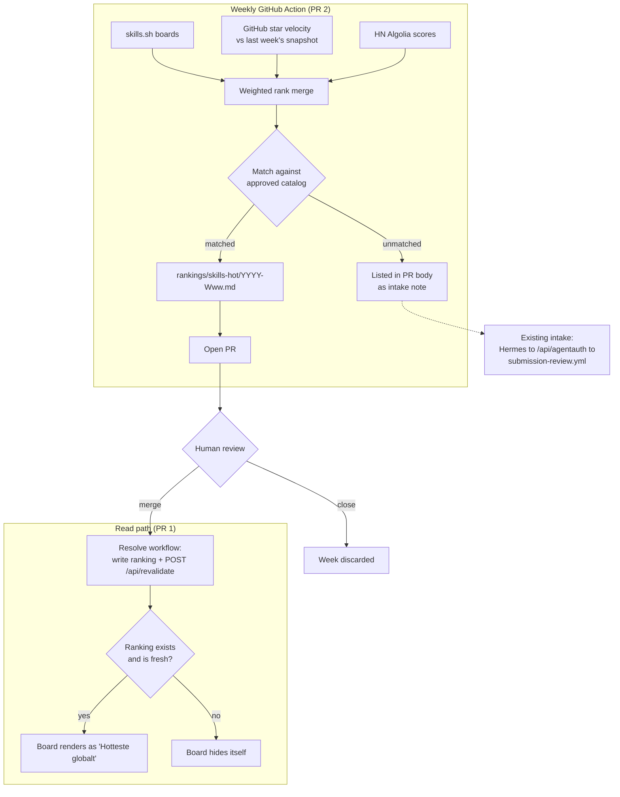

# feat: weekly externally-sourced Hot board for /skills

**Plan depth:** Deep · **Target repo:** vibetrends-dk

Two PRs, deliberately sequenced. PR 1 teaches the read path to live without the
frozen launch ranks and to hide the board when no fresh ranking exists. PR 2 adds
the weekly scan that produces real rankings behind a human merge gate.

---

## 1. Problem frame

`/skills` ships a third tab labelled **"Hot"** that is keyed `trending`, queries
the `trending_rank` column, and shows six rows.

Three things are wrong with it, and they compound:

1. **The data is frozen.** `hot_rank` and `trending_rank` were hand-curated in
   `supabase/migrations/20260620020000_seed_skills_snapshot.sql` at launch in June
   2026 and have not moved since. Its own header calls them "a hand-curated
   snapshot for launch" and "the seam the eventual own-signal engine replaces".
2. **The label, the key, and the query disagree.** The tab reads "Hot", is keyed
   `trending`, and shows neither the `hot` view nor anything measured.
   `src/lib/skillViews.ts` documents this mismatch at length instead of resolving
   it, and `?view=hot` is deliberately folded away because it rendered rows with
   every tab inactive.
3. **There is no local signal to replace it with.** Across 99 skills the
   `skill_upvotes` table holds **one** row, and 86 skills sit at the default
   `upvotes = 1`. Install intent is tracked, but `ConnectBlock.trackConnectCopy`
   sends it to `@vercel/analytics`, which the read path cannot query. Any
   velocity engine built on today's data would rank noise.

Both boards are also 100% imported skills.sh seed rows with zero Danish entries,
so the board that implies community momentum shows six American React skills.

**The reframe:** measure what is hot *globally* from sources that publish an
order, and say so in the label. That is checkable in week one, and it is the job
PRODUCT.md already assigns the site (pulling scattered material out of unfindable
READMEs into one organized place).

---

## 2. Requirements

- **R1.** The board's contents derive from external sources that publish a
  ranking, refreshed weekly.
- **R2.** No ranking reaches the catalog without a human merge.
- **R3.** The board disappears when its data goes stale, rather than showing a
  frozen list indefinitely. This is the failure mode currently live.
- **R4.** One key, one label, one query, consistent across the page, the REST
  route, and the MCP tool.
- **R5.** The scan never inserts catalog rows. Discovery and intake already exist.
- **R6.** Agents and humans see the same ranking from the same computation
  (PRODUCT.md principle 4).
- **R7.** The label states what it measures, so nobody has to guess whether the
  ranking is measured or editorial.

---

## 3. Key technical decisions

### KTD1. Two PRs, tolerant read path first

Not stylistic. `AGENTS.md` and the header of
`supabase/migrations/20260813000000_review_state.sql` both encode this rule, the
latter noting that reversing it "took search down for ~15 minutes once already".
PR 1 deploys code that tolerates an absent ranking; only then does PR 2 begin
writing one. Between the two, `/skills` shows Dansk and Alle. That is the honest
state, not a regression.

### KTD2. The scan is a GitHub Action in this repo, not a Hermes job

`docs/plans/2026-08-14-001-feat-danish-platform-candidate-feeder-plan.md` puts an
external scanner on the Hermes VPS, and `Agents/Hermes/project_audit_loop.py`
already submits across skills, vibes, and agents. That pipeline owns *submission*
and is operated through `/hermes-ops` on separate infrastructure.

Ranking is different work with a different failure blast radius: a board on
vibetrends.dk must not go dark because a VPS cron died in a repo debugged with
another skill. `.github/workflows/refresh-skill-docs.yml` already proves the
in-repo pattern (weekly cron, writes Supabase, no deploy step). The merge of
ranked sources is deterministic arithmetic, so it needs no LLM and gains nothing
from Hermes' subscription-cost advantage.

### KTD3. The scan ranks; it never inserts

Intake exists end to end: `POST /api/agentauth` lands rows at
`review_state='pending'`, `submission-review.yml` opens one PR per submission,
`submission-resolve.yml` makes merge mean approve and close mean delete. A second
intake path would duplicate that and split the curation ledger. Skills that rank
hot but are absent from the catalog are listed in the PR body as a note for the
existing pipeline.

### KTD4. Rank lives in a committed weekly manifest, mirrored to the database

`submission-review.yml` is explicit that merged manifests are "the curation ledger
 (PRODUCT.md bets the positioning on 'curated, never scraped', and a git history
of every accepted entry with a reviewer and a timestamp is that claim made
auditable)". Rankings get the same treatment: the Action commits
`rankings/skills-hot/<YYYY-Www>.md` on a branch and opens a PR. Merging it
triggers the resolve workflow, which writes the ranking to the database and calls
`POST /api/revalidate`. Closing it unmerged discards that week.

### KTD5. Board visibility is keyed on freshness

The read path renders the board only when an approved ranking exists and is newer
than the staleness horizon (proposed: 14 days, two missed scans). A dead cron
therefore removes the board instead of freezing it. This directly fixes the
current bug rather than re-creating it with newer data.

### KTD6. Sources are limited to those that publish an order

| Source | Signal | Weight | Notes |
|---|---|---|---|
| skills.sh boards | published rank | high | Direct ordering |
| GitHub star velocity | 7-day star delta on the source repo | high | Needs a weekly baseline snapshot (see U5) |
| Hacker News (Algolia API) | story points and comment count | medium | Free, real scores |
| Reddit | post scores | excluded | Ranks posts, not skills; interpretation is judgment, not data |
| X | none | excluded | Blocked to crawlers; the repo's own Exa skill documents the sparse coverage |

Merged by weighted rank aggregation across sources, with per-source
normalization. Three sources is the honest count. Weighting them explicitly keeps
the board from claiming precision it does not have.

### KTD7. `trending` stays as a deprecated API alias

PRODUCT.md commits to stable taxonomies for the agent audience. The tab and its
key collapse to `hot`, but `/api/skills?view=trending` and the MCP enum continue
to accept `trending` and resolve it to `hot`, so no agent integration breaks on
deploy.

### KTD8. Danish label naming

The tab reads **"Hotteste globalt"**, not "Hot". It names its own signal, so the
board does not imply Danish community momentum it is not measuring (R7), and it
stays consistent with the Danish-only interface.

---

## 4. High-level technical design

The two-phase gate matters: the Action proposes, the human disposes, and the read
path independently refuses to show anything stale. No single failure leaves a
frozen board up, which is the exact defect being retired.

---

## 5. Implementation units

### Phase A: read path (PR 1)

Ships alone. After it, `/skills` shows two tabs and nothing references the launch
ranks.

#### U1. Collapse the view taxonomy to one key and one label

**Goal:** End the label/key/query mismatch. One name, one meaning, everywhere.

**Requirements:** R4, R7, KTD7, KTD8

**Dependencies:** none

**Files:**
- `src/lib/skillViews.ts`
- `src/lib/db.ts` (`SkillView`, `parseSkillView`, the view branch in `getSkills`)
- `src/app/skills/SkillsExplorer.tsx` (`BOARD_LABELS`)
- `src/app/skills/page.tsx`
- `src/app/api/mcp/route.ts` (enum and Danish description at line 70)
- `src/app/api/openapi.json/route.ts` (enum at line 217)
- `src/lib/__tests__/skillViews.test.ts` (new or extended)
- `src/app/skills/__tests__/SkillsExplorer.test.ts`
- `src/app/api/mcp/__tests__/route.test.ts`

**Approach:** `SKILL_BOARDS` becomes `["danish", "all", "hot"]`. The `trending`
key is removed from the board union but retained in `parseSkillView` as an alias
resolving to `hot` (KTD7). The long explanatory comment in `skillViews.ts` about
why the two diverge gets deleted rather than updated: it documents a defect this
unit removes.

**Patterns to follow:** the existing `getValidView` coercion shape, and the
`resolveView` fallback in `src/lib/boardTabs.ts` for stale `?view=` values.

**Test scenarios:**
- `getValidView("hot")` returns `hot`; `getValidView("trending")` returns `hot`;
  `getValidView(undefined)` and `getValidView("garbage")` return `danish`.
- `parseSkillView("trending")` resolves to `hot` so `/api/skills?view=trending`
  keeps working for existing agent callers.
- The MCP tool schema and the OpenAPI document both still advertise `trending` as
  accepted, and their descriptions no longer claim it is a distinct view.
- `SkillsExplorer` renders the third board's label as "Hotteste globalt".
- Selecting the hot board leaves exactly one tab in the active state (the defect
  that caused `?view=hot` to be folded away originally).

#### U2. Freshness-gated board rendering

**Goal:** The board renders only when an approved ranking exists and is fresh;
otherwise it is absent, with no empty state and no stale rows.

**Requirements:** R3, KTD5

**Dependencies:** U1

**Files:**
- `src/lib/db.ts` (`getSkills` hot branch, new ranking read)
- `src/lib/boardTabs.ts` (if the freshness gate is expressed as a board that
  contributes zero items)
- `src/app/skills/page.tsx`
- `src/lib/__tests__/boardTabs.test.ts`
- `src/app/skills/__tests__/page.test.ts`

**Approach:** The hot branch stops filtering on `hot_rank`/`trending_rank` and
reads the current ranking instead. When no ranking row is fresher than the
staleness horizon, the hot board yields an empty list, and the existing
`visibleBoards` logic in `src/lib/boardTabs.ts` drops it from the row on its own.
That module's stated rule ("A filter that filters nothing is worse than no
filter") already covers this case; prefer extending it over adding a parallel
visibility mechanism.

**Execution note:** Add the freshness assertions before changing the query, so
the "board disappears" behavior is proven rather than assumed.

**Test scenarios:**
- Ranking dated within the horizon: the board renders in tab position three with
  its rows in rank order.
- Ranking older than the horizon: the board is absent from the tab row entirely,
  and `?view=hot` falls back to the default board with a valid active tab.
- No ranking rows at all (the state immediately after this PR deploys): board
  absent, page renders Dansk and Alle without error.
- A ranking referencing a skill that has since been deleted or set to
  `review_state='pending'`: that entry is skipped, the rest of the board renders,
  and no null row reaches the explorer.
- Boundary: a ranking exactly at the horizon is treated as fresh; one second past
  it is not.

#### U3. Weekly ranking schema

**Goal:** Persist a dated, ordered ranking per week, and retire the launch rank
columns from the read path.

**Requirements:** R1, R6

**Dependencies:** U1, U2 must be deployed first (KTD1)

**Files:**
- `supabase/migrations/20260815xxxxxx_skill_hot_rankings.sql`

**Approach:** A `skill_hot_rankings` table keyed by ISO week, holding the ordered
skill ids plus the merged score and per-source contributions for auditability.
Public read, no public write. `hot_rank` and `trending_rank` are left in place as
dead columns for one release rather than dropped, so a rollback of PR 1 does not
require a reverse migration; a follow-up drops them.

Per `AGENTS.md`: idempotent, reversible, applied with a one-off node script using
`pg` + `DATABASE_URL` and `ssl: { rejectUnauthorized: false }`, with the down path
in a trailing comment. Nothing tracks applied state, so re-runs must be safe.

**Execution note:** Apply only after U1 and U2 are deployed. This is the ordering
rule from KTD1, and it is the one step in this plan where getting it backwards has
a known production cost.

**Test scenarios:**
- Test expectation: schema-only, verified by applying the migration twice against
  a scratch database and confirming the second run is a no-op, then applying the
  down path and confirming the read path from U2 still renders (board absent).

### Phase B: the weekly scan (PR 2)

Ships after Phase A is deployed and the migration applied.

#### U4. Source adapters and deterministic merge

**Goal:** Turn three external sources into one ordered list of catalog skill ids.

**Requirements:** R1, R5, R6, KTD6

**Dependencies:** U3

**Files:**
- `scripts/scan-hot-skills.mjs`
- `scripts/__tests__/scan-hot-skills.test.mjs` (new)

**Approach:** One adapter per source, each returning a normalized ranked list.
Adapters are independently failable: a source that errors or returns nothing is
dropped from the merge with its weight redistributed, and the omission is
recorded in the output for the PR body. Matching to catalog entries is by
`github_url` and `source` first, then normalized title, and never fuzzy enough to
guess. Unmatched hot entries are collected separately (KTD3), never inserted.

**Patterns to follow:** `scripts/refresh-skill-docs.mjs` for GitHub API auth via
`GITHUB_TOKEN` and its dry-run flag; `Agents/Hermes/project_audit_loop.py`'s
`fetch_live_catalog` for the shape of catalog dedup, though not the code (that
lives in a different repo and language).

**Test scenarios:**
- Three healthy sources produce a deterministic order; running the merge twice on
  the same fixtures yields byte-identical output.
- One source returns HTTP 500: the merge completes with the remaining two, weights
  are redistributed, and the result records which source was dropped.
- All sources fail: the script exits non-zero without writing a manifest, so no
  empty ranking is proposed.
- A ranked entry matching no catalog row lands in the unmatched list and never in
  the ranking.
- A ranked entry matching a `review_state='pending'` row is treated as unmatched.
- Matching is exact on `github_url`, and two different skills from the same repo
  (a collection import) do not collapse into one another.
- Output is capped between 5 and 10 entries; fewer than 5 matched entries produces
  no manifest rather than a short board.

#### U5. Star-velocity baseline snapshot

**Goal:** Make the GitHub signal a delta rather than a popularity total.

**Requirements:** KTD6

**Dependencies:** U4

**Files:**
- `scripts/scan-hot-skills.mjs`
- `supabase/migrations/20260815xxxxxx_skill_star_snapshots.sql`

**Approach:** The GitHub API exposes `stargazers_count` but no history, so
velocity requires a stored weekly baseline per repo. Each run records the current
count and computes the delta against the previous run.

**The first run has no baseline and therefore no velocity.** It writes the
snapshot and merges using the other two sources only. This is expected and must be
visible in the PR body rather than silently producing a GitHub-weightless ranking
that looks normal.

**Test scenarios:**
- First run with an empty snapshot table: velocity contributes nothing, the run
  succeeds, and the output flags the missing baseline.
- Second run with a baseline one week old: the delta is computed per repo and
  contributes at its full weight.
- A repo whose star count decreased: the delta is clamped at zero rather than
  contributing a negative rank.
- A repo added to the catalog since the last snapshot: no baseline, excluded from
  the velocity component only, still eligible via other sources.
- A stale baseline older than two weeks is not used as if it were a one-week
  delta.

#### U6. Weekly Action that opens the ranking PR

**Goal:** Run the scan on a schedule and put its output in front of a human.

**Requirements:** R1, R2, KTD2, KTD4

**Dependencies:** U4, U5

**Files:**
- `.github/workflows/scan-hot-skills.yml`
- `rankings/skills-hot/.gitkeep`

**Approach:** Weekly cron, off-the-hour and offset from
`refresh-skill-docs.yml`'s Monday 04:17 UTC so the two do not contend for GitHub
API budget. Concurrency group of one. `workflow_dispatch` with a `dry_run` input,
matching the refresher. The job commits
`rankings/skills-hot/<YYYY-Www>.md` to a branch and opens one PR whose body
carries the merged ranking, the per-source contributions, any dropped sources, and
the unmatched-but-hot list.

One PR per week, not per entry. The reasoning in `submission-review.yml` for
per-submission PRs does not transfer: a ranking is a single ordered artifact where
"approve 7 of 10" is not a meaningful outcome, and partial approval would produce
a ranking whose order no longer means anything.

**Patterns to follow:** `.github/workflows/refresh-skill-docs.yml` for schedule,
concurrency, dry-run, and secrets shape.

**Test scenarios:**
- Test expectation: workflow config, verified by a `workflow_dispatch` dry run
  that produces a manifest and PR body as artifacts without committing or opening
  a PR.
- A second dispatch while one is in flight is queued or cancelled by the
  concurrency group, never run concurrently.
- A week whose scan produces no manifest (U4 floor not met) opens no PR and exits
  green, rather than opening an empty one.

#### U7. Resolve workflow: merged ranking goes live

**Goal:** Merging the PR publishes the ranking; closing it discards the week.

**Requirements:** R2, R3, KTD4

**Dependencies:** U3, U6

**Files:**
- `.github/workflows/resolve-hot-ranking.yml`
- `scripts/review-queue.mjs` (pattern reference only)

**Approach:** Mirrors `submission-resolve.yml`. Runs on `pull_request_target` so a
closed PR still has secrets and database reach, and follows that workflow's
security constraint exactly: **check out `main`, never the PR branch**, and read
only the changed file paths, validated against a strict
`rankings/skills-hot/<YYYY-Www>.md` pattern. Do not add a `ref:` pointing at the
PR head.

On merge: write the ranking rows, then `POST /api/revalidate`, because lists are
cached at `cacheLife('max')` and an Action cannot call `revalidateTag` itself. On
close: no database write; the manifest never landed on `main`.

**Test scenarios:**
- Merged PR: the ranking is written, revalidation fires, and `/skills` shows the
  board with the merged order on the next request.
- Closed unmerged PR: no database write, no revalidation, board unchanged.
- A PR touching a path outside `rankings/skills-hot/`: rejected by the path
  validator without a database write.
- A merged PR whose manifest references a skill deleted between proposal and
  merge: the write skips it and the board renders the remainder (paired with U2's
  read-side guard).
- Revalidation endpoint returns non-2xx: the job fails loudly rather than
  reporting success with a stale cache.

---

## 6. Scope boundaries

**In scope:** the ranking pipeline, its human gate, the freshness rule, and the
naming collapse across page, REST, and MCP.

**Not in scope:**
- Candidate discovery and submission. Already built (KTD3).
- Any change to `/vibes`, `/cli`, `/mcp`, or `/forum` boards. The memory note that
  hub boards are one shared surface applies to *default view and tab order*, which
  this plan does not touch; the hot board's meaning changes on `/skills` only.
- MCP write tools, still blocked on `docs/decisions/2026-06-19-agent-auth.md`.

### Deferred to follow-up work

- **Persisting install-intent locally.** `ConnectBlock.trackConnectCopy` already
  fires on every copy but reaches only Vercel Analytics. Writing it to Supabase is
  independent of this plan, cheap, and starts accumulating the only signal that
  can ever prove Danish traction. Worth doing soon so the data exists when it is
  wanted; revisit in a few months whether it earns its own board.
- **Dropping `hot_rank` and `trending_rank`.** Left as dead columns by U3; drop
  once PR 1 has been stable for a release.
- **Danish-sourced ranking.** The moment local signal is real, the honest board
  inverts from global to local. This plan does not pre-build that.

---

## 7. Risks

| Risk | Mitigation |
|---|---|
| skills.sh changes its markup and the adapter silently returns nothing | Adapters fail loudly; U4 exits non-zero when all sources fail, and a partial-source run is recorded in the PR body |
| The board republishes another directory's ranking with a Danish label | Three weighted sources plus the stated label (KTD8); if only skills.sh survives a run, the PR body says so and the human can close it |
| Weekly PR becomes unreviewed noise and gets rubber-stamped | One PR per week is a low enough rate to actually read, and KTD5 means an unreviewed week simply expires rather than accumulating |
| GitHub API budget contention with the doc refresher | Offset schedules and separate concurrency groups (U6) |
| The scan stops running and nobody notices | KTD5 removes the board after two missed weeks, making the failure visible on the site itself |

---

## 8. Open questions

- **Staleness horizon.** Proposed 14 days (two missed scans). Confirm before U2.
- **Source weights.** Proposed high/high/medium for skills.sh, star velocity, HN.
  Worth revisiting after three or four real weeks, when it is visible whether one
  source dominates the merged order.
- **Board size floor.** Proposed: no manifest below 5 matched entries. This may
  prove too strict in the first weeks, when catalog matching is untested against
  real source output.

---

## 9. Sources

- `supabase/migrations/20260620020000_seed_skills_snapshot.sql` — the launch
  snapshot this replaces, and its own note that it is meant to be replaced
- `supabase/migrations/20260813000000_review_state.sql` — the migration-ordering
  rule in KTD1
- `.github/workflows/refresh-skill-docs.yml` — the weekly-Action-writes-Supabase
  precedent
- `.github/workflows/submission-review.yml`, `submission-resolve.yml` — the
  manifest-as-curation-ledger pattern and the `pull_request_target` security
  constraint
- `src/lib/boardTabs.ts` — the existing rule that a board which filters nothing
  should not render
- `docs/plans/2026-08-14-001-feat-danish-platform-candidate-feeder-plan.md` — the
  adjacent Hermes scanner this plan deliberately does not duplicate
- Live database, queried 2026-08-15: 99 skills, 1 row in `skill_upvotes`, 6 rows
  each carrying `hot_rank` and `trending_rank`, none Danish
