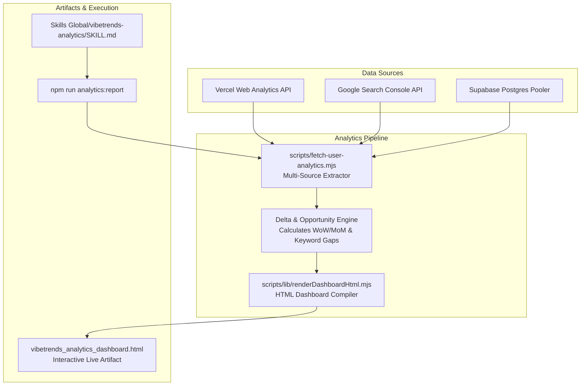

# feat: automated user analytics skill for vibetrends.dk

## Summary

Build an automated, domain-specific `vibetrends-analytics` skill for vibetrends.dk that extracts multi-source telemetry from Vercel Web Analytics, Google Search Console, and Supabase DB, computes period-over-period deltas, and renders a self-contained, interactive HTML live dashboard artifact with tabbed exploration.

---

## Problem Frame

Telemetry for vibetrends.dk is fragmented across three distinct sources: Vercel Web Analytics (traffic and routing), Google Search Console (organic impressions and search CTR), and Supabase (user auth, submissions, upvotes, and agent tokens). Gathering a comprehensive pulse on user activity currently requires manual queries and multiple dashboard visits. An automated skill that unifies these streams into a single interactive HTML live artifact provides an immediate pulse on organic search breakouts (such as Aula tools), catalog growth, and community engagement bottlenecks.

---

## Requirements Traceability

- R1. Extract visitor counts, pageviews, top route paths, referrer hostnames, country distributions, and device/OS breakdowns from Vercel Web Analytics API.
- R2. Extract organic search clicks, search impressions, average position rankings, top search queries, and landing page URLs from Google Search Console API.
- R3. Query user registrations, active authentication sessions, catalog inventory counts (skills, vibes, agents), community upvote counts, and agent token usage from Supabase.
- R4. Support configurable time windows (7-day, 30-day default, 90-day).
- R5. Calculate comparative period-over-period percentage changes and absolute deltas for core KPIs.
- R6. Identify and rank high-impression, low-CTR queries on Google Page 1 or 2 as growth opportunities.
- R7. Render a self-contained single-file HTML live artifact dashboard with a tabbed interface (Overview, Traffic & Demographics, Search & SEO, Users & Agent Activity, Growth Opportunities).
- R8. Implement client-side interactive search and sort for tables without external network dependencies.
- R9. Ensure complete offline operability with embedded CSS and vanilla JavaScript.
- R10. Package the skill as `vibetrends-analytics` in `Skills Global/vibetrends-analytics/SKILL.md` with active symlinks.
- R11. Provide a direct CLI execution script in the project root (`npm run analytics:report`).

---

## Key Technical Decisions

- **KTD-1: Modular ESM Telemetry Extractor (`scripts/fetch-user-analytics.mjs`)**: Consolidates database connection (via Supabase IPv4 pooler), Vercel Web Analytics queries (using local CLI auth token), and GSC queries (via `~/.claude/skills/gsc-admin/venv` runner) into a unified async extractor module that returns clean JSON.
- **KTD-2: Period-over-Period Delta Engine**: Computes current period `[now - window, now]` against baseline `[now - 2*window, now - window]` for both Vercel visits/pageviews and GSC search impressions/clicks to surface growth velocity.
- **KTD-3: Self-Contained HTML Dashboard Builder (`scripts/lib/renderDashboardHtml.mjs`)**: Compiles the analytics JSON into a single self-contained HTML artifact using clean vanilla CSS (with CSS variables matching Vibetrends off-white/forest green palette) and zero-dependency vanilla JS for tab switching and table search/filter.
- **KTD-4: Global Skill Definition with Local Workspace Binding**: Installs `vibetrends-analytics` in `Skills Global/vibetrends-analytics/` and wires it to `package.json` as `npm run analytics:report`, enabling immediate invocation from both chat agents and local terminal.

---

## High-Level Technical Design & Data Flow

---

## Implementation Units

### U1. Core Multi-Source Telemetry Extractor & Delta Engine

**Goal:** Build a robust, resilient Node.js module that queries Vercel, GSC, and Supabase for both the current and previous period, computes delta statistics, filters high-opportunity search terms, and outputs structured analytics data.

- **Files:**
  - `scripts/fetch-user-analytics.mjs`
  - `scripts/lib/analyticsDelta.mjs`
  - `scripts/__tests__/fetch-user-analytics.test.mjs`
- **Requirements Covered:** R1, R2, R3, R4, R5, R6
- **Patterns & Context:**
  - Connect to Supabase via `aws-0-eu-west-1.pooler.supabase.com` with `ssl: { rejectUnauthorized: false }`.
  - Read Vercel token from `~/Library/Application Support/com.vercel.cli/auth.json` and query `/v1/query/web-analytics/visits/count` and `visits/aggregate`.
  - Execute GSC query via `~/.claude/skills/gsc-admin/venv/bin/python3`.
  - Fall back gracefully if any single data source is offline or unauthenticated (e.g. return partial report with error notes rather than crashing the pipeline).
- **Test Scenarios:**
  - Test delta calculation math with positive, negative, and zero baseline values.
  - Test keyword growth opportunity filter: correctly selects queries with position ≤ 15, impressions ≥ 15, and CTR < 5%.
  - Test fallback handling when an individual data provider returns 400 or network timeout.
- **Verification:** `npm run test:unit` passes the delta engine tests.

### U2. Standalone Interactive HTML Dashboard Compiler

**Goal:** Create a modular HTML compiler that takes the unified analytics JSON and renders an interactive, single-file HTML dashboard with a tabbed interface, visual KPI cards with delta tags, searchable data tables, and growth opportunity call-outs.

- **Files:**
  - `scripts/lib/renderDashboardHtml.mjs`
  - `scripts/__tests__/renderDashboardHtml.test.mjs`
- **Requirements Covered:** R7, R8, R9
- **Patterns & Context:**
  - Theme: Light off-white background (`#FAF9F6`), forest green accents (`#264021`), warm borders, and clear typography.
  - Tabs:
    1. **Overview**: Key stats strip (Visitors, Pageviews, GSC Clicks, GSC Impressions, Signups), delta badges, high-level narrative.
    2. **Traffic & Geo**: Top route paths table with search filter, country distribution bar charts, device and OS meters.
    3. **Search & Keywords**: GSC query table (search term, clicks, impressions, CTR, average position), landing pages table.
    4. **Users & Agent Activity**: Daily registration velocity, auth provider distribution, catalog authoring breakdown (user vs seed), rate limit action telemetry.
    5. **Growth Opportunities**: Actionable cards for high-impression keywords, metadata recommendations, and community activation tips.
  - Interactive features: Vanilla JavaScript for instant tab switching, search input for filtering table rows, and sortable table columns. All embedded inline without CDN links.
- **Test Scenarios:**
  - Test that `renderDashboardHtml` returns valid HTML containing all 5 tab containers.
  - Test that embedded JSON is safely escaped against script injection.
  - Test that empty or missing sub-metrics render friendly empty-state placeholders rather than breaking.
- **Verification:** Unit test validates HTML structure; rendering test passes.

### U3. Skill Packaging & CLI Integration

**Goal:** Create the official `vibetrends-analytics` skill in `Skills Global/vibetrends-analytics/SKILL.md`, link it into agent environments, and wire a standard npm script in `package.json`.

- **Files:**
  - `/Users/kasperlandsvig/Documents/Claude Cowork/Skills Global/vibetrends-analytics/SKILL.md`
  - `scripts/generate-analytics-report.mjs`
  - `package.json`
- **Requirements Covered:** R10, R11
- **Patterns & Context:**
  - `generate-analytics-report.mjs`: CLI runner that accepts `--days=30` (or 7, 90), calls `fetch-user-analytics.mjs` + `renderDashboardHtml.mjs`, writes the `.html` artifact to disk (and artifact directory if in an active agent session), and prints a clean terminal summary with clickable file URL.
  - Add `"analytics:report": "node --env-file-if-exists=.env.local scripts/generate-analytics-report.mjs"` to `package.json`.
  - Create symlinks to `~/.gemini/config/skills/vibetrends-analytics` and `~/.claude/skills/vibetrends-analytics`.
- **Test Scenarios:**
  - Test running `npm run analytics:report -- --days=30` directly in terminal.
  - Test custom days parameter (`--days=7`).
  - Verify generated HTML file exists, is non-empty, and has valid HTML syntax.
- **Verification:** Script runs from CLI and outputs valid HTML dashboard.

### U4. End-to-End Execution & Artifact Verification

**Goal:** Execute the full pipeline against live production data, generate the live HTML artifact dashboard, and verify that all metric layers (Vercel, GSC, Supabase) are populated correctly.

- **Files:**
  - `scripts/generate-analytics-report.mjs`
- **Requirements Covered:** R1–R11, F1, F2, AE1, AE2, AE3
- **Patterns & Context:**
  - Run the generator script against live production credentials.
  - Verify live numbers match known production baseline.
  - Open generated HTML artifact in local browser to inspect interactive tabs, table search, and visual rendering.
- **Test Scenarios:**
  - Execute live run and check exit code 0.
  - Confirm file path is clickable and artifact opens cleanly in browser.
- **Verification:** HTML artifact is generated in the brain artifact directory and project output.

---

## Acceptance Examples

- **AE1: Complete Tri-Source Ingestion**: Running `npm run analytics:report` successfully fetches Vercel traffic, GSC search analytics, and Supabase DB metrics into the consolidated JSON structure without crashing.
- **AE2: Growth Opportunity Extraction**: The dashboard automatically flags keywords with ≥15 impressions, position ≤15, and CTR <5% (e.g. `boligsiden-property-data`, `motion whiledrag`, `rejseplanen`) in the Growth Opportunities tab.
- **AE3: Portable Offline Dashboard**: Opening the resulting `.html` file locally in any web browser provides instantaneous tab switching and table filtering without network requests.

---

## Scope Boundaries

- **In Scope**:
  - Dedicated telemetry extractor for `vibetrends.dk`.
  - Period-over-period delta math (current window vs preceding window).
  - Standalone HTML live artifact generator with tabbed navigation and search.
  - Skill packaging in `Skills Global` and npm script integration.
- **Deferred for Later**:
  - Automated email dispatch via Resend/Gmail (dropped per user confirmation).
  - Automated weekly cron scheduling.
  - Multi-site aggregation across other portfolio domains.

---

## Risks & Dependencies

- **Vercel CLI Token Expiry**: Relies on active token in `~/Library/Application Support/com.vercel.cli/auth.json`. Handled gracefully with fallback error message if token is missing.
- **GSC Python Environment**: Uses `~/.claude/skills/gsc-admin/venv/bin/python3`. If missing, search data is flagged as unavailable while Supabase and Vercel continue to render.
- **Supabase IPv6 vs IPv4 Routing**: Uses `aws-0-eu-west-1.pooler.supabase.com` pooler with `rejectUnauthorized: false` to ensure connectivity across all network environments.
